# Uma história macabra sobre "Estilização de Código"
 

## Standard JS
É um formatador automático para códigos `JavaScript`.
- Gerava formatção polêmica. (Um exemplo era a remoção de `;` no final das linhas)
    - Algumas remoções de `;` podem gerar problemas no código.
     
- O principal ponto de venda era a impossibilidade de configurações, gerando um modelo padronizado.
 

## Pull Request (PR)
Forma de apresentar alterações no código para posteriormente realizar o `Merge` (Adicionar as novas alterações ao código principal).
 

## Padronização de escrita de código
A padronização de escrita do código deve ser mantida para **facilitar a manutenção do código**.
 

---
---
---
 

# Sincronização das configurações do Editor

## Criando tarefas dentro de uma Issue
Uma `Issue` é uma tarefa que pode ser dividida em tarefas menores.
Para criar uma tarefa dentro de uma `Issue`, basta clicar no menu de `Issues` do projeto, escolher uma e editá-la.

**Nota:** Para criar um checkbox interativa, basta utilizar o código abaixi.
> // - [ ] Tarefa

**Observações** 
- Os caracteres `//` foram utilizados apenas para o `MarkDown` não interpretar a <i>checkbox</i>.
- Cada etapa concluída altera a porcentagem da `Issue` e da `Milestone`.

**Importante:** O `GitHub` modificou o sistema de visualização de progresso dentro das `Issues`. Para mais informações, consulte o **<a href="./Materiais/2-Sincronização das configurações do Editor.md">material desta aula</a>**.
 

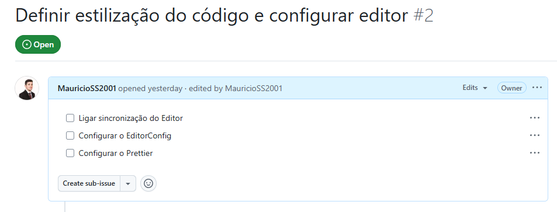
 

## Configurando o Editor
Atualmente o `Codepaces` possuí instâncias efêmeras (Cada vez que uma instânica é executada, ela começa com a configuração padrão).
 

### Setings Sync
Sincroniza as configurações do Editor do seu perfil na nuvem do `GitHub`.
- Inclui instalação de `Extensões`.
 

## Configuração na prática
**1.** Ativar a sincronização das configurações em nuvem.

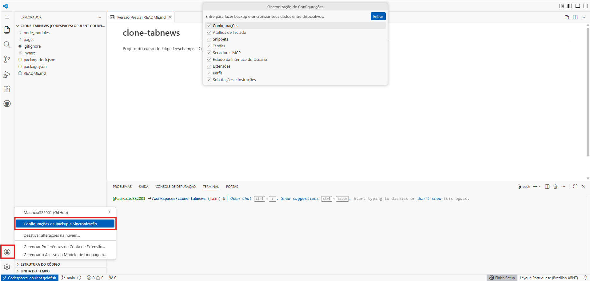

**2.** Clicar no botão `Entrar` e escolher a conta do `GitHub`.
 

---
---
---
 

# Configurar o EditorConfig

## O que é o EditorConfig?
O `EditorConfig` é um **configurador de Editor** que define regras de como o **Editor deve se comportar**.
- Por exemplo, a **largura de identação** do código.
- Uso de `Espaços` ou `Tabs`.

O `EditorConfig` não é configurado pela interface do Editor, mas sim por um **arquivo** presente no `Repositório`, chamado `.editorconfig`.

- Muitos **Editores de código** possuem suporte para o `EditoConfig` **nativamente**.
 

- Caso o projeto apresente o arquivo `.editorconfig` e o Editor de código possua supporte, as configurações são feitas **automaticamente** pelo Editor.
 

- `Codespaces` necessita de **extensão** para suportar `EditorConfig`.
 

- **Seguir regras de formatação ocorre ANTES de salvar o arquivo!** (Maioria das vezes).
 

- O `EditorConfig` é flexível ao ponto de poder configurar **diretórios do projeto individualmente**.
    - O `EditoConfig` procura o **arquivo de configuração** no diretório atual, caso não ache, sobe um diretório e procura novamente o arquivo (Procura até achar o arquivo com **root = true**).
 

## Configurando nosso Editor (EditorConfig)
**1.** Criar o arquivo `.editorconfig` no diretório do projeto.
 

**2.** Definir o arquivo como `root` (basta escrever o código abaixo na primeira linha do arquivo).
~~~ js
root = true
~~~
**Nota:** Como este arquivo é o `root`, ele tem prioridade hierarquica em relação aos arquivos `.editorconfig` que estão em diretórios "abaixo" dele.
 

**3.** Definir a identação do Editor.

O estilo da identação pode ser definido a partir do `ident-style` com a atribuição do estilo. O projeto utilizará `Espaço`.

Já a quantidade de vezes que o `ident_style` utilizará, será definida pelo `ident_size`. (Quantos `Espaço` terão por identação)

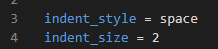

**Nota:** Por convenção, códigos `JavaScript` utilizam **dois** `Espaço`.
 

**4.** Definir quais arquivos serão afetados por estas regras. A definição do aruivos é feita dentro de colchetes (`[]`). Como queremos que afete todos arquivos, utilizaremos asterisco (`*`) para selecionar **todos arquivos**.

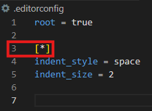
 

**5.** Instalar a extensão `EditorConfig`

Para instalar a extensão, basta ir na aba de **extensões** procurar por "**EditorConfig**" e clicar no botão `Instalar`.

 

## Destacando arquivos na mensagem de commit

Para destacar um arquivo como `arquivo`, basta utilizar crases` `` ` com o nome do arquivo no meio. Lembre-se, utilize aspas simples para definir a mensagem do <i>commit</i>.
 

~~~ git
git commit -m 'Adicionado o arquivo `exemplo`'
~~~
 

**Nota:** O `GitHub` atualizou a interface e agora não marca mais o fundo como `arquivo`, apenas altera a fonte do texto nesta parte.
 

---
---
---
 

# Configurar o Prettier

## Problema da aula passada
O `EditorConfig` só ajusta o código atual que está sendo produzido, porém caso um código antigo já tenha sido escrito e "<i>commitado</i>", ele permanecerá com identação errada.

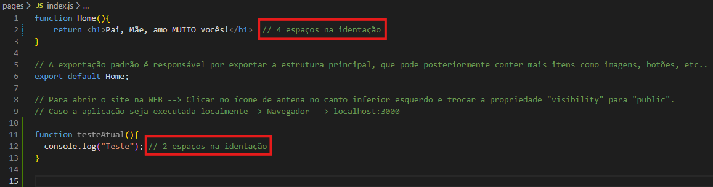

**Soluções possíveis (Não recomendadas)**
- Utilizar um <i>script</i> para verificar linha alinha do código e arrumar a identação.
 

- Utilizar módulo extras (não oficiais) para correções.
 

**Solução recomendada**
- Utilizar um **formatador de código** (`Prettier`).
 

## Prettier (Formatador de código)
O nome `Prettier` vem da palavra `pretty` que significa **"bonito(a)"** em Inglês. `Prettier` significa **"ainda mais bonito(a)"**.

`Prettier` é um formatador de código **opinado**, que significa que já vem com uma identação padronizada, embora possua uma pequena flexibilidade de alteração de regras.

**Para mais informações, acesse o <a href="https://prettier.io/">site oficial</a>**.
 

## Obtendo Prettier
Embora **possamos instalar a extensão no editor de código**, o **método mais recomendado é a utilização do pacote no `Node`** para garantir que qualquer desenvolvedor que integre o projeto receba o pacote obrigatoriamente.
- <a href="https://marketplace.visualstudio.com/items?itemName=esbenp.prettier-vscode">Extensão (VS Code)</a>
- <a href="https://www.npmjs.com/package/prettier">Pacote do `NPM`</a>

**Nota:** Para instalar o módulo `NPM` apenas para utilização em ambiente de desenvolvimento, use o seguinte comando:
~~~ js
npm install prettier --save-dev
~~~
**ou**
~~~ js
npm install prettier -D
~~~
 

Após a instalação para **apenas desenvolvimento**, o arquivo `package.json` recebe uma **nova categoria de dependências**.
Esta separação faz com que cada pacote seja utilizado somente em seu ambiente, **produção** ou **desenvolvimento**.

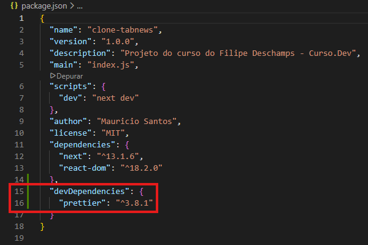

**Notas:** 
- Pacotes de **produção são utilizados no ambiente de desenvolvimento** também.
- `CI (Continous Integration)` é um ambiente que também atuará como um "porteiro" entre o que pode ou não ir do **desenvolvimento** para **produção**.
    - Garante que o código esteja "saudável" e sem "quebras" antes do `deploy` em **produção**.
 

## Executando Prettier no código
Para executarmos a analise `Prettier` no código, podemos criar um <i>script</i> no arquivo `package.json`.

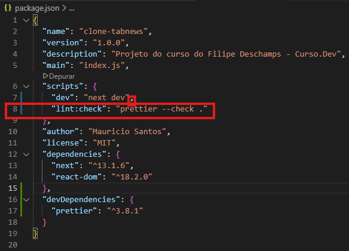

**Notas:**
- Não esqueça a **vírgula (`,`)** entre os **<i>scripts</i>**.
- O termo `lint` se refere a análise de código.
- `--check` executa o `Prettier` no **modo de conferência**.
- `.` é utilizado para selecionar os arquivos. O ponto (`.`) seleciona todos arquivos de uma vez.
 

**Executando o Script**
Para executar o <i>script</i>, basta utilizar o comando abaixo no `Terminal`.
~~~ js
npm run eslint:check
~~~
 

## Avisos do Prettier
Quando o <i>script</i> é executado, pode retornar avisos de formatação de código.

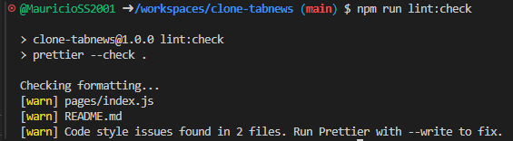
 

**Primeiro <i>warn (aviso)</i>:**
O primeiro `warn` refere-se a primeira função criada. (Componente do `React`)

Note que há **4** `Espaço` de identação.

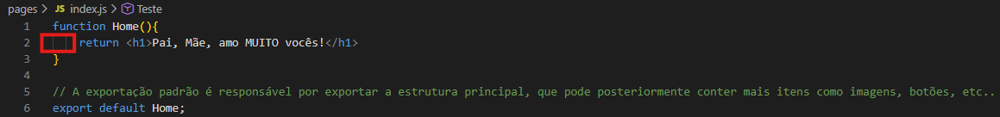
 

**Ignore o segundo aviso no arquivo `Readme.md`!.**
 

**Último <i>warn (aviso </i>)**
O último aviso questiona se você esqueceu de rodar o `Prettier` em **modo de correção**. (Rodamos apenas em **modo de conferência**).

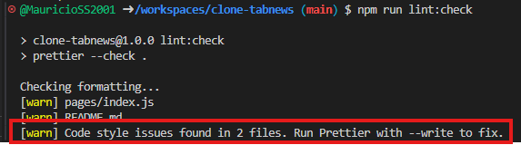
 

**Notas:**
- O **modo de conferência (Read)** apenas **lê o arquivo** a procura de erros, **não aplicando correções**.
 

- O **modo de escrita (Write)** nos arquivos, **permite a aplicação de correções**.
 

## Criando um Script de correção com o Prettier
Para criarmos o <i>script</i> de correção, basta criarmos ele no arquivo `package.json`.

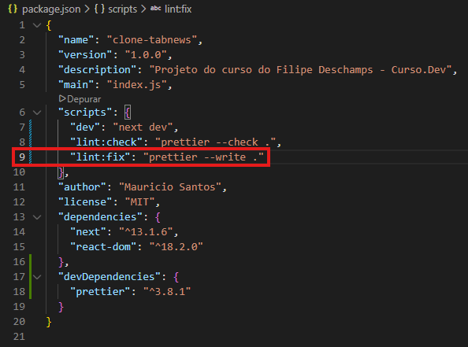

**Notas:**
- `fix` significa "arrumar".
- `write` permite a escrita (ajustes) dos arquivos.
- `.` seleciona todos arquivos.

Para rodar o <i>script</i> basta utilizar o comando abaixo no `Terminal`.
~~~ js
npm run lint:fix
~~~
 

## Analisando as alterações
Os arquivos que **não possuem** a marcação `unchanged`, **foram alterados (corrigidos)**.

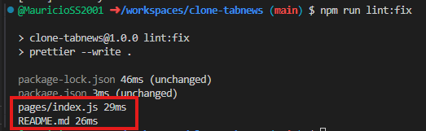

**Nota:**
- O comando `git diff` pode também ser utilizado **para verificar os arquivos alterados**. 
- Utilize a telca `Q` para sair do `git diff` e destravar o `Terminal`.
 

## Verificando um arquivo "cru"
Um arquivo no `GitHub` pode ser acessado de maneira "crua".
Um arquivo "cru" não exibe marcações fornecidas pelo `MarkDown (MD)`.
 

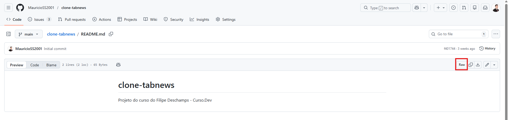
 

## Automatizando o Prettier
Para automatizar o `Prettier` basta instalar sua edição no Editor de código (`VS Code`).
- **<a href="https://marketplace.visualstudio.com/items?itemName=esbenp.prettier-vscode">Extensão `Prettier`</a>**.
 

**Após a instalação, é necessário configurar o Editor (`VS Code`) para utilizar o formatador**.

**1. CLicar na engrenagem no canto inferior esquerdo.**
**2. Selecionar a opção Configurações.**
**3. Pesquisar por `default formater`.**
**4. Alterar de "nenhum" para `Prettier - Code formatter`.**
 

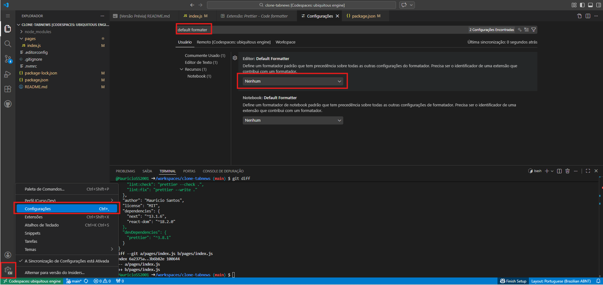

**6. Pesquisar por `format on save`.**
**7. Marcar a <i>checkbox</i>.**

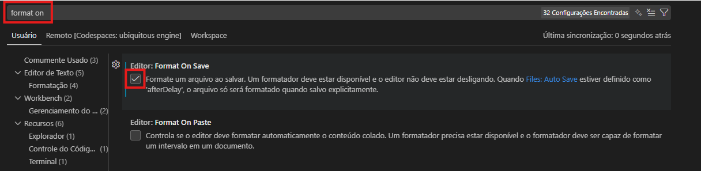

**8. Pesquisar por `auto save`.**
**9. Alterar a opção de `afterDelay` para `off`.**

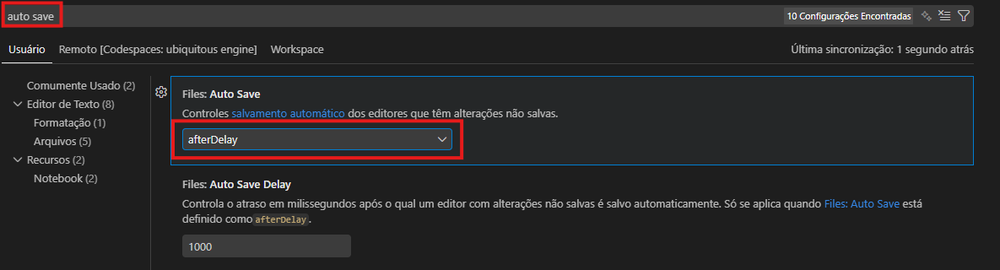
 

## Fechando uma Issue
Após concluir todas pequenas tarefas dentro de uma `Issue`, é importante fechá-la.

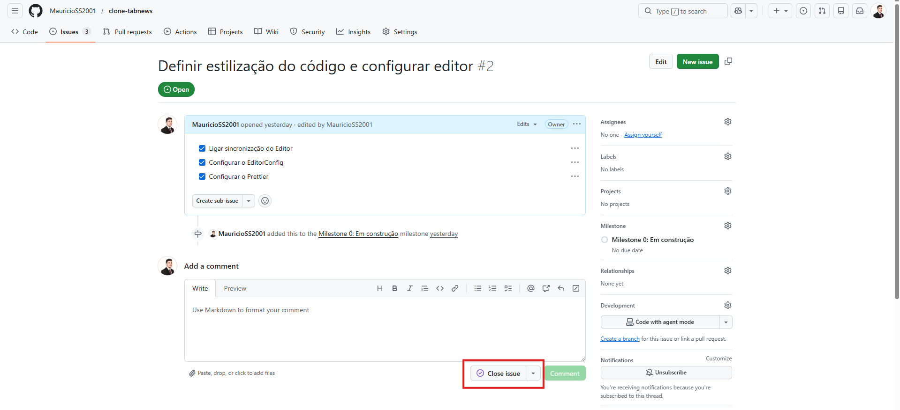
 

---
---
---
 

# 🎁 Extra: Configurar o Prettier Ignore

## Ignorando arquivos no Prettier
Para ignorar os arquivos ao executar o `Prettier`, basta criar um arquivo chamado `.prettierignore` no diretório do projeto.
Para adicionar arquivos/dire´torios para serem ignorados, basta digitar o nome e separá-los por linhas, assim como no `.gitignore`.

**Nota:** Os diretórios abaixo são ignorados pelo `Prettier` por padrão.
- `.git`
- `.svn`
- `.hg`
- `.node_modules`
 

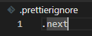

**Nota:** As versões a partir do `Prettier 3.0.0` ignoram diretórios também com base no `.gitignore`, deixando opcional a criação do `.prettierignore`.