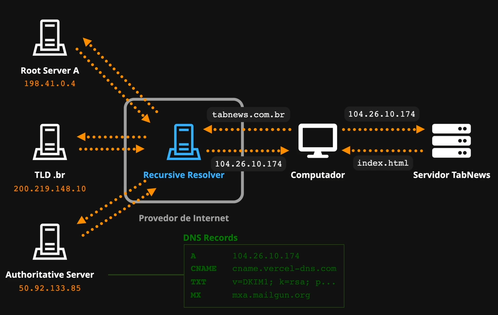
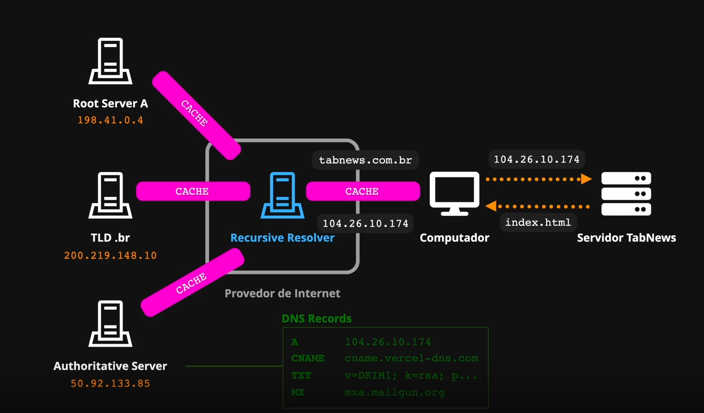

# Resolução de DNS (Desafio Nível 1)

## Cloudflare
Sistema que evita `Ataques de Negação` que tem o objetivo de **derrubar o sistema**.
 

## Domínios
Endereços como `www.google.com.br`, `www.youtube.com`, etc... **são apenas apelidos**. O real endereço de uma aplicação (um site por exemplo) é o `IP (Internet Protocol)`.
 

- Cada dispositivo conectado à `Internet` possuí um `endereço IP`.
 

- Um computador pede arquivos a outro por meio do envio de um "pacotinho".
    - Cada "pacotinho" tem o registro do `Endereço IP` final.
    - Durante o trajeto, cada roteador utilzia este `Endereço IP` para enviar o "pacotinho" pelo melhor caminho possíve até ele chegar ao destino final.

 

## Exemplo de IP
`www.google.com.br` tem os seguintes `Endereços IP`:
- `IPv6` : `2800:3f0:4001:837::2003:`
- `IPv4` : `172.217.29.163`
 

## DNS (Domain Name System / Sistema de Nomes de Domínios)
O principal objetivo do `DNS` é converter um domínio como `www.google.com.br` no `endereço IP` dele (`172.217.29.163`).
 

## Conexão entre computador (cliente) e servidor pelo DNS

**1.** O computador (`Cliente`) envia o `link` (`google.com.br`) da aplicação desejada (considere um <i>site</i>) para o `servidor DNS`.

**2.** O `Servidor DNS` envia o `Endereço IP` (`172.217.29.163`) para o computador (`Cliente`).

**3.** O computador (`CLiente`) envia as reuqisições para o `Servidor` por meio de seu `Endereço IP`.
 

## Dica sobre alteração de hospedagem
O `Domínio` deve ser mantido preferencialmente enquanto o `Endereço IP` pode ser alterado sem problemas.
 

## Desafio 1
Acessar a segunda aula do dia que está "escondida". para acessar, é necessário achar o `Domínio` da segunda aula.

**Link da primeira aula:** https://curso.dev/web/resolucao-dns-nivel-1

**Solução:** Alterar o link trocando o `1` pelo `2`.
 

---
---
---
 

# User Experience (UX)
`User Experience` é otermo utilizado para descrever a `Experiência do Usuário`. Por exemplo, se toda vez que o usuário precisasse avençar uma página alterando o `link` manualmente pelo navegador, poderiam acontecer inúmeros problemas levando a uma **experiência negativa** para o usuário.
 

---
---
---
 

## A Internet é distribuída
A `Internet` ser distribuída, faz com que haja uma catástrofe em algum lugar do planeta, os demais países não percam o acesso a `Internet`.
 

## Explorando funcionamento do completo do servidor DNS

**1. Seu computador(`cliente`) faz uma requisição para o `Recursive Resolver` do seu provedor de Internet.**
    - O `Recursive Resolver` é responsável pela descoberta do `endereço IP` do <i>site</i>.
    - Cada `Recursive Resolver` possui acesso aos `Root Servers`. (Atualmente, existem mais de 1700 instâncias deles para garantir a redundância da Internet.)
 

**2. O `Root Server` lê o domínio "ao contrário", no caso, pelo `.br`.**
- Sempre há um ponto (`.`) no final de cada <i>link</i>.
     

    **Exemplo:**
    > google.com.br. ===> Note o ponto `.` ao final do <i>link</i>.
    
     

    Este recurso é chamado `Fully Qualified Domain Name (FQDN)` ou `Nome de Domínio Completamente Qualificado`.
     
    - Este é o **endereço real completo**. 
     
    - A busca começa pelo último ponto (`root domain`).
 

**3. O `Root Server` busca o `endereço IP` em outro servidor por meio do `TLD (Top Level Domain)`.**
 
    - O `TLD` é um parte que compõem o <link>, como `.br`, `.net`, `.org`, etc...
 

**4. A busca é feita dentro do `Root Server` para descobrir qual o endereço `IP` do `TLD Server`.**
    - Servidores `TLD` são divididos em duas categorias:
     
- **ccTLDS (Country Code Top-Level Domains):** 
        São `TLDs` reservados para países, como `.br` para **Brasil** (Administrado pelo **Comitê Gestor da Internet no Brasil**), `.ca` para **Canada**, `.pt` para **Portugal**, etc...
         

**5. O `Root Server` devolve ao `Recursive Server` o `IP` do `TLD Server`.**
    - **Nota:** cada `TLD Server` é responsável por uma `TLD` como `.br`, `.net`, `.etc`...

- **gTLDS (Generic Top Domains):**
São `TLDs` genéricos como `.com` que significa **<i>commercial</i> / Comercial (usado para sites comerciais)**, `.org`, `.net`, `.dev`, entre outros.
 

**6. O `Recursive Server` recebe o endereço `IP` do `Authoritative Server` e solicita as inforamções para este `servidor`.**
- Este `servidor` possui todos `DNS Records (Registros de domínios)` que possui o endereço final do `servidor da aplica aplicação` (<i>site</i>).
 

---

## ICANN (Internet Corporation for Assigned Names and Numbers)
Organização internacional responsável pelos `TLDS`

**Curiosidade:** Em 2015, o **Banco Bradesco** adquiriu o `TLD` `.bradesco`. Após a aquisição, todos os `Root Servers` receberam a adição deste `TLD`.

---

## TTL (Time To Live)
Para evitar o tempo do processo de busca de enderço `IP` a cada requisição do navegador, a tecnologia `TTL` defini o "tempo de vida" que este `cache` deve ser mantido.
- Requisições para um mesmo servidor*.
 

- O `cache` acelera muito pois sua camada pode participar ativamente de todos os processos de busca.
 

- Alterações de `DNS` fazem com que a atualização do `cache` possa demorar para ser efetivada.
 

