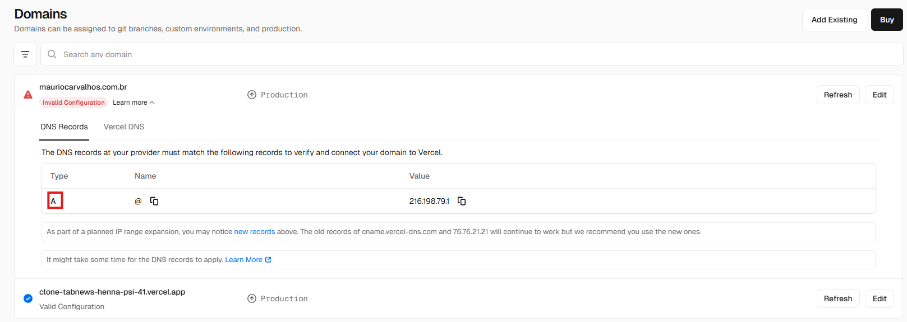
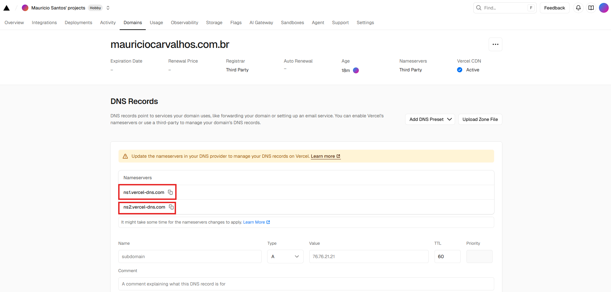
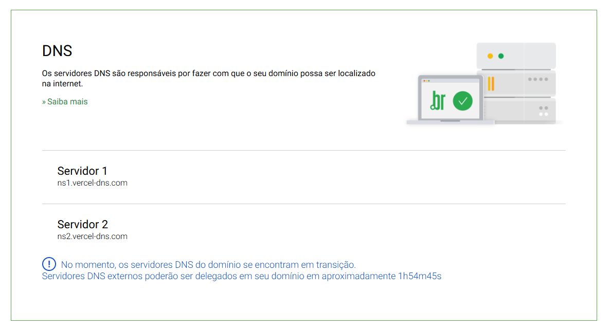

# Registrar um Domínio Próprio

## Ambientes
Durante o desenvolvimento, possuímos dois ambientes, sendo eles:

- **Produção:** Ambiente **final**, no qual o **cliente acessa**.
 

- **Homologação:** Ambiente de **desenvolvimento e testes**, onde a **equipe acessa**.
 

## Registrador de sites
Para registrar um `domínio` é necessário buscar um registrador de seu país. No Brasil, o mais popular é `registro.br`, mas há também o `HostGator`, `UOL Host`, `Locaweb`, entre outros...

- **Todos** podem reservar um domínio `.com.br`.
- `CPF` e `Email` são dados que ficam públicos após o cadastro.
 

## Registry
O `Registry` é responsável por manter todos os domínios armazenados. No caso do Brasil, este registro é o **<a href="nic.br">`nic.br` (Núcleo de Informação e Coordenação do Ponto BR)</a>**.
- Entidade sem fins lucrativos que administra os domínios desde 2005.
 

## Registrando um domínio
Caso o `domínio` esteja disponível e você adquira-o, o `Registry` envia os dados ao `TLD`. No caso do Brasil, o `TLD` também é administrado pelo `nic.br`.
Após isto, o `TLD` envia ao `Authoritative Server` os dados, finalizando o processo.
- Após o fim deste processo, qualquer pessoa pode acessar seu <i>site</i> através da Internet.
 

## Verificando o registro do site
Para verificar o registro do site, é possível utilizar a ferramenta <a href= "https://www.whatsmydns.net/">`WhatsMyDNS`</a>.
- Utilizar categoria `NS` para testar.
 

## Domínio do projeto
<a href="mauriciocarvalhos.com.br">mauriciocarvalhos.com.br</a>
 

---
---
---
 

# Precisamos dfe um `Servidor Autoritativo`
Para isto, utilizaremos um recurso da `Vercel` chamado `Vercel DNS`.
 

## A Record

`A` significa **address (endereço)**.

`Value` é o `Endereço IP` na `Vercel`.

- **Nota importante:** A `Vercel` recomenda um modelo de configurações, porém o `Registro.br` **obriga** a utilizar outra configuração.
    - `Registro.br` **obriga** a ter dois `Endereços DNS`, porém a `Vercel` recomenda apenas um.
 

## Mudando o Authoritative Server para a Vercel
Para mudar o `Authoritative Server` para a `Vercel`, basta habilitar a opção `Enable Vercel DNS` na tela do `domínio do projeto`.

A tela abaixo demonstra os **endereços** após a opção `Enable Vercel DNS` ser ativada.

 

Posteriormente, os **endereços DNS** gerados pela `Vercel` devem ser informados no `registro.br`.

**Nota:** Este processo demora no mínimo **2 horas** para entrar em vigor na `Internet`.
 

---
---
---
 

# Verificando manualmente um Endereço DNS
O comando `dig` pode ser executado no terminal para fazer a verificação manual.

## Instalando o dig
**1.** Executar no terminal o comando para atualização de pacotes disponíveis.
~~~ Terminal
sudo apt update
~~~
**Notas:**
`sudo`: Executa o comando como **administrador**.
`apt (Advanced Package Tool)`: É o gerenciador de pacotes.

**2.** Executar o comando para instalação dos pacotes necessários.
~~~ Terminal
sudo apt install dnsutils
~~~
**Nota:**
- `dnsutils` é um pacote com várias ferramentas que inclue o `dig`.

**3.** Executar o comando `dig`, que listará os `root servers`.

**4.** Executar o comando usando o `URL` e o termo `A` (`A Record`).
~~~ Terminal
dig mauriciocarvalhos.com.br A
~~~