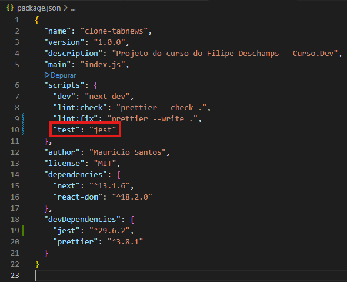
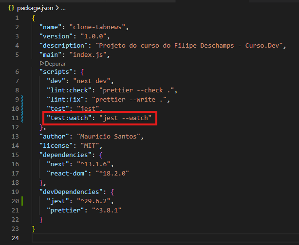
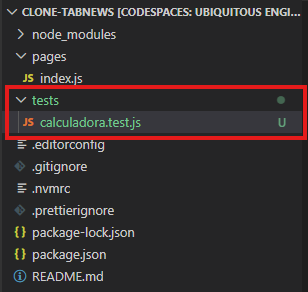
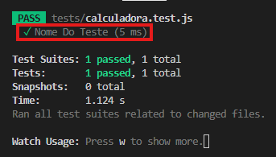
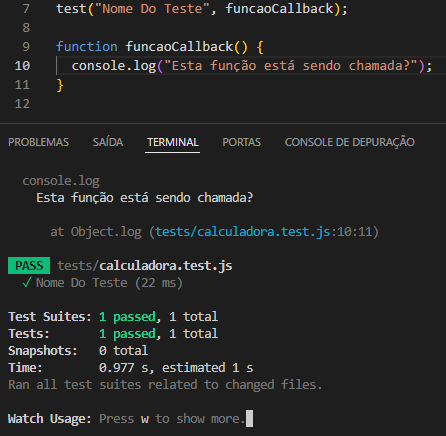
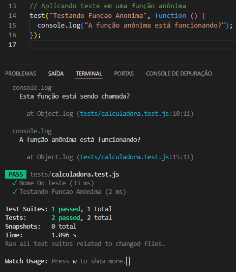
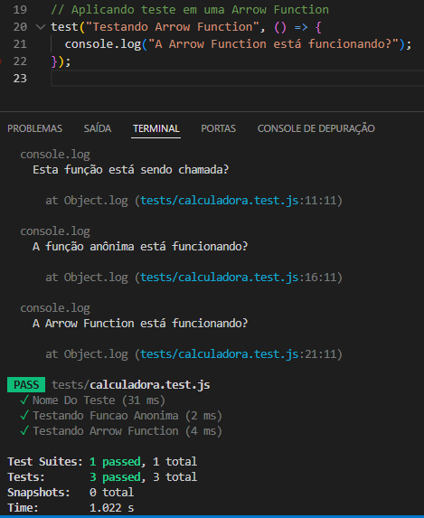
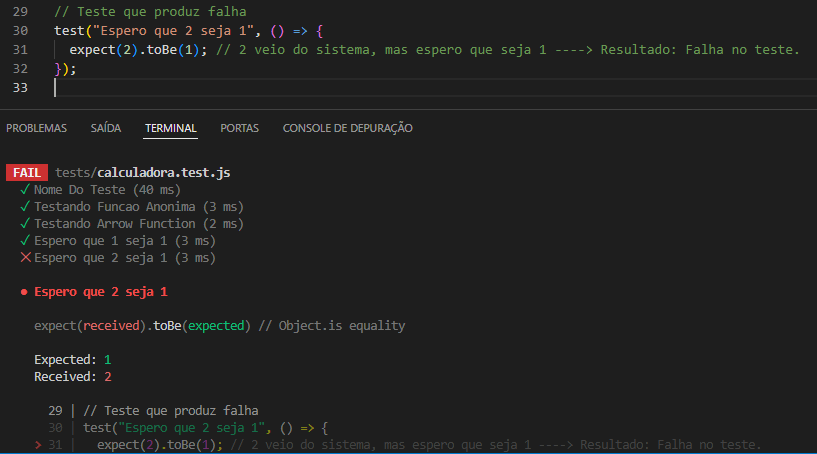
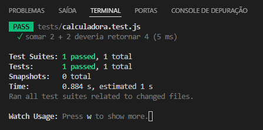

# Testes Automatizados: um caminho sem volta

## O que são Teste Automatizados
`Testes Automatizados` são etapas de verificação de código feitas automáticamente pela máquina. Estes testes fazem verificações repetidas após alterações no código para garantir que o código não "quebre".
Repetir inúmeras vezes vários testes seria uma tarefa massante que ocasionaria erro em algum momento, para isto, é possível definir vários testes para serem executados por vez.
 

---
---
---
 

# Instalar um Test Runner

## O que é um Test Runner
Podemos resumir `Teste Runner` como um **código que roda outros códigos (nosso código)**.
- Sequência de comandos a ser executada.
    - Forçar possibilidades tanto **positivas** quanto **negativas (dados inválidos, por exemplo)**.
    **Exemplo:** Tentar cadastrar um e-mail **válido** e posteriormente um e-mail **inválido**.

**Nota:** `Testes Automatizados` são baseados em **resultados esperados**.
 

## Regressão de um sistema
uma `Regressão` de sistema, indica que a versão mais recente do sistema começou a apresentar falhas em processo que funcionavam nas versões anteriores.

**Exemplo:**
- **Versão 1**
    - Sistema de cadastro de usuários **verifica corretamente** se um e-mail já foi cadastrado.
     

- **Versão 2**
    - Sistema de cadastro de usuários **verifica incorretamente** se um e-mail já foi cadastrado e **recadastrá-o novamente**.

No exemplo acima, **houve regressão**.
 

## Retornos do Test Runner
`Test Runners` retornam `Reports (Relatórios)` apresentando testes com **sucessos** ou **falhas**.
- Apresenta tanto de maneira **Visual** quanto **Programática**.

**Nota:** A maneira **Programática** permite implementação com `CI (Continuos Integration)` para evitar que erros sejam implementados.
 

## Watch
`Watch` é um termo referente a execução dos testes sob vigilância. Quando ele detecta que os arquivos do código foram alterados, iniciar os testes automatizados.
 

## Instalando o Test Runner (Jest)
~~~ terminal
npm install --save-dev jest@19.6.2
~~~

**Nota:**
- O pacotes será instalado no modo para execução apenas no ambiente de desenvolvimento.
- A versão sugerida é a `19.6.2`.
 

## Criadno um script para o Jest
Para criar um `script` para execução, basta ir até o arquivo `package.json` e adicioná-lo nos scripts do projeto.

 

## Testando a instalação do pacote
Para testar a isntalação do pacote, basta **executar o script**.
~~~ Terminal
npm run test
~~~
 

**Nota:** O comando retornará um erro informando que não há testes criados, porém significa que a instalação foi bem sucedida.
 

**Curiosidade:** Como o `Script` `test` é um padrão no desenvolvimento, é possível rodar o comando de forma simplificada.
~~~ Terminal
npm test
~~~
 

## Configurando um Watch para o Jest
Para configurar um `Watch`, basta criarmos um novo `Scipt` no arquivo `package.json`.

 

Para executar o `Script`, basta utilizar:
~~~ Terminal
npm run test:watch
~~~
 

**Nota:** Ao executar este `Script`, o `terminal` ficará executando o `Jest` em tempo real. A cada vez que algum arquivo for salvo, o `Jest` será executado.

**Importante:** Para sair do `Terminal`, basta apertar a tecla `Q` ou o comando `CTRL`+`C`.
 

---
---
---
 

# Criar um "Teste de Teste"

## Modo Arqueiro
O `Modo Arqueiro` refere-se a busca de tentar chegar a um alvo. No nosso caso (Desenvolvimento), é possível **lançar a flecha primeiro** e **posicionar o alvo depois**.

- **Alvo Educacional (Será descartado posteriormente):** Programar uma **calculadora**.
 

## Criando o primeiro arquivo de teste
**Nota importante:** Ligue o `Test Runner (Jest)` executando seu `script`.
~~~ Terminal
npm run test:watch
~~~
 

Por convenção, o padrão para criação de arquivos é dentro de um diretório chamado `tests`.

Dentro deste diretório, criaremos o primeiro arquivo de `testes automatizados`, chamado **<i>calculadora.test.js</i>**.
 

**Notas:** 
- Ao salvar o arquivo, o `Test Runner (Jest)` acusará um erro, informando que a "bateria de testes" precisa ter **no mínimo um teste**.
- O `Jest` reconhece um arquivo de teste por meio do `.test`.
 

## Configurando o arquivo de teste
Para criar um teste, basta utilizar a função `test()` passando **dois argumentos**, onde o primeiro é o **nome da função** e o segundo, **uma função <i>callback</i>**.

~~~ JavaScript
test("Nome_do_Teste", funcaoCallback)
~~~
 

Após a criação da **função de teste**, é necessário crial a **função de callback**. 
(Pode ser criada após a função de teste mesmo).
 

~~~ JavaScript
function funcaoCallback(){}
~~~
 

Quando o arquivo for salvo e o `Jest` rodar novamente, ele informará sucesso.

Para verificação se tudo está funcionando corretamente, é possível adicionar um pequeno trecho na função `funcaoCallback`.

 

### Criando um teste com uma `Função Anônima`
Também é possível passar uma `Função Anônima` como `parâmetro` para a função de teste (`test`).

 

### Criando um teste com uma `Arrow Function`
Também é possível criar uma `Arrow Function` diretamente como `parâmetro` na função de teste.

 

## "Esperando" um resultado com Expect
`Expect` é uma função utilizada **dentro** da função `test` para definir o resultado esperado do teste. A **Funão encadeada** `.toBe()` receberá como parâmetro o valor que se espera receber.

Vamos pensar no exemplo, "espero que 1 seja 1".

~~~ JavaScript
test("Espero que 1 seja 1", () =>{
    expect(1).toBe(1);
})
~~~
**.toBe** **Função encadeada** que compara o termo do `Expect` com o desejado.

**A frase das funções pode soar como:**
> "Espero que 1 seja 1".
 

## Funcionamento de um teste
Dentro do teste, podemos considerar **2 lados**, utilizando as direções. À esquerda temos o **valor gerado dinâmicamente** e à direita, temos o **valor esperado**.

> variavelGenerica == valorEsperado ??????
>
> "O **valor dinâmico** que recebi na **Esquerda**, é o mesmo que o valor que eu **espero** na **Direita**?"
 

**Notas:
- O **valor esperado** pode ser `Hardcoded` (Implícito direto no código).
- O **valor que vem do sistema**, chega pelo `Expect`, enquanto o **valor esperado** está no `toBe`.
 

## Falha em um teste
Quando um teste falha, ele mostra o **resultado recebido** e o **resultado esperado**.
 

**Notas:**
- `Expected`: Valor **esperado**.
- `Received`: Valor **Recebido**.
 

## Softcoded VS Hardcoded
- `Softcoded`: Valor **dinâmico**, gerado pelo próprio código.
- `Hardcoded`: Valor **fixo**, definido à mão no código.
 

---
---
---
 

# Criar um "Teste de Verdade"

## CommonJS
`CommonJS` **é um padrão** criado no início do `JavaScript`, quando ele não possuia um **sistema oficial de módulos** embutido na linguagem. Na sexta versão da linguagem (2015), foi disponibilizado pelo `TC39` (Comitê responsável pelo `JS`) um sistema oficial (`ES6 Modules`).

**Nota:** `ES` significa `EcmaScript`, nome original do `JavaScript`.
 

## Transpiling
Tecnologia capaz de converter um código para uma versão compatível de outra tecnologia.

**Nota:** O `Jest` (versão utilziada no projeto) não suporta os `módulos` do `JavaScript`. Dentro deste contexto, utilizaremos `Transpiling` para conseguir versões que sejam suportadas em ambas tecnologias.
 

## Importando um módulo
Para importar um **módulo JavaScript**, basta declarar uma variável e atribuir um valor **<i>require</i>** a ela.
Vamos considerar importar o módulo `caluladora` no arquivo `calculadora.test.js`.
~~~ JavaScript
const calculadora = require("../models/calculadora.js")
~~~
 

## Criando um teste real
Para criar um teste real, utilizaremos a função `somar`, **importada** do **`Módulo Calculadora`**.

~~~ JavaScript
test("somar 2 + 2 deveria retornar 4", () => {
  const resultado = calculadora.somar(2, 2);
  //console.log("Valor de Resultado", resultado); ==> Linha apenas para exemplo.
  expect(resultado).toBe(4);
});
~~~
 

**Notas importantes:**
- Criamos uma variável chamada `resultado` para armazenar o retorno da função `soamr`.
- **"Esperamos"** que o resultado de retorno da função **seja 4.**" (`Expect()` e `toBe()`).
 

## Resultado do teste automatizado (Sucesso)

 

## TDD (Test Drive Development / Desenvolvimento Orientado a Testes)
Por meio desta técnica, começamos especificando o resultado esperado em um teste e depois desenvolvemos o programa para atingir este resultado.
