# A maior briga no universo dos Testes Automatizados

## Teste de Unidade VS Teste de Integração
Um `Teste de Unidade` leva em consideração apenas um módulo individual do sistema. Podemos citar como exemplo, o Módulo `Calculadora.js` (Este módulo funciona de maneira independente, sem usar nenhuma outra parte do sistema).
Já um `Teste de Integração`, testa módulos que **dependem de outros do sistema, camadas ou mesmo infraestrutura**.
 

### Hierarquia da pasta `test`
 

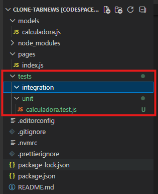
 

## Teste End-to-end (E2E)
Um `Teste End-to-end` é mais avançado que os anteriores que pode simular até mesmo a **interface vista pelos usuários**.
 

## Velocidade dos testes
A velocidade dos testes é **inversamente proporcial a quantidade**, ou seja, **"quanto mais testes, mais devagar é o processo"**.
 

## Pirâmide de testes
Criada em 2009 por **Mike Cohn**, a `Pirâmide de Testes` é um diagrama que demonstra o fluxo ideal de testes, onde é recomendado fazer mais testes na base do que no topo da pirâmide.
 

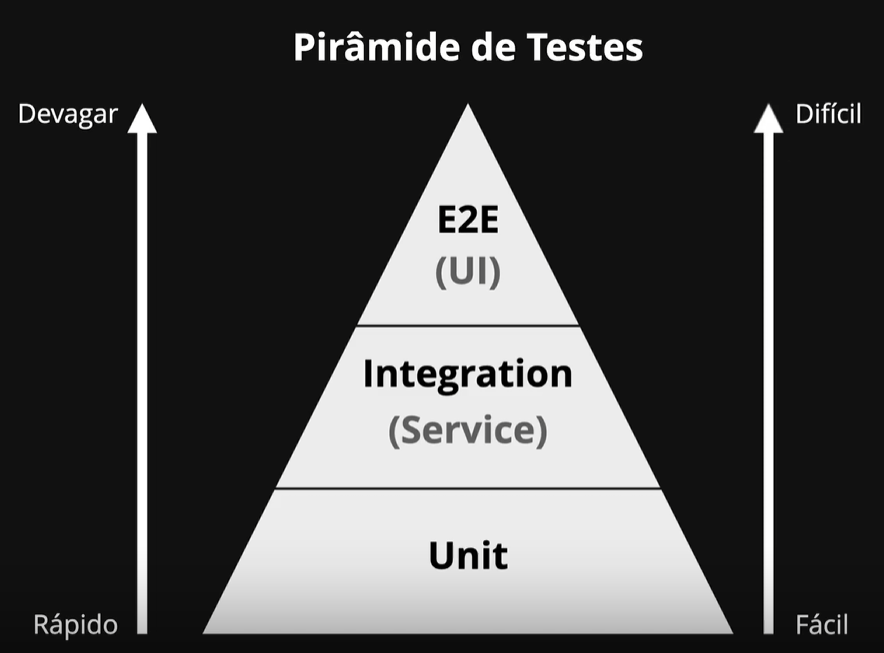

**Notas:**
- `Integration Test` também é chamado de `Teste de Serviço`.
- `E2E` é um teste que engloba `Teste de UI` (**Interface do usuário**).
- **Modelo considerado obsoleto por alguns**, onde atualmente `Testes de Integração` são considerados **mais importantes** do que `Testes Unitários`.
    - Alguns consideram a importância dos testes com base em sua velocidade.
 

**Importante**
> Ajuste os testes de seu sistema conforme a necessidade.

 

## Empresa API First
Uma empresa `API First`, prioriza a disponibilização de `API's REST` para utilização em outros sistemas com integração.
 

---
---
---
 

# Encostando a mão no Protocolo HTTP

## Endpoint
`Endpoint` pode ser traduzido como "`Ponto Final`" ou "`Local Final`" que uma requisição (Geralmente `HTTP`) chegará.
 

> Qualquer endereço na Internet, **é um `Endpoint`**.

 

Geralmente, oo termo `Endpoint` está ligado ao termo `API (Application Programming Interface)` (**Interface de Programação de Aplicações**).
 

## API (Interface de Programação de Aplicações)

### Interface
Uma `Interface` é uma camada que o usuário tem acesso. Geralmente uma tela exibida na aplicação, mas também podemos pensar em um **microondas**, onde a pessoa não precisa saber como ele funciona "por dentro", apenas precisa saber como operar os botões frontais dele (isto é a interface dele).

> A ideia principal de uma **interface**, é **facilitar a utilização de algo**.

**API's** podem ser **programáveis** e sua função depende de quem utilizará a **interface**, humano ou computador. Uma `Interface WEB` é destinada a leitura e operação humana, já uma `programável`, tem foco na integração com sistemas e computadores.
 

### TUI
`Text-based User Interface` ou `Interface de Usuário Baseada em Texto` é uma interface desenvolvida com apenas texto que geralmente é executada no `Terminal`.

### GUI
`Graphical User Interface` ou `Interface de Usuário Gráfica`, são telas mais harmoniosas para seres humanos, como **sites dentro de navegadores** por exemplo.
 

## NEXT lidando com requisições (Construindo a API do Projeto)
O `Next` possui `File-based routing` que permite que requisições externas sejam **<i>roteadas</i>** por meio de configurações de arquivos.
 

### Convenção padrão do NEXT
Por padrão no `Next`, ao criar um diretório chamado `api` dentro do diretório `pages`, fará com que todos arquivos ali se tornem **uma rota pública** da `API` do site.
 

## Criando a rota Status
Para criar a `rota` **status**, basta criarmos um arquivo chamado `status.js` dentro de `pages/api/`.
 

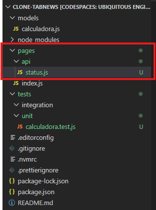

**Nota importante:** A nomenclatura do arquivo irá gerar uma `rota` com este nome.

**Exemplo:** <a href="mauriciocarvalhos.com.br/api/status">mauriciocarvalhos.com.br/api/status</a>
 

## Criando a função de status
Dentro do arquivo `status.js`, criaremos uma `função` para retornar o status.

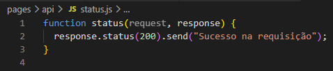

**Notas importantes:**
- `request`: Tudo que o "Mundo" envia para sua apçlicação.
- `response`: Tudo que sua aplicação envia para o "Mundo".
- `200`: Por padrão, enviar o código `200` para quem pediu (fez uma `request`) significa sucesso.
- `send`: Enviar algo para quem fez a **requisição** (`request`).
 

## Testando a API
Para testar a API, basta executar a aplicação no `Terminal`.
~~~ Terminal
npm run dev
~~~

Logo em seguida, acessar o site (Disponibilizado na `localhost` pelo próprio `GitHub`) e adicionar ao final `/api/status`.
 

**Exemplo:**

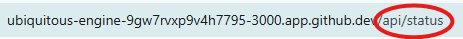

## Erro na requisição
Ao executar os passos acima, **ocorrerá um erro**.

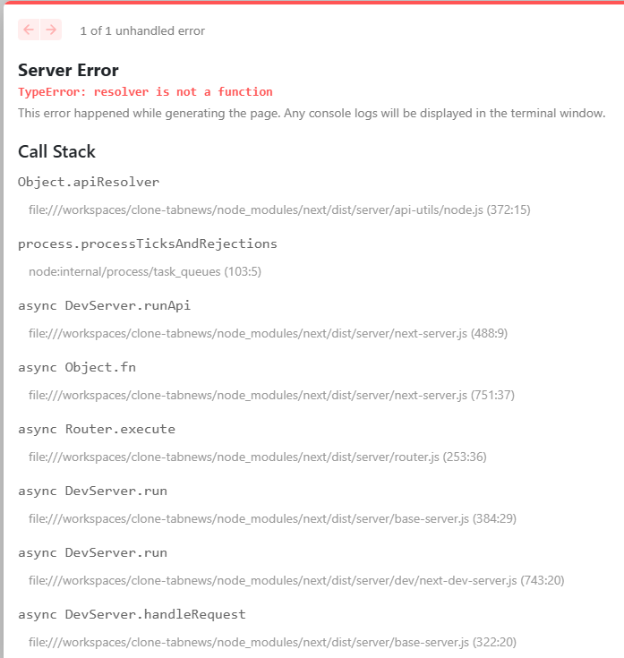

O erro é **causado pela falta da exportação da função no JavaScript (`status.js`)**.
 

### Corrigindo o erro
Para corrigir o erro, basta definir a expportação na `função` <i>status</i> no `status.js`.

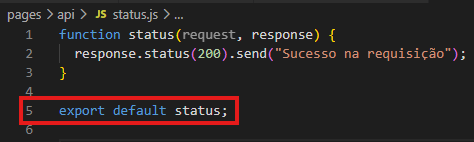

O resultado final, apresentará a mensagem definida na `função`.

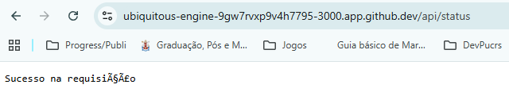

**Notas:**
- O método `send()` não define o `charset (Character Set)` (conjunto de caracteres de tipo de teclado).
 

## Respondendo com um JSON
Podemos também enviar a resposta (`response`) como um `JSON`.

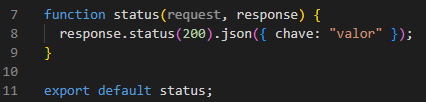

Um `JSON` é um objeto que pode ser **serializado** e é composto sempre por **chave** e **valor**.
 

### Resposta em JSON
O navegador mostrará a visualização do `JSON` recebido.

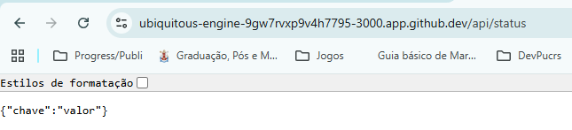

**Nota:**
- `JSON` suporta `Charset` `UTF-8` (inlui acentos da língua Portuguêsa).
- Para uma exibição mais bonita no navegaor, é possível utilizar a extensão `JSON Viewer`. <a href="https://chromewebstore.google.com/detail/json-viewer/aimiinbnnkboelefkjlenlgimcabobli">Disponível na loja de extensões do navegador</a>.
 

## Testando a API no CURL
`Curl (Client URL)` é uma ferramenta que permite testar `requisições HTTP`. Ele atua como `Cliente` durante a **requisição** (`Request`).

Para testar a **requisição** (`Request`) basta rodar o seguinte comando no terminal (Divida o terminal para evitar cancelar a excução do servidor em andamento):

~~~ Terminal
curl http://localhost:3000/api/status
~~~
 

**Resultado esperado:**
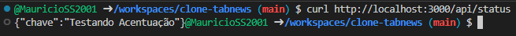

**Notas importantes:**
- O `localhost` refere-se à máquina remota criada pelo `GitHub` no exemplo.
 

## Verificando tudo da Requisição (Request) e da Resposta (Response) no CURL
Para verificar todos detalhes que o `CURL` deisponibiliza basta usar um dos comandos abaixo no `Terminal`:

~~~ Terminal
curl https://localhost:3000/api/status --verbose
~~~
~~~
curl https://localhost:3000/api/status -v
~~~
 

**Resultado esperado:**

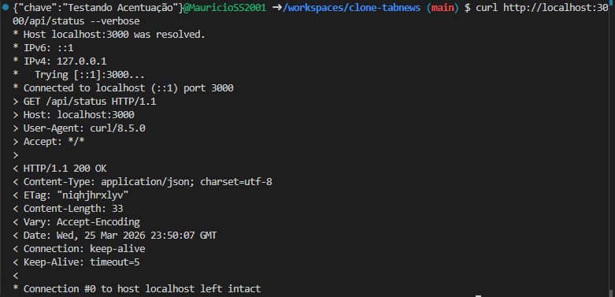

**Tipos de log:**
- **Linhas com `*`:** Informam o que o `CURL` fez **internamente**.
- **Linhas com `>`:** Informam o que foi enviado para o `Servidor` (`Request/Requisição`).
- **Linhas com `<`:** Informam o que o `Servidor` nos enviou (`Response/Resposta`).
    - Recebemos `Header/Cabeçalho` e `Body/Corpo` na resposta.

**Notas:**
- Quando um navegador de Internet recebe uma resposta que inclua `HTML` e/ou `CSS` + `JS`, ele **renderiza a página WEB**.
- `CURL` não tem capacidade de renderização, então apenas mostra a resposta recebida.
 

---
---
---
 

# Não é magia! (é Protocolo)

## Acessando um site por IP
Acessar um site por `Endereço IP`, depende do **tipo de servidor**. Um `Servidor` que está `hospedando (host)` apenas um site, fornece-o quando acessamos o `Endereço IP`. Isto é diferente quando pensamos em `Virtual Hosts`, uma técnica para `hospedar vários sites em apenas um servidor (Host)`. Neste caso, o `Endereço IP` é o mesmo para vários `sites`.

## Testando acessar nosso site
Para tentar acessar nosso site, utilizaremos o `A Record` disponibilizado pela Vercel, **<a href="76.76.21.21">76.76.21.21</a>**. Este `Endereço IP` fará o **navegador** ser redirecionado para o **<a href="vercel.com">site da Vercel</a>**. Mas por que isto acontece?
 

## Verificando a requisição feita com o Curl
Para fazermos o mesmo teste, podemos utilizar o `Curl` para enviar a `Requisição ao servidor`. Para isto, utilizaremos o comando abaixo no `Terminal`.

~~~ Terminal
curl https://76.76.21.21
~~~
 

## Analisando o erro recebido
Ao executar o comando do passo anterior, receberemos um erro no `Terminal`.

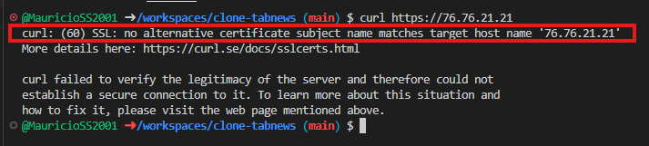

O **erro 60**, refere-se ao **SSL**, ou seja, ele não conseguiu encontrar um `Certificado` para o `hostname` (**76.76.21.21**).

- **Notas:**
    - O **certificado** geralmente está associado à um `Domínio`.
 

### Ignorando a verificação de segurança
Para ignorarmos a necessidade do certificado, podemos utilizar o comando abaixo:
~~~ Terminal
curl https://76.76.21.21 --insecure
~~~
 

**Resultado:**
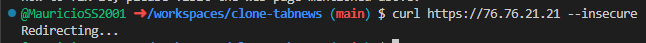

Ao executar o comando **ignorando a verificação de segurança**, recebemos um informativo de que fomos `redirecionados` (Assim como o **navegaodr WEB** fez).
 

## Análise completa da Requisição
Para analisarmos completamente a requisição, podemos utilizar o comando abaixo no `Terminal`.

~~~ Terminal
curl https://76.76.21.21 --insecure --verbose
~~~
 

**Resultado:**

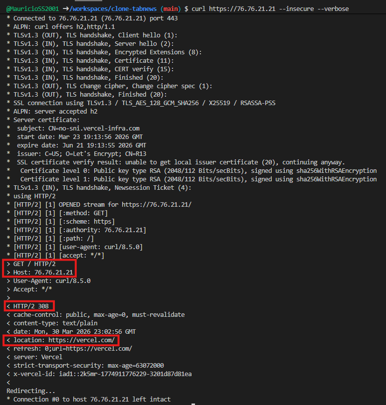

Por meio do **parâmetro** `--Verbose` é possível ver detalhes da `Requisição` e da `Resposta`.
O primeiro bloco marcado mostra que o `Curl` executou uma `Requisição` do tipo `GET` para o `Servidor` (**Endereço: 76.76.21.21**).
O segundo bloco marcado, mostra que a `Resposta` do `Servidor` para o `Curl` foi o código **308** (Cabeçalho retornado), que significa "movido permanentemente".
O terceiro bloco marcado, apresenta a `Localização`, ou seja, o `link` para qual a `Requisição` deve ser redirecionada (<i>https://vercel.com</i>).
 

### Por que o Navegador WEB conseguiu ser redirecionado, enquanto o Curl teve problemas na verificação de segurança?
Quando digitamos o `Endereço` **76.76.21.21** no `navegador Web`, ele fez uma requisição por meio do `protocolo HTTP` (Não utilizou o protocolo HTTP**S**).

- **Notas:**
    - Utilizar o `endereço` por meio do protocolo HTTP**S** **irá gerar erro** de segurança no navegador. (<i>https://76.76.21.21</i>)
 

## Acessando nosso site da maneira correta
Para acessar de maneira correta nosso site no `servidor` da **Vercel** (que possuí inúmeros sites hospedados), basta **incluir um `cabeçalho` na `requisição`**.
Para isto, basta executar o seguinte comando no `Terminal`:

~~~ Terminal
curl https://76.76.21.21 --insecure --verbose --header 'Host:mauriciocarvalhos.com.br'
~~~
 

**Resultado:**

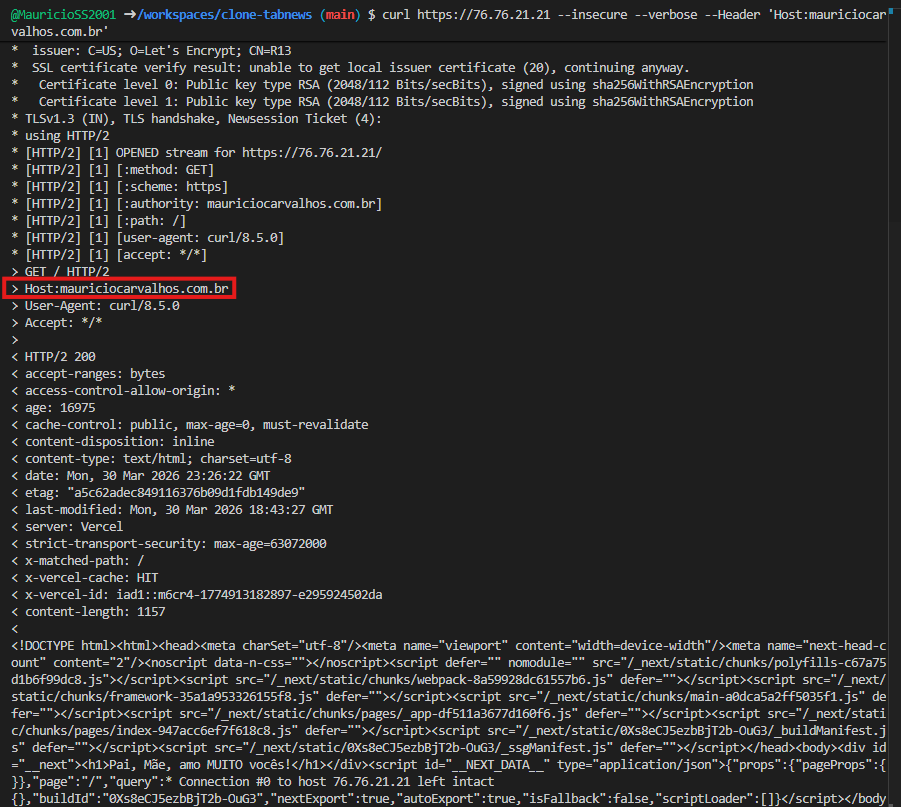

Dentro da `Requisição` feita pelo `Curl` ao `Servidor`, foi enviado o `Cabeçalho` contendo as informações do <i>site</i> que queriamos acessar (Bloco marcado).
 

**Conclusão IMPORTANTE:**
com este teste, podemos comprovar que a partir do `cabeçalho`, podemos acessar o site desejado em um `servidor` que **hospeda vários <i>sites</i>**.

> O **Cliente** é responssável por informar o site que deseja acessar no `Cabeçalho` enviado ao servidor.
 

---
---
---
 

# Versionamento de API e Endpoint "/status"

## Mudanças Breaking Change e Non-Breaking Change
- **`Breaking Change`**: Quando um `Script` integra-se a sua `API` e uma alteração feita por você na `API` quebra ele.
    - Mudança que **causa quebra** na integração.
    - **Exemplos:** 
        - Mudar uma **propriedade** chamada `nome_de_usuario` para `username`.
        - Alterar **tipo de dado** de **retorno**.
     
    - Alterações que **NÃO mantém compatibilidade** com versões anteriores, são chaamdas `Backward compatibility`.

 

- **`Non-Breaking Change`:** Alterção que não quebra `Scripts` (que integram a sua `API`) após você alterar a `API`.
    - Mudanças que **NÃO causam quebra** na integração.
    - **Exemplos:**
        - Adicionar uma **nova propriedade**. (Sujeito a revisão)
 

### Consumidores e fornecedores

- **`Consumidor`**: Quem está **consumindo** (pedindo) os dados para `API`.
 

- **`Fornecedor`**: Quem está **fornecendo** (hospedando e dando manutenção) os dados da `API`.
    - Cuida do **versionamento da `API`** também.
 

## URI Path Versioning e Header Versioning (Versionamento de uma API)

### URI Path Versioning
`URI Path Versioning` refere-se à presença da **versão da `API`** no **caminho**.

- **Exemplos:**
    >https://tabnews.com.br/api/v1/contents
    
    >https://tabnews.com.br/api/v2/contents

Dentro dos endereços das `API's` acima é possível ver a versão pelos indicaroes **v1** e **v2**.
 

### Header Versioning
`Header Versioning` refere-se ao versionamento por meio do envio do **cabeçalho** (por parte do `cliente`) informando qual versão ele deseja utilizar.
- **Exemplo:**
    > Accepts-version: 1.5
    > Accepts-version: 2023-09-21

**Nota importante:** O **exemplo acima** refere-se a um conteúdo que o `cliente` envia no **cabeçalho** de uma `requisição` para `API`.
 

**Curiosidade**
> Algumas empresas mantém os dois tipos para `API's` para caso um dia queiram usar o outro.
 

## Criando o versionamento da API no nosso sistema
para criar o versionamento por meio  de `URI Path Versioning`, criaremos um diretório chamado `v1` dentro do diretório `api` do projeto.

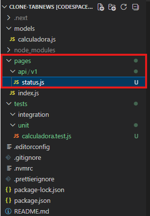

**Nota importante:** O arquivo `status.js` foi movido para dentro de `api\v1\`.

Com a alteração feita, a `requisição` causará **erro 404** caso não seja feita para o novo `endereço`.

~~~ navegador
https://ubiquitous-engine-9gw7rvxp9v4h7795-3000.app.github.dev/api/v1/status
~~~

**Nota importante:** O `link` acima foi gerado automaticamente pelo `GitHub` por causa do uso do `Codespaces`.
 

### Organizando o endereço
Para organizarmos melhor, criaremos um **diretório novo** chamado `status` dentro do diretório `v1`. E moveremos o arquivos `status.js` para dentro dele, renomeando o arquivo para `index.js`.

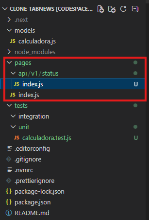

**Notas importantes:** 
- A partir deste momento, o arquivo `status.js` passará a se chamar `index.js` e ficará dentro do diretório `pages\api\v1\`.

- Podemos inserir vários arquivos dentro do diretório `status` para diferentes páginas.
 

### Criando diretórios (pastas) no VS Code
Para aninharmos diretórios durante a criação de um no `VS Code`, podemos criar subdiretórios utilizando `/` com o nome seguinte.

> api/diretorioNovo/subdiretorioNovo

> api
> |- diretorioNovo
> |. |- subdiretorioNovo

 

## Organizando os testes
Criaremos alguns diretórios novos dentro do diretório `integration`. 
(`/api/v1/status`)

~~~
integration/api/v1/status
~~~
 

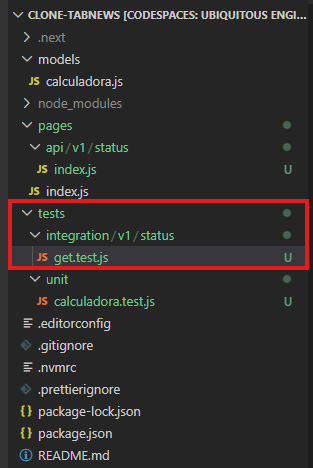

Dentro dos novos diretórios, também será craido o **arquivo de teste** chamado `get.test.js`.
 

### Explicando o Get
Denro do `Protocolo HTTP` sempre é necessário **especificar um método** que definirá qual ação você deseja realizar contra o `servidor`.
 

Método|Ação a ser realizada
-|-
**GET** | Obter (pegar) dados do `servidor`
**POST** | Postar (enviar) dados ao `servidor`
**DELETE** |
**PUT** |
**PATCH** |

Sempre que acessamos uma `página WEB` no `navegador`, estamos realizando um `GET` para o `servidor`.

Podemos olhar a `requisição` nas **feramentas do navegador (F12)**.

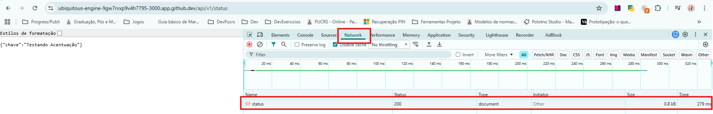

**Nota:** `Requisição` do tipo `GET`.
 

## Criando o teste da API
Para criarmos o teste da `API` (usando `GET`), criaremos o seguinte teste dentro do arquivo `get.test.js`.

~~~ JavaScript
test("GET to /api/v1/status should return 200", async () => {
  const response = await fetch("http://localhost:3000/api/v1/status");
  //console.log(response.status); // Retorna undefined
  //console.log(response); // Retorna Promise
  // Promise ---> Promessa de valor futuro

  expect(response.status).toBe(200);
});
~~~

Este teste será responsável pela verificação do retorno do método `GET` na `requisição HTTP`.

### Analisando o teste
O quesito principal do teste é **verificar se houve o retorno do código 200** na `requisição`.

**Para que serve cada coisa?**
- `fetch`, é um **método(função)** para realizar uma `requisição` (do tipo `GET`) ao `servidor`.
- `async` é um termo que define que uma função será **assíncrona**.
- `await` é um termo que faz a execução do código **parar** até que o processo seja realizado. (No exemplo, o método `fetch`)
 

**linhas comentadas**
Considerando inicialmente o teste criado sem o recurso `async` e `await`, houveram alguns problemas durante a execução.

- A **primeira linha comentada** mostrava que `response.status` retornava o valor `undefined`. Isto ocorria porque o método `fetch` **ainda não havia recebido o retorno do `servidor`**.

- A **segunda linha comentada** mostrava que `response` recebia o valor `promise`. `Promise` é o valor de que em algum momento futuro, a variável receberia um valor retornado pelo `servidor`. (Como `fetch` não havia retornado ainda, havia uma **promessa** como valor)
 

### Funcionamento de async e await
- **async**
`async` define a função como assíncrona, podendo parar a execução do código até que dada tarefa seja completa. Dentro do nossso teste, era necessário esperar o `servidor` enviar uma resposta antes de prosseguirmos.
 

- **await**
`await` é o que define qual parte do código sera **interrompida até que a tarefa seja concluída**. Dentro do nosso exemplo, a tarefa necessária era a função `fetch` e precisávamos esperar o `servidor` retornar um valor.
 

## Testando uma Regressão
Com o teste feito, é possível testar um **regressão** no sistema.
Ao mudar o nome do diretório de `status` (`/pages/api/v1/status`) para `health`, o teste acusa o **erro 404 (não encontrado)**.
 

## Teste final
Podemos ver os `deploys` feitos pelo `GitHub`.

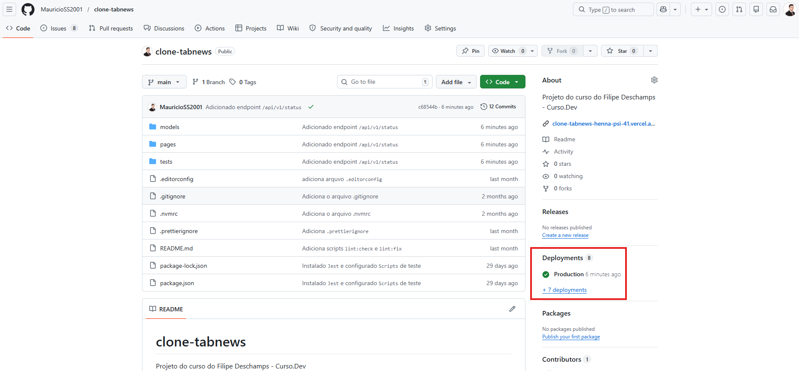

Acessando o último da lista, é possível ver as alterações.

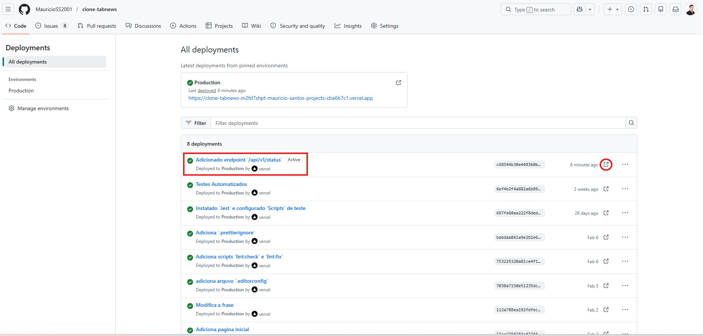

Ao adicionar o `endereço` que configuramos a `API`, será possível ver o resultado.

**Nota importante:**

Como o `commit` foi feito na `branch` `main`, as alterações já estão disponíveis no `ambiente de produção` (ambiente que o cliente final acessa).

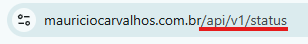