# Qual Banco de Dados escolher?

### Future Proof (À Prova de Futuro)
Tecnologias que não se tornarão obsoletas tão rápido. Continuam tendo **valor à longo prazo**.
 

## Requisitos para Escolha de um Banco de Dados

### DBMS (Data Base Management System)
Também conhecido como `SGBD` (`Sistema de Gerenciamento de Banco de Dados`) em Português, é considerado um **"pacotão" que engloba todo o Banco de Dados**. Dentro dele existem duas partes, sendo uma para **armazenar os dados (O Banco)** e **"quem fará a gestão dos dados (controlar, proteger, etc...) (Esta camada fica à frente do Banco de Dados, é o `DBMS`)"**.
 

**Exemplos de `DBMS`:**
- MySQL
- PostgreSQL - Postgres
- Oracle Database
- Microsoft SQL Server
- MongoDB
 

**Notas importantes:**
> **Os exemplos acima, tecnicamente não seriam considerados Banco de Dados, mas sim, DBMS's.**

> **Mesmo assim, consideraremos-os como "Banco de Dados".**

 

#### Tipos de Banco de Dados
**O tipo do Banco de Dados é um dos critérios mais importantes para a escolha**. **Cada tipo possui estruturas/modelos de dados** que impactarão nos casos de uso do sistema.

**Exemplos:**
- **Bancos de Dados Relacionais (SQL)**
- **Bancos de Dados Não Relacionais (NoSQL)**
    - Armazenamento de documentos em `JSON` ou `BSON`.
    - Armazenamento de dados com **Chave-Valor**.
- **Bancos de Dados Série Temporal**
    - Utilizados principalmente em **dados de monitoria**.
- **Bancos de Dados Espaciais**
    - Utilizados principalmente em **dados geográficos**.
 

### Query (Consultar)
Processo de consulta por meio de comandos no `Banco de Dados`.

### Migration (Migrações)
Alterações na estrutura do `Banco de Dados` automatizadas e com histórico (versionamento).
 

## SQL e NoSQL

### SQL
`SQL (Stuctured Querry Language)` (**Linguagem de Consulta Estrutural**) é uma **linguagem declarativa**, criada em **1974** usada para usada para **consultar ou manipular** dados de um **Banco Relacional (SQL)**.
Criada dentro de laborátorios da `IBM`, após uma década, se tornou um padrão entre bancos deste tipo (`Relacionais`).
Alguns comandos são praticamente padrões entre os `Bancos(relacionais)` como `SELECT`, `INSERT`, `UPDATE` e `DELETE`.
 

## Estágios de Flexibilidade

**Menor para maior (3 até 1)**

> **3 - Interface Visual (Pré construída)**
> **2 - Excel (Muitos dados, porém se torna muito pesado)**
> **3 - SQL (Fazer o que quiser com os dados ou utilizar um Framework com conector para Banco de Dados)**

 

## Querry (O que escolher para fazer Querrys e Migrations?)

### ORM
`ORM (Object-Relational Mapping)` (**Mapeamento Objeto-Relacional**) é uma **abstração** para conectar **o mundo dos Bancos de Dados(Relacionais) com os Objetos (Programação orientada à Objetos)**.
Esta **abstração** permite uma melhora visual nas consultas (`querrys`).
Podemos ver isso no exemplo abaixo

~~~ SQL
SELECT COUNT(*) FROM USERS;
~~~

**Podemos transofrmar a consulta acima em:**

~~~
Users.count();
~~~
 

O `ORM` transformará este **método** em ***querry real** e retornará os resultados para você.

**Notas:** 
- Os comandos acima servem para consultar o número total de usuários registrados no sistema.
- Um `ORM` **abstrai** a conexão com o `Banco de Dados`.
 

## Sequelize
`Sequelize` é um `ORM` que suporta `Bancos de Dados` conhecidos como `Oracle`, `Postgres`, `MYSQL`, `MariaDB`, `SQLite`, `SQL Server`, entre outros.
 

**Exemplo de uso**
Utilizando o `ORM Sequelize`, podemos mudar de `MYSQL` para `MariaDB` sem haver impacto, visto que este `ORM` suporta os dois `Bancos de Dados`.
A **Abstração** fará a parte da compatibilidade.
 

## CTE - Common Table Expressions
Este recurso permite realizar `querrys` **recursivas** que permite montar a relação entre consultas (No caso do `TabNews`, as respostas).
 

## Módulo PG (Node Postgres)
`PG` é um módulo `Node` que abstrai o mínimo possível de um `Banco de Dados Postgres`.
- Utilizaremos ele para realizar `querys`.

## Migrations
É um **arquivo que instrui uma modificação na estrutura** do `Banco de Dados`.
- Adicionar um **novo campo** em uma **tabela**, por exemplo.
- O **versionamento** destes arquivos é importante para melhor controle na aplicação das alterações.
    - Isto ajuda na implementação em diferentes ambientes como `homologação` e `produção`.

### Node-pg-migrate
É um **módulo** compatível, inclusive com o `Módulo PG`
- Irá **gerenciar** as `migrations`.

## Anotações importantes desta aula
- Utilizaremos `Postgres` como `Banco de Dados` da aplicação.
- "Não importa muito a escolha do `Banco de Dados` no início do projeto, pois a maioria é equiparável e **dará conta do seu projeto**.
 

---
---
---
 

# Por que o Docker dominou o mundo?

### Máquina Host
A `Máquina Host` é a que **hospeda** o/a serviço/aplicação.

**Questões que podem levar a diferentes comportamentos de um mesmo serviço em diferentes máquinas:**
- Hardware
- Sistema Operacional (SO)
- Patches de Segurança
- Softwares Satélites
- Antivirus
- Linguagem do Sistema Operacional (SO)
- Fuso Horário

> Mesmo que duas pessoas sigam o mesmo tutorial do mesmo modo, são hosts (ambientes) diferentes.

 

## Máquina Virtual (Virtual Machine / VM)
`Máquinas Virtuais` são máquinas (com Sistema Operacional) virtualizadas dentro de uma máquina real. Podemos considerar como exemplo Uma máquina física com `Windows 11` que tem uma máquina virtual com `Windows XP` nela.
Este recurso é popular por meio do <i>software</i> `VirtualBox`, criado em 2007 pela `Oracle`.
 

**Nota:** `Máquinas VIrtuais` **suportam Sistemas Operacionais diferentes do hospedeiro**.
- Podemos criar uma `Máquina Virtual` com `Debian (Linux)` dentro de uma máquina física que possui `Windows`.
 

### Por que máquinas virtuais davam muito trabalho?
Porque era necessário configurar manualmente cada `Máquina Virtual` nova. Cada configuração necessitava de recursos em versões específicas, como **Sistema Operacional**, entre outros.
 

### Administrando Máquinas Virtuais
Em 2010, **Mitchell Hashimoto**, fundador da `HashiCorp` (Empresa que desenvolveu `TerraForm` posteriormente) criou o `Vagrant`, uma tecnologia capaz de administrar `máquinas virtuais`, **automatizando** a criação das mesmas.
Para criar uma `Máquina Virtual`, era possível utilizar um **arquivo que especificava os softwares que deveriam ser instalados**.

**Exemplo de arquivo:**

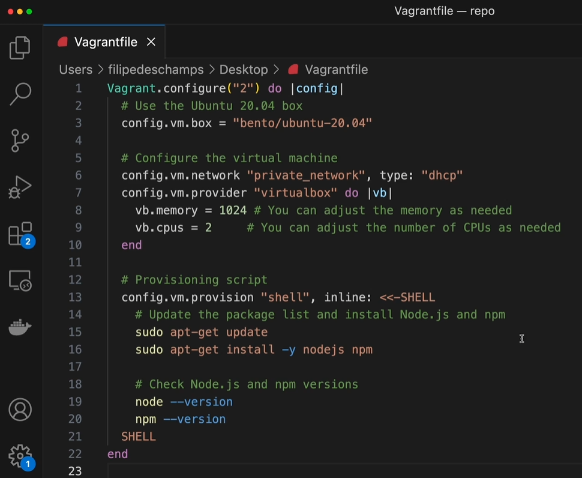

**Nota:** O arquivo acima **é apenas um exemplo** e não constitui parte do projeto.
 

### O uso de recursos pela Máquina Virtual
`Máquinas Virtuais` se tornavam honerosas para as `Máquinas Hospedeiras` visto que consumiam muitos recursos físicos, principalmente **memória RAM** e **processamento**.
 

## Docker
Em **2013,** **Solomon Hykes** decobriu importantes recursos disponíveis no `Linux`. 
**O primeiro recurso** era o `Namespaces` que podia isolar processos dentro da mesma instância do Sistema Operacional. Os processos podiam se enxergar apenas entre eles se necessário.
O **segundo recurso** era o `Cgroups (Control Groups)` que permitia um controle granular sobre os recursos do sistema, como alocar apenas certa quantidade de **memória RAM** ou **processamento**.
Juntando estas descobertas, ele conseguiu fazer uma abstração que chamou de `Docker`.
Inicialmente, o `Docker` **não criou nada novo**, apenas **criou uma interface mais amigável com os recursos já existentes**.
 

**Linha do Tempo**

O recurso chave do `Docker` foi desenvolvido em **2013** e se chama `PID Namespace`. Este recurso é capaz de **isolar totalmente um processo, inclusive compartilhando o ID de processo mas em `Namespaces` diferentes**.
 

### O que o Docker pode fazer
O `Docker` é capaz de agrupar recursos dentro da `Máquina Hospedeira` **sem a necessidade virtualizar um novo Sistema Operacional**, embora "rode" um `Linux` dentro do `Sistema Operacional Hospedeiro`.
Vale destacar também que `Docker` possui uma **interface programável (User Interface/UI)** muito mais amigável para o usuário.
 

## Máquina Virtual VS Container
Utilziar um `Container` ao invés de uma `Máquina Virtual` **necessita menos recursos da Máquina Física (Hospedeira)**.

**Comparação:**

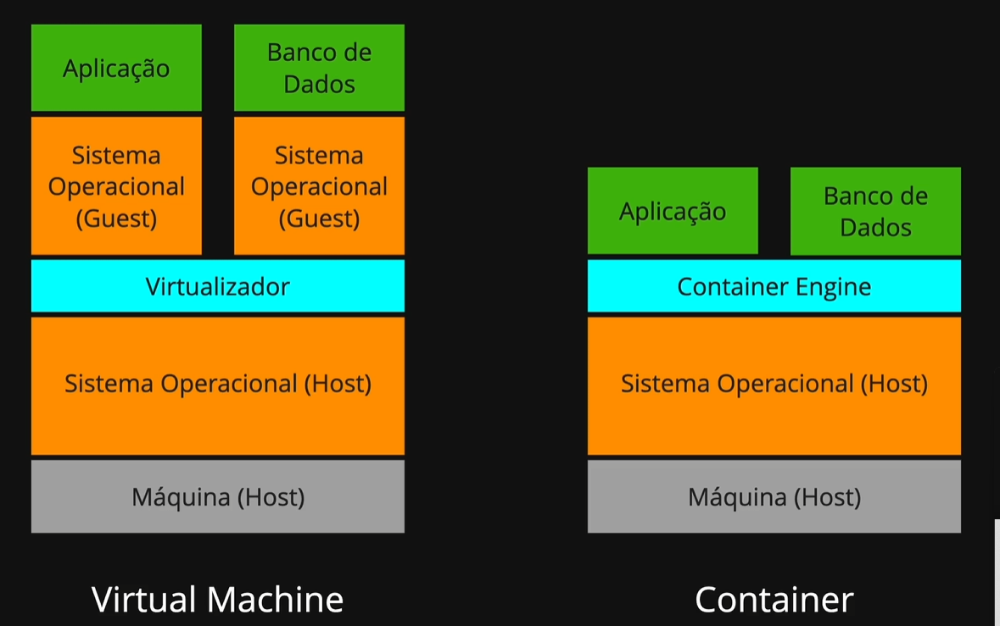

- **Notas:**
    - Quanto mais alta a "torre", mais recursos de <i>hardware</i> da `Máquina Host (Hospedeira)` são consumidos.
    - `Virtualizador`: Programa que virtualiza um Sistema Operacional como o `VirtualBox`, por exemplo.
    - `Container Engine`: Programa que gerencia os `Containers` como o `Docker`, por exemplo.
    - `Container Engine` se aproveita de alguns recursos disponíveis no `Sistema Operacional Hospedeiro (Host)` para **consumir menos recursos de <i>Hardware</i>**.
     

    ---
    ---
    ---
     

    # Subir Banco de Dados (Local)

    ## Docker Compose
    `Docker Compose` é uma ferramenta que permite **administrar os containers do Docker**.
     

    ## Containers do projeto
    - **Banco de Dados**: `Container` responsável pelo `Banco de Dados`.
     

    - **Mailcatcher**: `Container` responsável por um **serviço que simula um servidor real de e-mail**.
        - Será usado também nos `Testes de Integração`.
 

## Docker no VS Code
O `Docker` vem **instalado por padrão no `CodeSpaces` (Ambiente remoto do `GitHub`)**.
 

### Verificando a versão do Docker
Para verificar a versão do `Docker`, basta rodar o seguinte comando no `Terminal`:

~~~ Terminal
docker --version
~~~
 

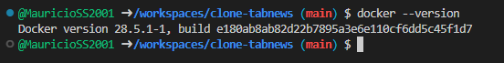
 

### Verificando a versão do Docker Compose
Para verificar a versão do `Docker`, basta rodar o seguinte comando no `Terminal`:

~~~ Terminal
docker-compose --version
~~~
 

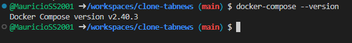

**Nota importante:** O comando `docker-compose` **SERÁ DESCONTINUADO**, então, futuramente utilizaremos o seguinte comando:
 

~~~ Terminal
docker compose --version
~~~
 

**Note que "compose" virou um SUBCOMANDO**.
 

### Listando comandos Docker
Para lsitar os comandos disponíveis do `Docker`, basta utilizar o seguinte comando no `Terminal`:

~~~ Terminal
docker compose
~~~
 

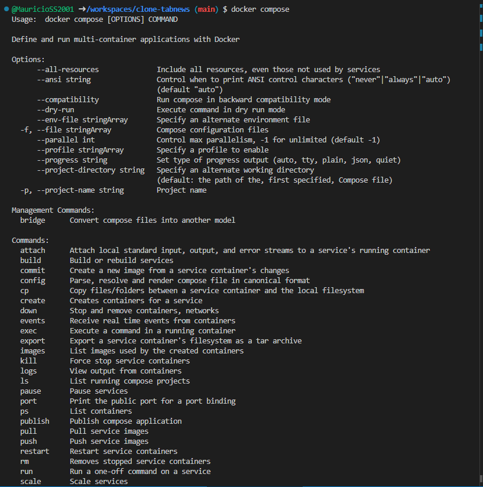
 

## Criando o arquivo de configurações do Docker
Este arquivo será responsável por dfefinir os recursos (como bibliotecas, por exemplo) e suas versões necessárias para um `container`.

Para isso, criaremos um arquivo chamado `compose.yaml` na **pasta raíz do projeto**. Este nome é a **convenção padrão**.

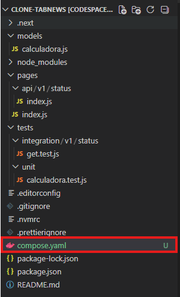

**Nota:** Anteriormente o arquivo tinha o nome de `docker-compose.yaml`.
 

### Arquivo YAML
`YAML` significa "`YAML Ain't Markup Language` / `YAML Não É Linguagem de Marcação`".

Em resumo, ele é um arquivo para **guardar dados, configurações...** e **não ser uma linguagem de marcação de textos, como `HTML`, por exemplo**.

Ele é um `Superset` do `JSON`, embora **pareça muito** com `Python`. A semelhança se deve ao fato de que ele **define a hierarquia dos elementos por indentação (`YAML` guia-se por espaços (`space`) em branco)**.
 

## Declarções dentro do arquivo `compose.yaml`
Para começar, criaremos uma chave chamada `services` para mapear os serviços que utilizaremos

Após a criação da chave `services`, declararemos os seviços que serão "levantados". Os serviços serão o `database` e o `mailcatcher`. O serviço `servico3` será utilizado como exemplo.
 

**O arquivo `compose.yaml` ficará da seguinte maneira:**
~~~ compose.yaml
services:
  database: 
    ...
  mailcatcher: 
    ...
  servico3: 
    ...
~~~
 

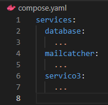
 

**Nota:** Os **caracteres ponto (".")** foram utilizados para **ilustrar a indentação**.
 

## Imagem Docker
Uma `Imagem Docker` pode ser gerada de duas maneiras.
- A partir de um arquivo `dockerfile`.
- Estando já disponível em repositórios públicos (`Docker Hub`, por exemplo).
 

## Contrução de um Container

**Primeira Etapa:** Tudo começa no arquivo `Dockerfile`, que possui os comandos que irão formar o `ambiente virtual` com o `serviço` que quisermos consumir.
 

**Segunda Etapa:** O arquivo `Dockerfile` é **compilado** em uma `Imagem`.
- Na prática, é um **arquivo binário**.
- Toda alteração feita em um arquivo `Dockerfile` **já compilado, necessitará recompilar para gerar uma nova `Imagem`**.
 

**Terceira Etapa:** Gerar um `container` a partir da `Imagem`.
- Todo `Container` é uma `Imagem` "rodando".
- Nos conectaremos no `Container`.
 

**Nota:** `Containers` gerados a partir **da mesma imagem, sempre serão IDÊNTICOS**.
 

**Etapa extra:** Podemos fazer o **<i>upload</i> de uma imagem para um repositório de imagens**. 
Um dos repositórios de imagens mais conhecido é o `Docker Hub`.
 

**Imagem Ilustrativa:**

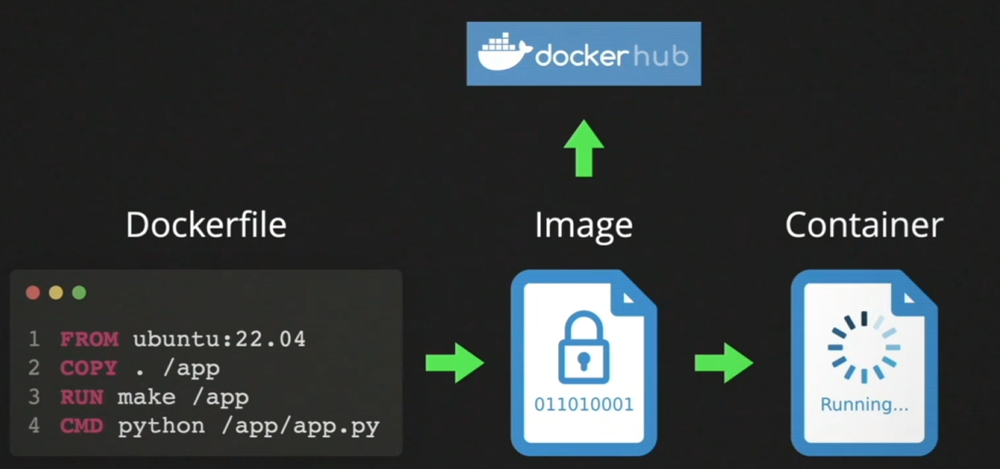
 

## Imagens no Docker Hub

**Link do DockerHub:** <a href="https://hub.docker.com/">https://hub.docker.com/</a>

Para começarmos, acessaremos a `Imagem` **oficial do `Docker`**.
**Disponível em:** <a href="https://hub.docker.com/_/postgres">https://hub.docker.com/_/postgres</a>
 

**Dica de boa prática:**
> **Não puxar imagem genérica (qualquer versão), mas sim definir a versão.**

**Nota:** No projeto, utilizaremos o `Docker 16-alpine3.22`.
 

## O que significa `Alpine`
`Docker Alpine` roda em cima de um `Alpine Linux`, que **consome a menor quantidade possível de recursos**.

**Curiosidade:** A `Imagem` base do `Alpine Linux` pesa **menos que 10 MB**.
 

## Configuração final do `compose.yaml`
Alteraremos a configuração do arquivo `compose.yaml` para a seguinte:

~~~ compose.yaml
services:
    database:
        image: 'postgres:16-alpine3.22'
~~~
 

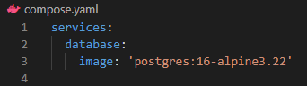
 

**Notas:**
- `image` define qual imagem deve ser utilizada, onde `postgres` é o nome da imagem oficial disponível no `Docker Hub` e a **versão é especificada após os dois pontos ('':'')**.
 

## Rodando o `Container`
Para criarmos a `Imagem` e "rodarmos" o `Container`, basta digitar o seguinte comando no `Terminal`:
 

~~~ Terminal
docker compose up
~~~
 

**Execução do comando:**
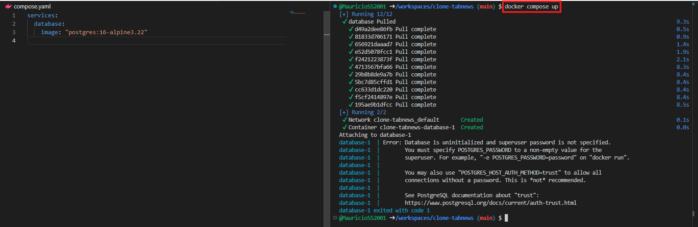
 

## O erro ocorrido
O `Docker` não conseguiu "levantar" o `container` devido a um erro causado porque **não foi especificada uma senha para o `superuser (Super Usuário)` do `Banco de Dados`**.
 

**Erro no `Terminal`**:

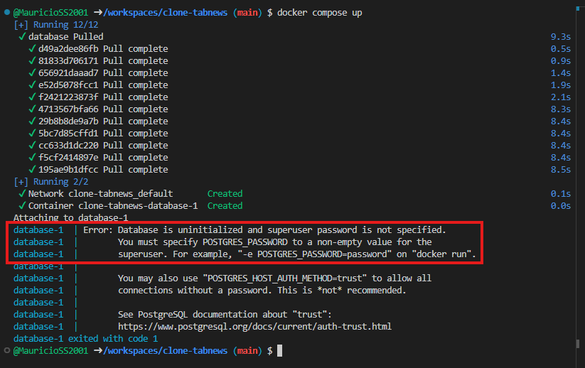
 

**Notas importantes:**
- Embora tenha ocorrido o erro, o `Docker` **funcionou**.
    - A `Imagem` foi baixada.
    - O `Container` **foi criado**.
    - O `Postgres` **foi inicializado**.
 

## Lendo a documentação da `Imagem` do `Postgres`
A `Documentação` da `Imagem` do `Postgres` explica que existem várias `variáveis de ambiente` importantes para utilizar esta `Imagem`.
 

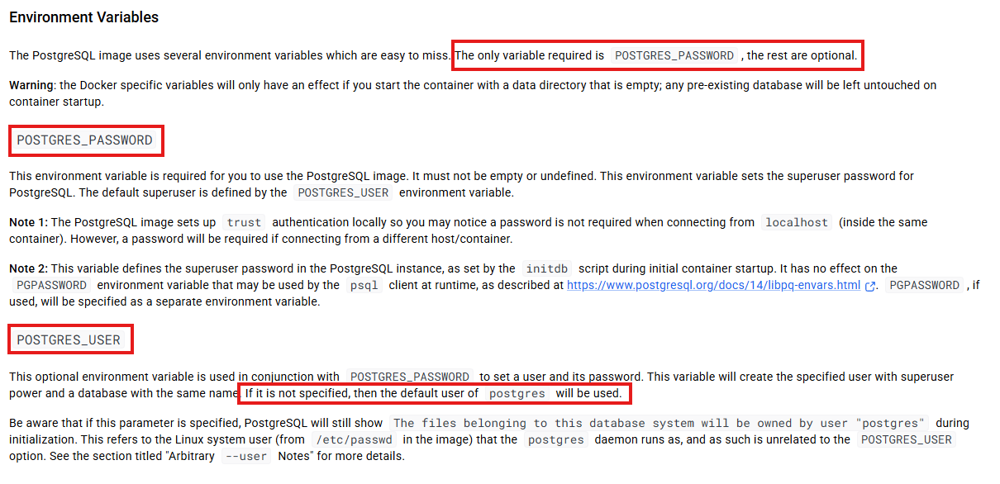

Conforme informado na `Documentação`, apenas a `variável de ambiente` `POSTGRES_PASSWORD` **é obrigatória**, sendo as demais opcionais.

A `Documentação` também informa que caso não seja criada uma `variável de ambiente` `POSTGRES_USER`, o `Postgres` criará um `superuser (Super usuário)`, chamado **"postgres"**.
 

## Criando uma `Variável de Ambiente` no `compose.yaml`
Para definirmos uma `Variável de Ambiente`, utilizaremos o termo "`environment`" **dentro da `Imagem` desejada (Indentação)**.
Logo após a criação do "ambiente" (`ènvironment`), criaremos a `Variável de ambiente`, chamada `POSTGRES_PASSWORD`, **atribuindo uma senha à ela**.
 

**Arquivo `compose.yaml`:**

~~~ Docker
services:
  database:
    image: "postgres:16-alpine3.22"
    environment:
      POSTGRES_PASSWORD: "local_password"
~~~
 

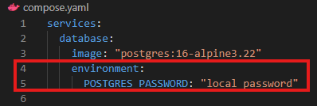
 

**Nota:** 
A **Indentação** fará com que o `Docker` saiba que há um ambiente dentro da `Imagem` `Postgres`, definido pelo termo `environment`. Ele também saberá que dentro deste ambiente, existem as `Várias de Ambiente`.
 

## Rodando o `container` novamente
Para rodarmos o `container`, utilizaremos novamente o comando abaixo no `Terminal`:

~~~ Terminal
docker compose up
~~~
 

### Analisando o console
Ao executar o comando, o `Docker` realiza os processos novmaente para **compilar a `Imagem`** e "rodar" o `Container`.

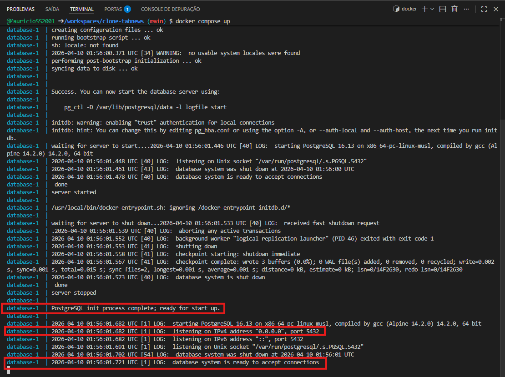

**Análise do `Terminal`:**

- A **primeira marcação** informa que o **`Container` está pronto para ser inicializado**.
 

- A **segunda marcação** informa que o **`Banco de Dados` está rodando na PORTA 5432**.
 

- A **terceira marcação** informa que o **`Banco de Dados` está PRONTO para receber (aceitar) conexões**.
 

**Nota importante:**
O `Container` **informa que está PRONTO para receber conexões**, porém **NÃO HÁ portas abertas**, impossibilitando conectarmos a ele.
 

## Teste de integração no `Container`
`Testes de Integração` como `Jest` e `Continous Integrator (CI)` executarão comandos como `docker compose up` para **rodar os testes com o `Container`.
 

---
---
---
 

# Se conectando no Banco de Dados (Local)

## Consultando status de Containers
Para consultar o **<i>status</i>** do nosso container, utilizaremos o seguinte comando no `Terminal`:

~~~ Terminal
docker ps
~~~
 

O comando `ps` significa `process list (Lista de Processos)` e é padrão em distribuições `Unix`.
 

**Resultado obtido:**

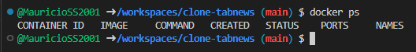
 

Por padrão, o `Docker` **mostra apenas `Containers` em execução**. Para exibirmos os `containers`, mesmo que **não estejam em execução**, utilizamos o seguinte comando no `Terminal`:
 

~~~ Terminal
docker ps --all
~~~
**OU**
~~~ Terminal
docker ps -a
~~~
 

**Resultado obtido:**

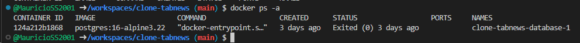
 

**Nota importante:** Durante a aula, o professor demonstra que recebeu o `Exit Code` **255** ao executar o comando.

### Exit Codes
Assim como no `Protocolo HTTP` poossuimos **códigos** que indicam **sucesso, erro, etc..**, nos **processos temos os `Exit Codes`**.

`Exit Codes` **são informados no encerramento do processo** e informam se o processo obtevesse **sucesso** ou algum **erro**.

Por padrão, **o código 0** indica **sucesso** e qualquer outro valor acima dele, indica **erro/falha**.
 

**Notas:**
- `Continuous Integrator (CI)` verifica o `Exit Code` para **aceitar ou recusar** as açterações.
 

## Verificando logs de um Container
Para verificarmos os `logs` de um `container`, basta utilizar o seguinte comando no `Terminal`.

~~~
docker logs nomeContainer
~~~
 

**Notas:**
- O nome do `Container` deve ser informado para exibição de seus `logs`.
 

**Execução do comando:**
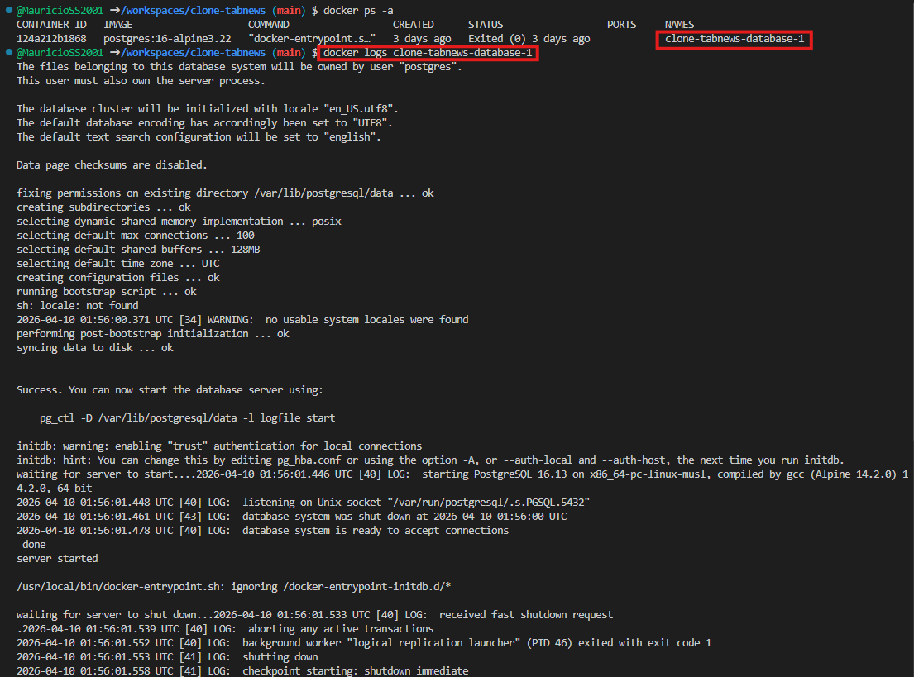
 

## Saída Graceful/Gracefully
O termo `Graceful` é traduzido como **gracioso(a)**. Ele indica que um processo terminou sua execução **de maneira esperada** (sem apresentar erros, falhas, etc...).
 

## Conexões no Container
ROdaremos novamente o `Container` agora com o comando abaixo no `Terminal`:

~~~
docker compose up
~~~
 

## Conexão ao Banco e relação Cliente-Servidor
A partir deste momento, o `Container` com `Postgres` é um `Servidor`, e qualquer `Cliente` pode se conectar a ele.

**Tipos de `Cliente`:**
- `Cliente` com **interface gráfica**.
- `Cliente` de **linha de comando**.
- `Cliente` dentro do código `Backend` da **aplicação**.
 

## PSQL
`PSQL` é uma ferramenta oficial do `Postgres`, que trabalha com `Linha de Comando`.
 

#### Parando o Container
Pararemos agora a execução do `Container` por meio da execução do atalho no `Terminal`:
`CTRL` **+** `C`.

## Container Detached
Quando um `Container` é executado de modo `Detach`, ele **"roda desacoplado do `Terminal"`**.

**Notas:**
- O serviço (`Postgres`) **será executado em `Background`**, possibilitando que utilizemos o `Terminal`.
 

Para **executarmos o `Container` de modo `Detach`**, utilizaremos o seguinte comando no `Terminal`:
 

~~~ Terminal
docker compose up --detach
~~~
**OU**
~~~ Terminal
docker compose up -d
~~~
 

**Execução do comando:**
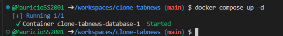

**Nota:**
Embora o `Terminal` esteja aceitando comandos, o `Container` do `Postgres` **está sendo executado em <i>Background</i>**.
 

### Verificando se o Container está em execução
Para verificarmos se o `Container` está sendo exccutado, utilizaremos o comando que exibe os `Containers` em execução:
 

~~~ Terminal
docker ps
~~~
 

**Resultado da execução:**

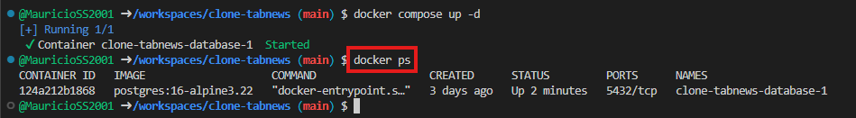
 

## Instaladno o Cliente (Client) do Postgres
Para isntalarmos o `Cliente` do `Postgres`, utilizaremos os seguintes comandos no `Terminal`:
 

**Atualizar o `apt`:**
~~~ Terminal
sudo apt update
~~~
Este comando irá **atualizar** a **lista de pacotes** deste `gerenciador de pacotes` (`apt`).
 

**Instalar o `Cliente` (`Client`):**
~~~ Terminal
sudo apt install postgresql-client
~~~
Este comando irá **instalar apenas o `Cliente` (`Client`)** do `Postgres`.
 

**Nota:** Durante a instalação, confirme com **"Y"** a instalação do **pacote**.
 

### Comando `psql`
Ao executar o comando `psql` no `Terminal`, ocasionará um erro devido a falta de configurações como **credenciais**, **localização**, **porta**, entre outros...
 

## Executando o comando `psql` com parâmetros
Para executarmos o comando `psql` **passando parâmetros**, definiremos os mesmos no `Terminal`.
 

~~~ Terminal
psql --host=localhost --username=postgres --port=5432
~~~

**Notas:**
- `host` é o parâmetro que identifica onde o `postgres` **está sendo executado**.
 
- `username` é o parâmetro que define o usuário que está acessando. Quando criamos o `Container`, não definimos o `username` do `superuser`, então o `postgres` utilizou o padrão, **"postgres"**.
 
- `port` é o parâmetro que define a porta em que o `Banco de Dados` **está rodando (sendo executado)**. (**Porta padrão do `postgres`**)
 

## Analisando o erro
Ao executarmos o passo anterior, irá surgir um erro no `Terminal`.

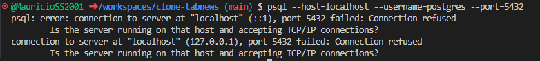

Este erro é causado **porque o `Container` não está expondo nenhuma porta para o "Mundo externo"**.
 

## Expondo as portas do `Container`
Para **expor as portas** do `Container`, basta configurarmos no arquivos `compose.yaml`.

~~~ compose.yaml
services:
  database:
    image: "postgres:16-alpine3.22"
    environment:
      POSTGRES_PASSWORD: "local_password"
    ports:
      - "5432:5432"
~~~
 

**Imagem do código:**

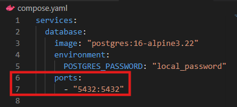

**Notas:**
- O traço `-` indica uma lista dentro do `yaml`.
- O modelo de portas funciona como:
    **"portaExterna:portaContainer"**
    - A **primeira porta  (esquerda)** refere-se a **porta do "Mundo Externo"**. (Poderia ser qualquer porta).
    - A **segunda porta (direita)** refere-se a **porta do `Container`**. (O `postgres` utiliza a **5432** como padrão)
 

### Rodando o comando de conexão novamente
Para tentarmos conectar ao `Container`, utilizaremos o seguinte comando novamente:
 

~~~ Terminal
psql --host=localhost --username=postgres --port=5432
~~~
 

**Erro recebido:**

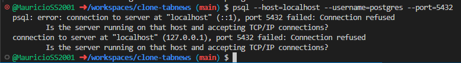
 

### Como resolver este erro?
O erro aconteceu porque as alterações não entraram em vigor no `Container`. Poderíamos **destruir e rodar novamente o `Container`** por meio dos comandos:
 

**Destruindo o `Container`:**
~~~ Terminal
docker compose down
~~~
 

**Executando o `Container` novamente (para recriar um novo):**
~~~ Terminal
docker compose up
~~~
 

## Resolvendo o problema com apenas um comando
Podemos utilizar um comando para **forçar recriar o `Container`**.
 

**Comando para recriar o `Container`:**
~~~ Terminal
docker compose up -d --force-recreate
~~~
 

**Execução do comando:**

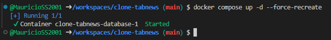
 

**Notificação do `CodeSpaces (GitHub)`:**

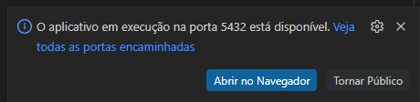

Este informativo alerta que **há uma nova porta disponível (Porta 5432)**.
 

## Executando mais uma vez o comando `psql`
Iremos agora executar novamente o comando do `psql`:
 

~~~ Terminal
psql --host=localhost --username=postgres --port=5432
~~~
 

**Execução do comando:**

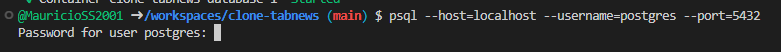

**Nota:** O `Postgres` pede agora a **senha do usuário**.
 

**Importante:**
- O **"Mundo externo"** e o `Container` acabaram de **se conectar**.
 

## Inserindo a senha e testando o `Banco de Dados`

### Informando a senha
Agora digitaremos a **senha do usuário**, definida no **arquivo `.yaml`** (A senha é "local_password").

Durante a digitação os caracteres **não aparecerão no `Terminal` por questão de segurança**.
 

### Testando o banco
Se tudo deu certo, o termo `postgres` aparecerá no `Terminal`.

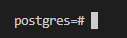
 

Para testarmos o funcionamento do `Banco de dados`, podemos utilizar a seguinte `query (Consulta)`.

~~~ SQL Terminal
SELECT 1 + 1;
~~~
 

**Execução do comando:**

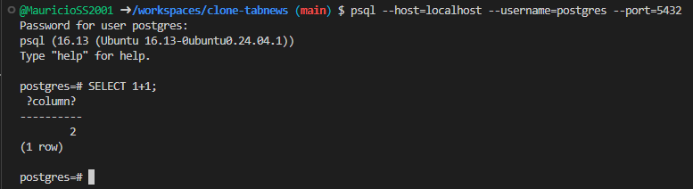
 

## `Clientes (Clients)` se conectando no `Banco de Dados`
Com o exemplo desta aula, vimos que **qualquer `Cliente (Client)` (Que seja `Postgres`) pode se conectar ao `Banco de Dados`**.
 

**Notas:**
- Utilizamos o `psql` (`Cliente` de `Linha de Comando`) para fazer a conexão.
- Utilizaremos o `pg` para fazer uma conexão pelo `Backend` da nossa aplicação.
 

## Desconectando do `Banco de Dados`
Para **desconectarmos** do `Banco de Dados`, utilizaremos o seguinte comando:

~~~ terminal
\q
~~~
 

**Notas:**
- `q` vem do termo **"<i>quit</i> (sair)"**.
 

**Execução do Comando:**

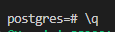
 

### Destruindo o `Container`
Agora **destruiremos o ``Container`:

~~~ Terminal
docker compose down
~~~
 

**Execução do Comando:**

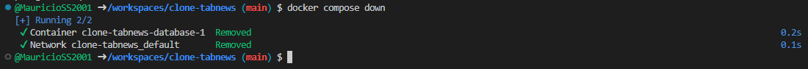
 

## Organizando o Projeto
Criaremos um diretório chamado `infra` **na raíz do projeto** e moveremos o arquivo `compose.yaml` para dentro dele.
 

**Estrutura do Projeto:**

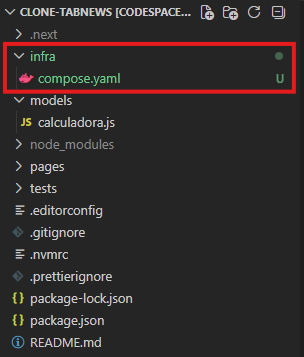

Ao movermos o arquivo `compose.yaml`, o `Docker` falhará ao executar o comando que executa o `Container`:

~~~ Terminal
docker compose up
~~~

Isto acontece, pois o `Docker` não consegue mais localizar o arquivo `compose.yaml`.
 

### Executando um `Container` especificando onde o `compose.yaml` está
Para executarmos o `Container` especificando para o `Docker` onde o arquivo `compose.yaml` está, basta utilizarmos um dos seguintes comandos:
 

~~~ Terminal
docker compose --file infra/compose.yaml up
~~~
**OU**
~~~ Terminal
docker compose -f infra/compose.yaml up
~~~
 

## <i>Commitando</i> as Alterações
 

**Adicionando arquivos ao <i>commit</i>:**
~~~ Terminal
git add -A
~~~
 

**Adicionando mensagem ao <i>commit</i>:**
~~~ Temrinal
git commit -m 'Adicionado arquivo de configuração `compose` com serviço de `Banco de Dados`'
~~~
 

**Empurrando alterações (<i>push</i>):**
~~~ Terminal
git push
~~~