# Criar módulo "database.js"

## Instaladno o `pg`
Para instalar o `pg` (Módulo para conexão ao `Banco de Dados`), utilizaremos o seguinte comando no `Terminal`:
 

~~~ Terminal
npm install pg@8.11.3
~~~
 

**Nota:**
- Para padronização (usar mesma versão que o Professor), utilizaremos a versão `8.11.3` no projeto.
 

**Execução do comando:**

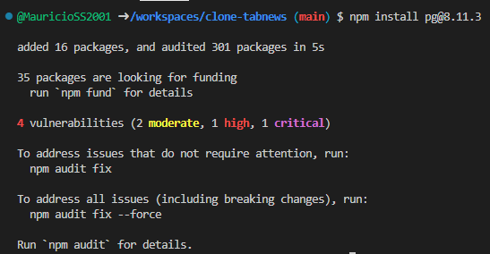
 

### Vulnerabilidades nas Dependências
Ao instalarmos um `pacote` pelo gerenciador (`npm` por exemplo), somos informados de que há problemas de segurança por meio do **aviso de vulnerabilidades**.

Em alguns casos, o pacote **pode** ter vulnerabilidades de segurança. O termo **"pode"** foi utilizado, porque **também existem falsos positivos**.

A cada atualização do `pacote`, estas vulnerabilidades são corrigidas.
 

## `Testes de Integração` e atualização de `pacotes`
`Testes de Integração` são importante pois tembém **verificam o funcionamento de `módulos` do sistema após atualizações de `pacotes`**.
 

## Executando os `Testes Automatizados` para desenvolver o módulo `database.js`
Para deixarmos os `Testes Automatizados` executando (em `modo watch`), utilizarmeos o comando abaixo no `Terminal`:

~~~ Terminal
npm run test:watch
~~~
 

**Executando o comando:**

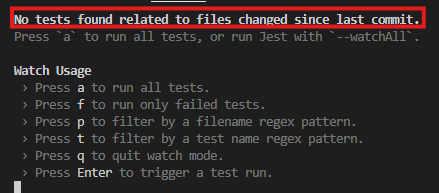

### Analisando o aviso do `Jest`
O aviso destacado na imagem acima pode ser traduzido como: 
> **"Nenhum teste encontrado relacionado a arquivos alterados desde o último commit"**.

Este aviso é importante porque informa que o `Jest` **executará testes apenas em arquivos que estejam alterados/<i>trackeados</i> pelo `Git`**, ou seja, **arquivos que já existiam no último <i>commit</i> não serão testados**.
 

### Encerrando execução do `Jest`
Encerraremos a execução do `Jest` neste momento, com o **atalho no teclado**: `CTRL` **+** `C`
 

## Configurando o `Jest` para vigiar todas laterações
Para ocnfigurarmos o `Jest` de modo que ele "vigie" todas alterações e **sempre rode os `Testes Unitários`**, adicionaremos o termo **All** no comando definido no `package.json`.
 

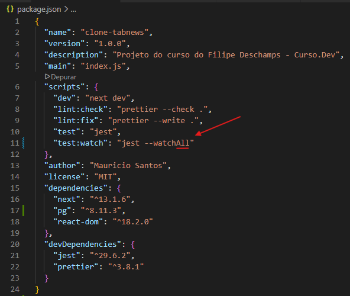
 

Agora iremos **salvar o arquivo** e executar o comando no `Terminal` para "rodar" o `Jest`:
 

~~~ Terminal
npm run test:watch
~~~
 

**Execução do comando:**

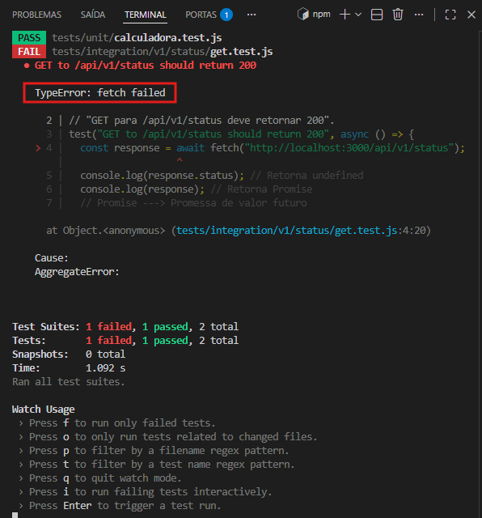
 

O erro aponta que **houve falha ao executar o `Fetch`**. Este erro ocorre porque **o `Servidor WEB` não está está sendo executado ("Rodando")**.
 

### Corrigindo a falha no teste do `Fetch`
Para corrigirmos a falha, **basta executarmos o `Servidor WEB`**. Para issso, **dividiremos o `Terminal`** e no novo `Terminal` utilizaremos o comando para executar o `Servidor`.
 

~~~
npom run dev
~~~
 

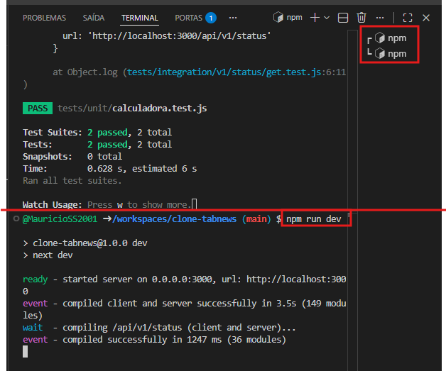

**Notas:**
- O `Terminal` de cima está executando o `Jest`.
- O `Terminal` de baixo (Novo), executa o comando para **rodar o `Servidor WEB`**.
 

## `DX` (Developer Experience)
`DX` é o termo que refere-se a **Experiência do Desenvolvedor**.
 

## Terminal para o `Docker`
Ao invés de dividirmos o `Terminal`, **criaremos um novo desta vez**, clicando no ícone de mais (`+`) no Menu dos `Terminais`.
 

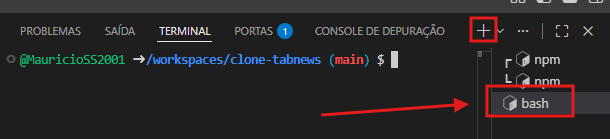

Ao clicar no ícone, um **novo `Terminal` será criado**. Note que enquanto estamos com apenas a visualização dele na tela, os outros dois `Terminais` (os `npm`) **exceutando serviços em <i>background</i>**. (Um rodando o `Jest` e o outro, o `Servidor WEB`)
 

### Executando o `Container` do `Banco de Dados` (`Postgres`)
Para executarmos o `Container`, utilizaremos o seguinte comando no `Terminal`:
 

~~~ Terminal
docker compose -f infra/compose.yaml up -d
~~~
 

**Notas:**
- `-f` é um parâmetro utilizado para indicar o diretório do arquivo `compose.yaml`.
- `-d` é um parâmetro para executar o `container` no modo `detach` (**executar em <i>background</i> e não travar o `Terminal`).

Ao executar o `Container`, o `VS Code` informará sobre a abertura da **porta**.
 

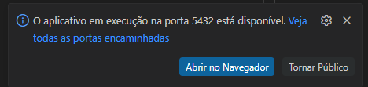
 

### Fechando o novo `Terminal`
Para **fecharmos o novo `Terminal`**, utilizaremos o atalho `CTRL` **+** `D` **OU** utilizaremos o comando `exit`.
 

~~~ Terminal
exit
~~~
 

**Nota MUITO importante:**

Embora o `Terminal` **tenha sido fechado**, o `serviço (Container do Banco de Dados)` **continua sendo executado em <i>background</i>**.
 

### Serviços em execução no momento
No presente momento possuimos **três serviços em execução**.

- `Banco de Dados` (`Postgres` no `Container`)
- `Servidor WEB` (`Node com Next.JS`)
- `test:watch` (`Jest` executando `Testes Unitários`)
 

## Módulo dentro do `Teste`
Para testarmos o módulo `database.js`, importaremos ele futuramente para dentro de `api/v1/status`.
 

## Importando o `Módulo` `database.js`
Para importarmos o `módulo` `database.js`, declararemos a importação no arquivo `index.js` (`/pages/api/v1/status/index.js`).
 

~~~ JavaScript
import database from "../../../../infra/database.js";
~~~
 

**Código:**

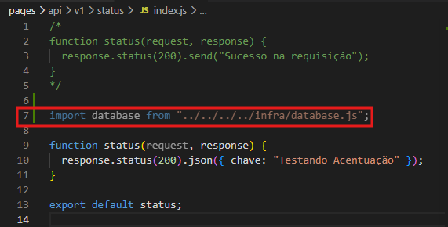

**Notas:**
- O **trecho comentado no início do arquivo serviu para fins didáticos em aulas anteriores.
- `../` foram utilizados para voltar diretórios até a **pasta raíz** do projeto.
 

### Falha nos testes do `Jest`
Logo após a alteração anterior, o `Jest` acusará falha nos testes.
 

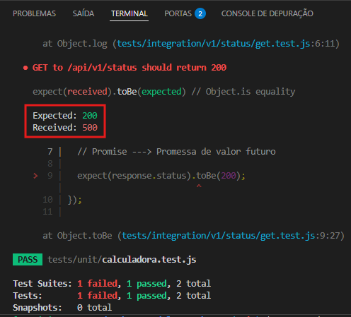

O `Jest` informa que recebeu o **código 500, ao invés de 200** da `API`.
 

## Criando o `Módulo` `database.js`
Criaremos agora o arquivo `database.js` dentro do diretório `/infra`.
 

**Criação do Arquivo (`Módulo`):**

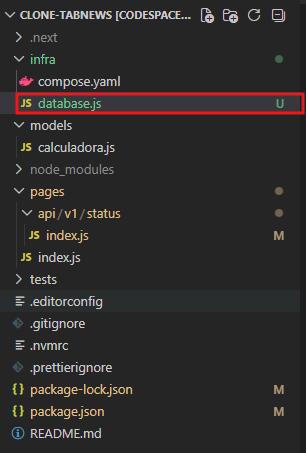
 

### Sucesso no teste do `Jest`
Ao criar o `Módulo` `database.js`, o `Jest` realizará novos testes e acusará **sucesso**.
 

**Teste do `Jest:`**

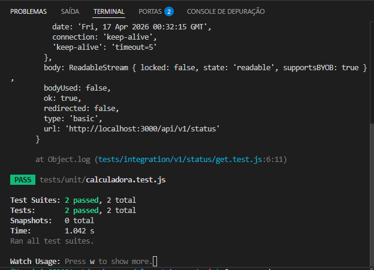
 

## Imprimindo o que está sendo importado
Para visualizarmos o que está sendo importado do `Módulo` `database.js`, podemos utilizar a função de impressão no `console` do `JavaScript` (`console.log`).
Este teste será feito dentro do `index.js` da `API`.
 

~~~ JavaScript
console.log(database)
~~~
 

**Código:**

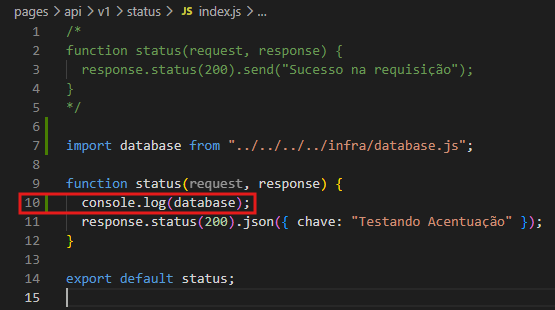
 

**Importante:** Dentro do `Módulo` `database.js`, **nada foi exportado** (não há nenhuma função `export()` no arquivo).

### Resultado recebido
O resultado recebido do `console.log()` foi um **objeto vazio**, representado por chaves (`{}`) no `JavaScript`.
 

**Impressão no console (`Terminal`)**

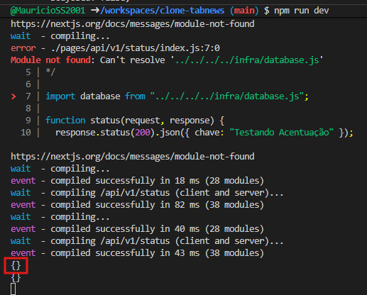

**Notas:**
- O valor foi impresso em duplicidade por causa de pequena alteração no arquivo, considere apenas a primeira impressão.
 

## Criando o `Módulo` `database.js`
Para criarmos o `Módulo`, começaremos primeiro **exportando um objeto**. Para isto, adicionaremos o seguinte código no arquivo `database.js`:

~~~ JavaScript
export default{
    query: query,
}
~~~
 

**Notas:**
- O **primeiro termo** `query` identifica **uma propriedade que será esportada**.
 

- O **segundo termo** `query` identifica **uma função** que é o valor da **propriedade citada anteriormente**.
 

- Poderíamos **exportar um objeto vazio com o trecho abaixo**. (Apenas exemplo, isto não será utilizado no projeto)

~~~ JavaScript
export default {}
~~~
 

Ao salvar o arquivo, o `Jest` acusará erros, pois a `função` `query` não foi implementada ainda.

A função `query` será **extremamente importante visto que não utilizaremos ORM neste momento**. (As `querys (consultas)` serão **escritas à mão neste momento**)
 

## Abstraindo a utilização do `Banco de Dados`
A ideia principal é criar uma **abstração** que facilite a utilização do `Banco de Dados`, algo como um comando simples, `database.query(...)` por exemplo.
 

### `node-postgres (pg)` abstraindo
O criador do `node-postgres (pg)` teve a mesma preocupação em relação a **abstração** de seu `Módulo`. Esta preocupação levou a criação de uma interface bem simples de ser utilizada.

Abaixo, veremos o código que contém as abstrações desenvolvidas por ele. Este é o código ínimo para utilização do `Módulo` `node-postgres (pg)`.
 

**Nota importante:** O modelo abaixo é apenas um **exemplo didático**, **a implementação real no projeto será diferente**.
 

~~~ JavaScript
import { Client } from 'pg'
const client = new Client();
const client = await new Client().connect()
 
const res = await client.query('SELECT $1::text as message', ['Hello world!'])
console.log(res.rows[0].message) // Hello world!
await client.end()
~~~
 

**Disponível em:** <a href="https://node-postgres.com/">https://node-postgres.com/</a>

**Funcionamento do código**
- A **primeira linha realiza a importação** do `Client (CLiente)`. (`Client` é uma exportação feita pelo `Módulo` `pg`)
 

- A **segunda linha instancia** um `Client`. (O `client` conseguirá se conectar ao `Banco de Dados`).
 

- A **terceira linha realiza a conexão com o `Banco de Dados`**. (O termo `await` garante que a execução do código seja pausada até que a conexão tenha sido estabelecida)
 

- A **quarta linha executa a `query`** por meio da função `.query(...)`. (O `await` garante que a execução do código seja pausada até que a função `query` retorne um resultado)
 

- A **quinta linha imprime o valor recebido (valor da `query (consulta)`)**.
 

- A **sexta linha encerra a coneção com o `Banco de Dados`**. (O termo `await` garante que a execução do código seja pausada até que a conexão tenha sido encerrada)
 

## Implementando algumas funcionalidades no `Módulo` `database.js`
Para implementarmos a **conexão com o `Banco de Dados`** e a `função` `query`, adicionaremos o seguinte código ao arquivo `database.js`:

~~~ JavaScript
import { Client } from "pg";

async function query(queryObject) {
  const client = new Client(); // Instânciando um Client
  await client.connect(); // Aguardando estabelecer conexão com o Banco de Dados
  const result = await client.query(queryObject); // Armazenando o resultado da query (consulta) em uma variável
  client.end(); // Encerrar conexão com o Banco de Dados
}
~~~
 

**Código:**

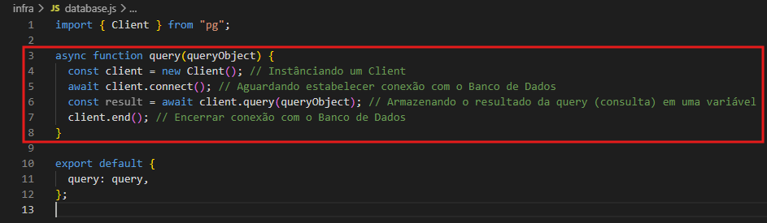

**Notas:**
- `queryObject` é um parâmetro que virá "de fora" da `função`. (`Assinatura do Método`)

- Os termos `await` garantem que a execução do código **seja pausada** até que cada tarefa definida tenha terminado.
 

### Retornando o resultado da `query (Consulta)`
Para retornarmos o resultado obtido pela `query (Consulta)`, adicionaremos a seguinte linha na `Função`, dentro do `database.js`.
 

~~~ JavaScript
return result; // Retornando o resultad da query (Consulta).
~~~
 

**Código:**

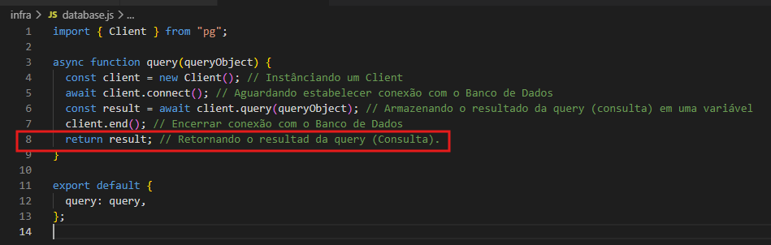
 

Após realizar as alterções, o `Jest` acusará sucesso ao executar os `Teste Unitários`, porém, embora a função `query` tenha sido implementada, ela **ainda não é utilizada**.
 

**Resultado do `Jest`:**

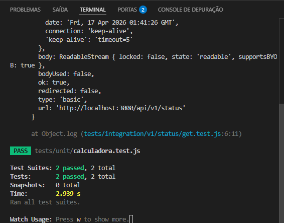
 

## Testando a `função` `query`
Para testarmos a `função` `query`, faremos algumas alterações no `index.js` (`/pages/api/v1/status`)
 

**1.** Transformar a `função` `status` em **assíncrona**.

**2.** Criar uma variável e armazenar o valor que será recebido a partir do chamado da `função` `query`.

~~~ JavaScript
const result = await database.query("SELECT 1+1;");
~~~

**3.** Imprimir o valor da variável `result` com a `função` `console.log`.

~~~ JavaScript
console.log(result)
~~~
 

**Código:**
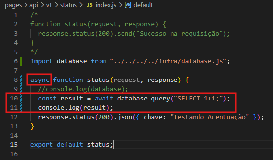

**Notas:**
- A **linha 9** foi comentada pois era apenas um **exemplo didático**.
 

Ao executar os passos acima e salvar o arquivo, o `Jest` **acusará erro novamente**.
 

**Erro informado pelo `Jest`**:

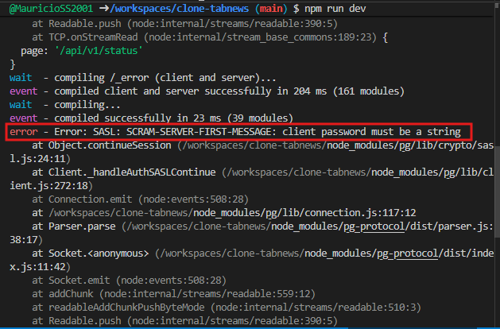

Este erro ocorre porque o `Banco de Dados` **não recebeu uma senha** para realizar o acesso.
 

## Inserindo dados na instanciação do `Client`
Para adicionarmos dados à instânciação do `Client (Cliente)`, **passaremos um objeto como parâmetro**. Para informar ao `JavaScript` que estamos enviando um objeto, basta utilizar  **chaves** (`{}`).
 

Criaremos o objeto dentro da linha de instânciação (linha demonstrada abaixo):
 

~~~ JavaScript
cosnt client = new Client({}) // {} representam o objeto
~~~
 

**Objeto:**

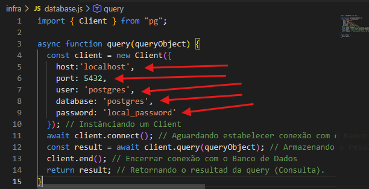
 

## Resultado no `Terminal`
Ao salvar o arquivo `index.js`, o `Jest` executará os testes novamente, e o resultado recebido do `console.log`, será impresso no `Terminal`.
 

**Resultado impresso no `Terminal`:**

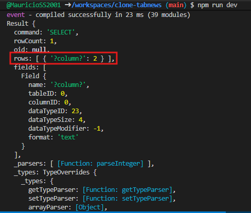

**Notas:**
- A linha grifada mostra o resultado que a `query (Consulta)` retornou.
 

## Pequenas alterações para visualizar melhor
Nos exemplos acima, era impresso no `Terminal` um **objeto inteiro** que continha o resultado dentro, porém agora impriremos **apenas o resultado**.

Para isto faremos os seguintes passsos:

**1.** Imprimir `result.rows` na `função` `console.log`.
**2.** **Apelidar** o resultado de `sum` (**"soma"** em Inglês).
 

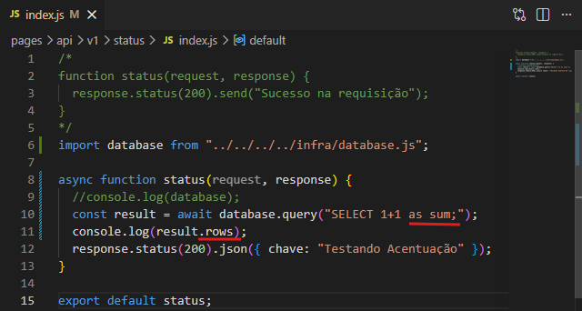
 

### Resultado obtido no `Terminal`

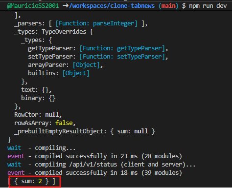
 

## Criações feitas até agora no Projeto
A partir de um `repositório` vazio, criamos várias coisas até agora.

- endpoint (`status` retornando **código 200**)
- docker compose ("levantamos" um `Banco de Dados`)
- watch (`Testes Automatizados`)
- database.js (com `Módulo` capaz de se conectar com `Banco de Dados`, executar uma `query (Consulta)` e retornar o resultado)

No decorrer do proejto até aqui, também acabamos **criando alguns problemas**, sendo os principais deles:

- Dados de conexão ao `Banco de Dados` **Expostos no código**.
- Dados de conexão ao `Banco de Dados` **duplicados entre arquivos**.

Para resolver isto, **utilizaremos `variáveis de ambiente`**.
 

---
---
---
 

# A importância das Variáveis de Ambiente

## Aplicação `Stateless` (`Sem Estado`)
Uma **aplicação pode ser dividida em camadas**. Vamos considerar **três camadas**, sendo elas, `Interface`, `Aplicação` e `Persistência`.
 

**Camadas da Aplicação:**

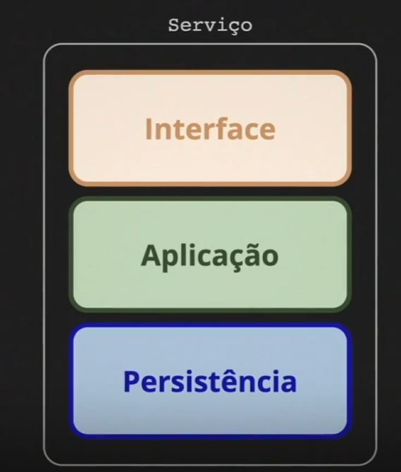

Vamos considerar agora como exemplo, **uma calculadora como nossa aplicação**.
Vamos falar agora sobre cada uma das **camadas desta aplicação (Calculadora)**.

- `Interface`
A `Interface` é a camada que é representada pela tela que o usuário vê, como os botões dos números, botões das operações, entre outros.
Esta camada **também é importante** pela `Experiência do Usuário (UX)`.
 

- `Aplicação`
 A `Aplicação` é a camada responsável pela validação das `regras de negócio`. podemos pensar sobre uma equação, `2 + 2 * 2`. O resultado da equação será `6` e não `8` pois neste caso, a `regra de negócio` é construída em cima das regras `Matemática` (A aplicação faz operações matemática).
 Esta camada pode ser resumida como **importante para "computar" um resultado**.
  

 - `Persistência`
 A `Persistência` é uma camada responsável por **armazenar os dados em outro local**. Podemos pensar por exemplo, que sem querer fechamos a calculadora mas queriamos salvar o dado que havia sido "comnputado" anteriormente. A camada de `Persistência` **visa resolver este problema**.
 Dentro do exemplo da **calculadora**, podemos considerar que os valores "computados" são salvos em um "Mini `Banco de Dados`" que está na aplicação, armazenada no `Hardware` do dispositivo (Considere um celular, por exemplo).
 Mesmo que o dispositivo seja desligado, após ligar novamente, **a camada da `Aplicação` poderá acessar os valores novamente**.
  

 ### Perdemos o dispositivo, e agora?
Dentro do exemplo anterior, vamos considerar situações onde o `Hardware` contendo a `Aplicação` é extraviado.
Se os dados **estivessem apenas salvos no `Hardware` (Parte física do dispositivo)**, eles seriam **perdidos**, porém há uma solução para isso. A solução consiste no armazenamento em locais remotos, como por exemplo em um `Backend` em um `Servidor` **remoto**. (Pense também em `Nuvem`)
Esta ideia de que os valores podem ser armazenados fora da `Aplicação` é o conceito de `Stateless (Sem Estado)`.
 

**Notas:**
- `Aplicações` geralmente apresentam **estado efêmero**. (Dados ficam ali enquanto você está utilizando, porém são salvos antes do encerramento da aplicação e recuperados em sua abertura)
 

## Funcionamento do `Backend` ao retomar a `Aplicação`
Quando a `Aplicação` é executada novamente, ele faz uma sequência de passos para retomar o **estado efêmero**.
 

- `Interface`
Vamos considerar por exemplo que a aplicação consulte uma `API (Rest, por exemplo)` e enviará os **dados recebidos** para camada de `Aplicação`.
 

- `Aplicação`
Os dados serão processados ("computados") na camada de `Aplicação`.
Neste ponto, precisamos lembrar que a camada de `Aplicação` **também pode falhar**, **reiniciando, por exemplo, por algum erro ou alguma situação não prevista, até mesmo uma atualização de segurança**.
 

- `Persistência`
A camada de `Persistência` geralmente é representada por um `Banco de Dados` e **auxília a prevenir a segurança dos dados casos os erros citados anteriormente ocorram**.
Lembre-se, o `Banco de Dados` **também está sucetível a falhas**, evite-as **realizando `Backups` do `Banco`.
 

**Imagem ilustrativa do exemplo:**

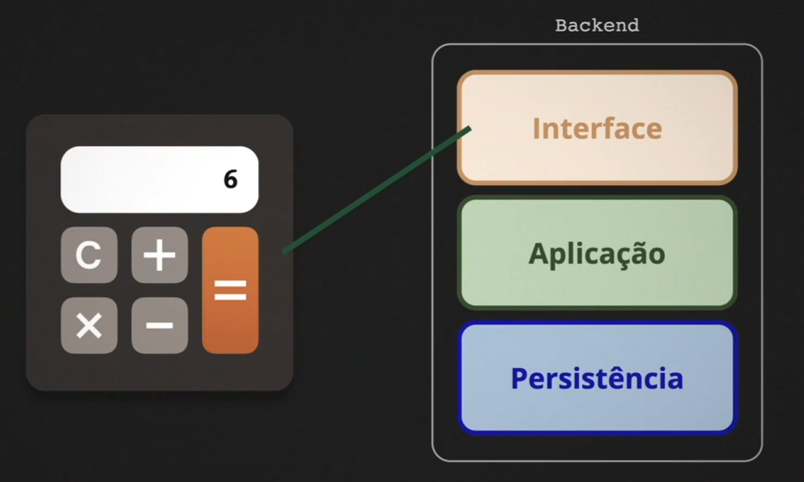
 

### `Backups` de `Bancos de Dados`
Um `Backup` pode ser considerado um arquivo que contém uma **cópia** dos dados. Ele deve ser distribuído de maneira segura para que em alguma situção de falha, erro, ataque, etc... possa **reestabelecer os dados do `Banco`**.
 

### Escalabilidade de `Aplicações` `Stateless`
O desenvolvimento de um `Software` com a utilização de metodologias `Stateless`, torna-o **mais fácil de escalar posteriormente**.
A **escalabilidade** dá aplicação é feita de modo **horizontal**, de modo que duplicamos dados para vários usuários. Pense por exemplo em uma rede social, cada usuário tem seus posts, conteúdos, etc... se a aplicação for `Stateless` é mais fácil balancear carga e realizar outros métodos para uma **escalabilidade horizontal**.
 

**Exemplo de acesso de usuários em aplicação SEM `Stateless`**

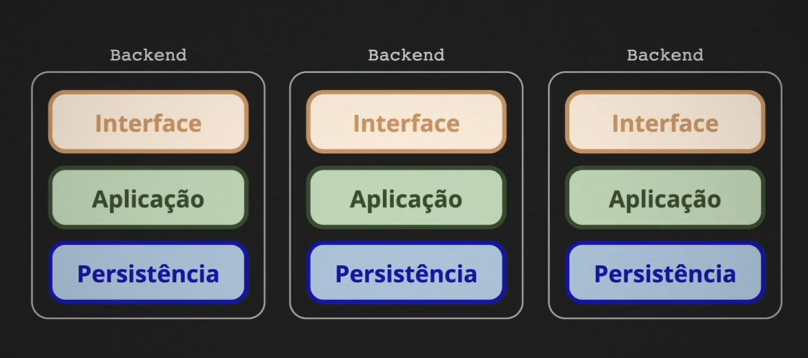
 

**Exemplo de acesso de usuários em aplicação COM `Stateless`**

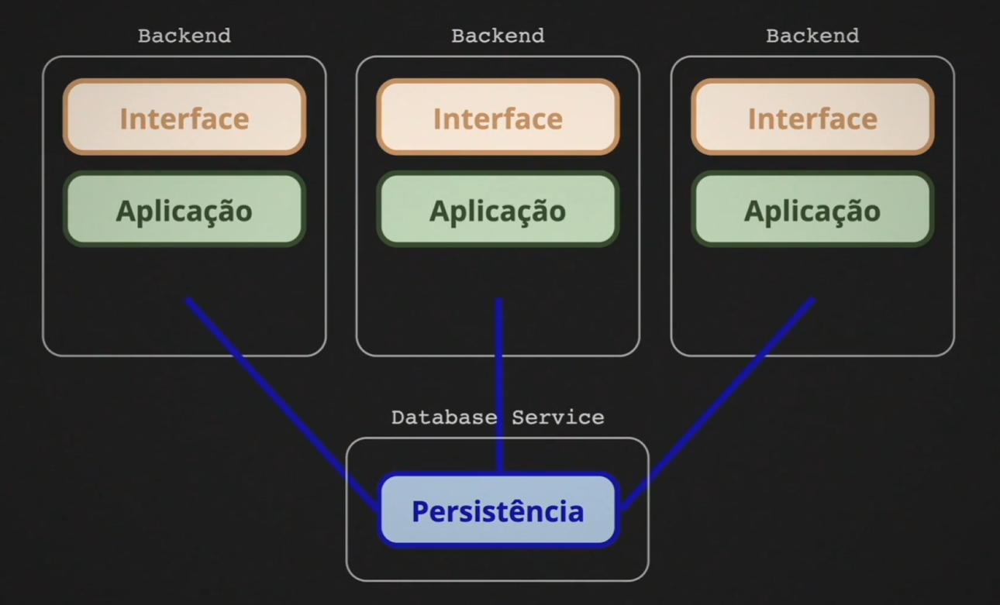
 
 

## Máquina Pura
`Máquina Pura` é um termo utilizado para identificar uma máquina (computador) que não possuí configurações extra, reecursos específicos, já confiugurados, entre outros. Podemos considerar por exemplo, uma máquina recém formata, apenas com `SO (Sistema Operacional)`.
 

### Dentro de que contexto são utilizadas?
`Máquinas Puras` geralmente se referem a instâncias onde a aplicação será executada, como `Ambiente de Homologação`, `Ambiente de Produção` e até mesmo `Ambiente de Desenvolvimento (Novos computadores)`.
 

## Nossos `Ambientes` do Projeto
Por enquanto, as credenciais de acesso ao `Banco de Dados` estão <i>Hardcoded</i> (fixas de maneira estática) no código. Isto faz com que alguns `Ambientes` como o de `Produção` e `Homologação` **tentem acessar um `Banco de Dados` local**, porém, nenhuma delas possui este recurso.
 

**Exemplo de tentativa de acesso ao `Banco de Dados` por diferentes `Ambientes` atualmente:**

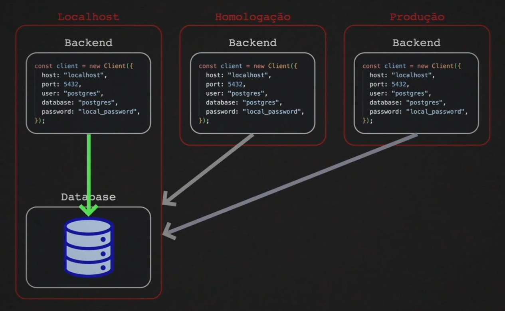

**Nota:** Os `Ambientes` de `Homologação` e `Produção` **falham ao tentar acessar**.
 

### Como o acesso deveria ser feito
O acesso ao `Banco de Dados` deveria ser feito de modo que cada `Ambiente` **possua seu próprio `Banco`**.
 

**Representação dos acessos de cada `Ambiente`:**
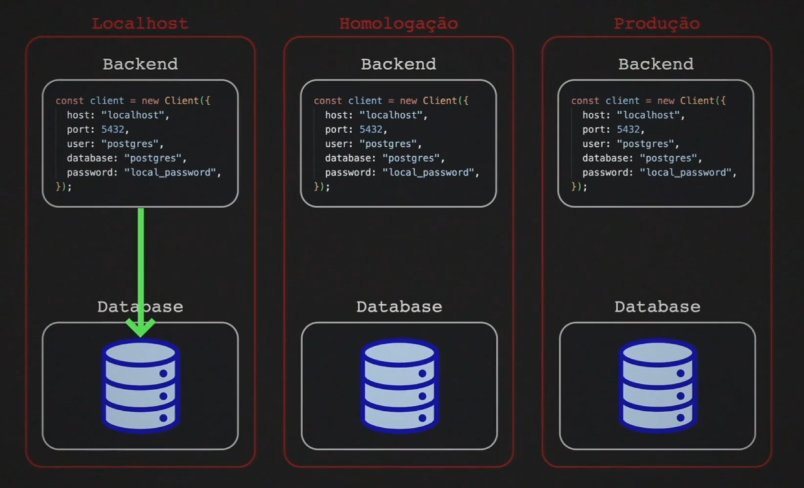

Dentro deste contexto, **entra o conceito de** `Variáveis de Ambiente`, onde cada `Ambiente` possuí um `Banco de Dados` **próprio**, com **informações de conexão (endereço, usuário, senha, etc...) PRÓPRIAS**.
 

**Representação de onde as `Variáveis de Ambiente` serão encaixadas:**

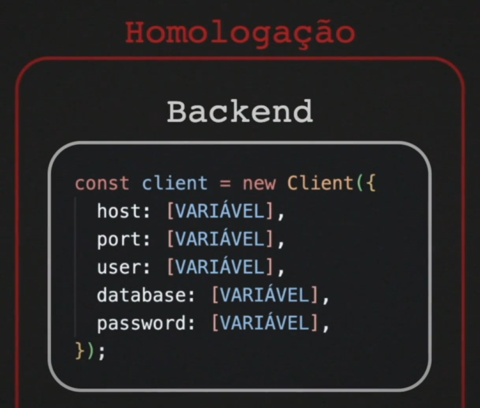

Considerando o exemplo da imagem acima, cada `Ambiente` possuirá **suas próprias `Variáveis de Ambiente`**.
Os valores serão aplicados de maneira **dinâmica** conforme o `Ambiente` em que a `Aplicação` esteja sendo executada ("rodando").

**Exemplos:**
- Se a `Aplicação` estiver rodando no `Ambiente de Desenvolvimento (localhost)`, o valor da `Variável de Ambiente` `host`, será `localhost`.
 

---
---
---
 

# `Variáveis de Ambiente` no Código

## De onde vem as `Variáveis de Ambiente`
As `Variáveis de Ambiente` vem do `Ambiente` em que o `Programa` está sendo executado, mas, **mais especificamente** do `Processo` **que está sendo executado**.
 

### O que é um `Processo` ?
Para respondermos esta pergunta, consideraremos o nosso `Servidor WEB`. O `Servidor WEB` está rodando **dentro de um `processo`** no `Sistema Opercaional`. Neste exemplo, o `Processo` citado é o `Bash` (`Terminal`).
Durante a criação de um `Processo`, ele puxa as `Variáveis de Ambiente` do `Processo Pai`.

**Notas:**
- O `Bash` é o `Processo Pai` do `Servidor WEB`.
- O `Processo Pai` (`Bash`) possui `Variáveis de Ambiente` que são enviadas ao `Processo` do `Servidor WEB`.
 

## Verificando o `Ambiente`
Para verificarmos as `Variáveis de Ambiente` disponíveis em um `Ambiente`, podemos utilizar o comando abaixo no `Terminal`:
 

~~~ Terminal
env
~~~
 

**Notas:**
- `env` significa `Environment (Ambiente)`.
 

**Execução do comando no `Terminal`:**

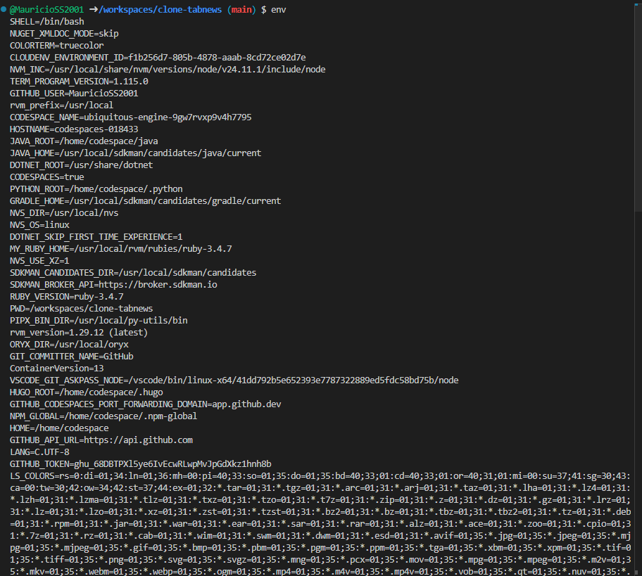

Note que **cada linha é uma `Variável de Ambiente`**.
 

### Constituição de uma `Variável de Ambiente`
Uma `Variável de Ambiente` é representada pelo **nome em maiúsculo(por conveção)** seguido de um **sinal de igual** (`=`) e por fim, o **valor desejado desta `Variável de Ambiente`** (Este valor **sempre é uma `string`**).
 

**Exemplo de uma `Variável de Ambiente` que apareceu no `Terminal`**:

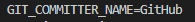

**Notas:**
- Caso seja necessário trabalhar com números em `Variáveis de Ambiente`, sempre serão representados por `strings`, porém você pode converte-los posteriormente para `int` ou outro tipo, **dentro da aplicação**.
 

## Alterando `Variáveis de Ambiente`

**Crie um `Terminal` para executar o `Banco de Dados` do `Docker`**

Execute o comando para executar o `Container` do `Docker` com o `Postgres`

~~~ Terminal (1)
docker compose -f infra/compose.yaml up -d
~~~
 

**Crie um novo `Terminal`e divida em dois para os passos seguintes!**

Começaremos executando o `Jest` em modo `watch`. Para isto, utilizaremos o comando abaixo no `Terminal`:
 

~~~ Terminal
npm run test:watch
~~~
 

Agora, no segundo `Terminal`, iniciaremos o `Servidor WEB` com a execução do comando `npm run dev` no `Terminal`.
 

~~~ Terminal
npm run dev
~~~
 

**Organização dos `Terminais`:**

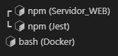
 

### Alterando as credenciais no código
Para utilizarmos uma `Variável de Ambiente`, começaremos alterando o arquivo `database.js` (`infra/database.js`), adicionando a utilização de uma `Variável de Ambiente` nos dados.

**Alteraremos a linha**

~~~ JavaScript
password = "local_password",
~~~

**para a segunte linha:**

~~~ JavaScript
password = process.env.POSTGRESS_PASSWORD
~~~
 

**Código esperado:**

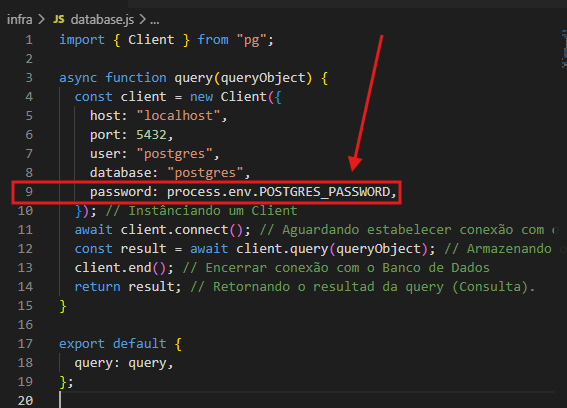
 

**Notas:**
- `process` acessa os recursos disponíveis do `Processo`. (`env` é um deles)
- `env` acessa as `Variáveis de Ambiente`. (Vindas do `Processo Pai` (`Bash`))
- Embora tenhamos solicitado a `Variável de Ambiente` `POSTGRESS_PASSWORD`, ela **ainda não existe**.
 

### Erro no `Jest`
Após a execução dos passos anteriores, o `Jest` infromará que há um erro na bateria de testes.

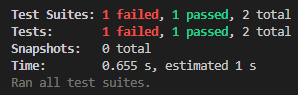
 

### Analisando erro
O erro **refere-se as credenciais de acesso** ao `Banco de Dados`.
Este erro ocorre porque a `Variável de Ambiente` `POSTGRES_PASSWORD` **não existe**. então ela **não é enviada**.
 

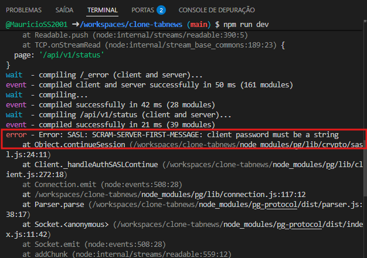
 

### Declarando uma `Variável de Ambiente` Nova
Para declararmos uma `Variável de Ambiente` nova, há mais de uma possibilidade.
 

#### Declarando `Variáveis de Ambiente` pelo `Terminal`
Para criar pelo `Terminal`, basta digitá-la diretamente e informar em qual `Processo` ela será executada.
 

~~~ Terminal
POSTGRES_PASSWORD=local_password npm run dev
~~~
 

**Execução do comando no `Terminal`:**

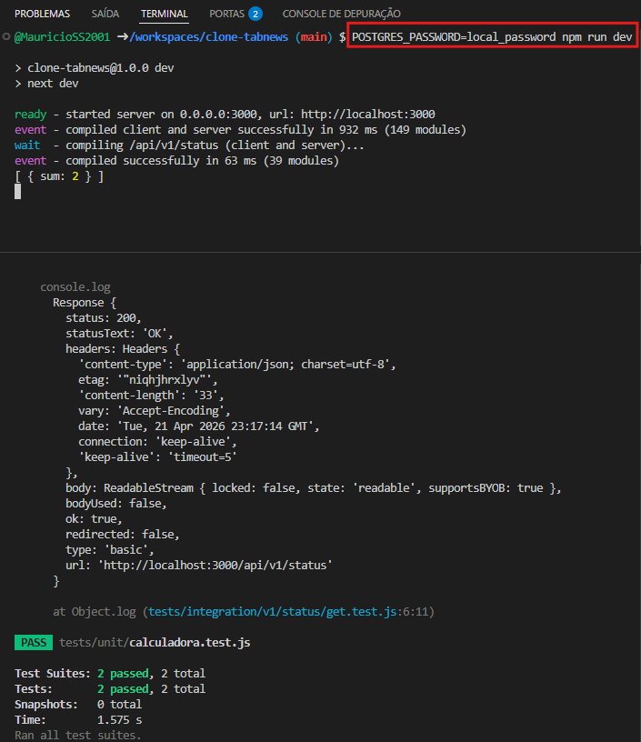

**Notas:**
- Logo após declarar a `Variável de Ambiente`, foi informado em qual processo ela seria utilizada (Utilizada quando iniciar o `Servidor WEB` com `npm run dev`)
- Ao executar isto no `Terminal`, o comando que inicia o `Servidor WEB` (`npm run dev`) é executado **automaticamente**.
- Esta forma não é segura, pois podemos executa o comando `history` no `Terminal`, que trará os parâmetros utilizados no comando anterior.

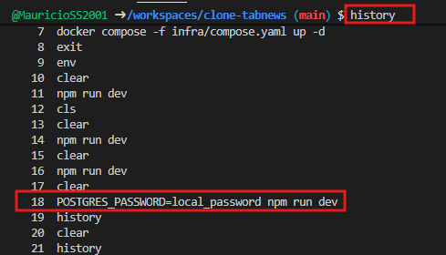

- Senhas **NÃO devem estar escondidas de pessoas que trabalham no código**.
- Podemos executar um comando **sem deixar registros no `history`**, apenas **utilizando um espaço(`space`) no início do comando**.
 

**Comando com espaço (`space`) no início:**
~~~ Terminal
 POSTGRES_PASSWORD=local_password npm run dev
~~~
 

#### Criando `Variáveis de Ambiente` utilizando o `Módulo` `Dotenv`
`Dotenv` é um `Módulo JavaScript` com **zero dependências** que **importa `Variáveis de Ambiente` de um arquivo `.env`** para dentro do `process.env` (`processo`).

Este `módulo` é tão popular que **existe nativamente no `Next.js`**.

Para criarmos nossas `Variáveis de Ambiente` utilizando o `Módulo` `Dotenv`, seguiremos os passos abaixo:

**1. Criar um arquivo chamado `.env` na raíz do Projeto**

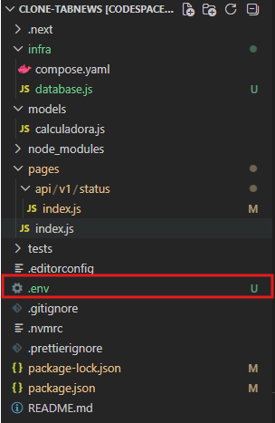

**2. Declarar a `Variável de Ambiente` no arquivo `.env`:**

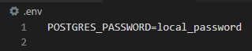

**Lembre-se:** Embora o termo `local_password` está digitado como texto simples no arquivo, ele será utilziado como uma `string` (`"local_password"`) **ao executar o código**.
 

**Testando executar o `Servidor WEB`:**

Para testar a execução do `Servidor WEB`, basta utilizar o comando no `Terminal`

~~~ Terminal
npm run server
~~~
 

**Resultado esperado:**

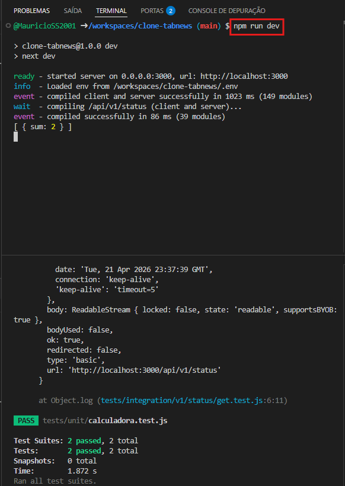
 

### Criando as demais `Variáveis` de ambiente no `.env`

**Truques no `VS Code`:**
Podemos copiar os dados que faltam e adicionar no `.env`. Porém **precisamos corrigi-los** para que sejam aceitos no `Módulo` `Dotenv`.

**1. Selecionar o primeiro caracter dois pontos (`:`) e utilizar o atalho `CTRL` + `D` para selecionar todos caracteres iguais no arquivo (`:`).**

**2. Utilizar o atalho `SHIFT` + `Seta Direita` para selecionar o espaço em branco.**

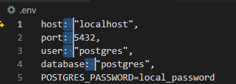

**3. Apertar o sinal de igual (`=`) para sobreescrever os caracteres marcados.**

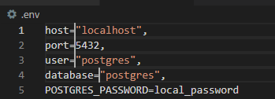

**4. Mover o cursor(como temos vários cursores, todos irão mover junto) e adicionar o termo "POSTGRES_" no início de cada `Variável de Ambiente`.**

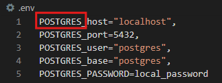

**5. Alterar os termos que estão em minúsculo para maiúsculo manualmente:**

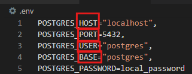

**6. Remover aspas e vírgulas.**

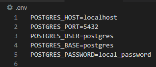
 

## Utilizando as `Variáveis de Ambiente` dentro do `database.js`
Por fim, alteraremos o arquivo `dabatase.js` para receber as `Variáveis de Ambientes` definidas no `.env`.

**Arquivo `database.js`:**

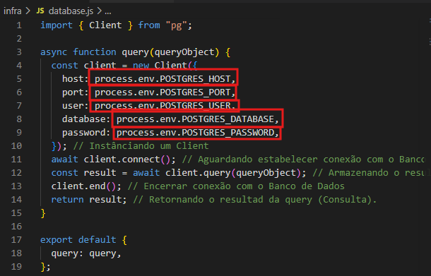
 

### Testando um erro
Vamos agora testar um erro só para garantir que tudo está funcionando. Alteraremos a `Variável de Ambiente` `POSTGRESS_PORT` para conter o valor `5431` (valor errado).
 

**Importante:** Durante a confecção desta parte do manual, o termo `DATABASE` foi escrito acidentalmente como `BASE`. **Utilize `DATABASE`**.
 

**Erro no arquivo `.env`:**

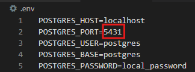
 

**Resultado esperado (Erro acusado no `Jest`):**

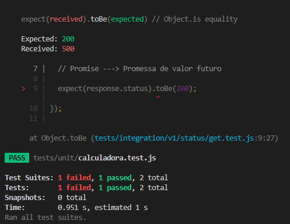

**Nota:** Corrija a porta `5431` para `5432` após o teste e verifique o funcionamento novamente.
 

---
---
---
 

# Variáveis de Ambiente no Docker Compose

## Evitando duplicidade de `Variáveis de Ambiente`

Dentro do escopo atual, a `Variável de Ambiente` `POSTGRES_PASSWORD` é utilizada apenas no `módulo` `database,js` enquanto o arquivo `compose.yaml` (Utilizado pelo `Docker Compose` para executar um `container` com `Banco de Dados (Postgres)`) utiliza **uma senha `hardcoded` (fixa no código)**.
 

### `Variável de Ambiente` do `Banco de Dados`

Dentro do arquivo `.env`, possuímos uma `Variável de Ambiente` chamada `POSTGRES_DATABASE`, porém a **imagem do `Docker`**(Para mais `Variáveis de Ambientes` aceitas pelo `Docker`, consulte a `imagem` no `DockerHub`) aceita uma `Variável de Ambiente` chamada `POSTGRES_DB`.
Para resolvermos isto, alteraremos o arquivo `.env` na linha onde há a `Variável de Ambiente` `POSTGRES_DATABASE` para `POTGRES_DB`.
 

~~~ .env
POSTGRES_DB=postgres
~~~
 

**Código do arquivo `.env`:**

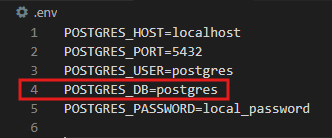
 

### Por que utilizamos o termo `POSTGRES_DB` no `.env` e ele é aceito mesmo estando escrito como `POSTGRES_DATABASE` no `Módulo` `database.js`?

Ao salvar o código **com a instrução anterior**, é possível perceber que o `Jest` não acusou erros na execução.
 
**Informação do `Jest`  no `Terminal`:**

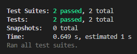

#### Desvendando o mistério
Não acontece erro, pois conforme a documentação da `Imagem` `Docker`, caso o `objeto` `cliente` **seja instânciado sem uma propriedade `database`**, a `Variável de Ambiente` `POSTGRES_DATABASE` é procurada, caso ela não exista, a `imagem` **utiliza o mesmo valor da `Variável de Ambiente` `POSTGRES_USER`** (que é `postgres`, assim como o **nome da `Database`**).

Para mais informações, consulte o [Material da Aula](./Materiais/4-Variáveis%20de%20Ambiente%20no%20Docker%20Compose.md).
 

## Adicionando a `Variável de Ambiente` do `.env` no `compose.yaml`
Para adicionarmos a `Variável de Ambiente` (presente no arquivo `.env`) da senha do `Banco de Dados` no `compose.yaml`, começaremos removendo o escopo manual da declaração `hardcoded` das `Variáveis de Ambiente` presentes no `compose.yaml`. Removeremos as seguintes linhas do arquivo:
 

**Linhas que serão removidas (`compose.yaml`):**

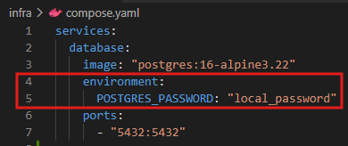

Adicionaremos agora o local onde o arquivo `.env` está armazenado.

~~~ compose.yaml
env_file:
  = ../.env
~~~

**Adicionando local do `.env` dentro do `compose.yaml`:**

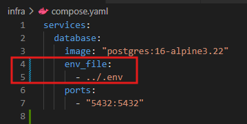

**Notas:**
- `..` foram utilizados para voltar um diretório e cair na **raíz do projeto**, onde o arquivo `.env` está.
 

### Padronizando as `Variáveis de Ambiente`
Para mantermos as `Variáveis de Ambiente` padronizadas, alteraremos os valores das `Váriaveis` `POSTGRES_USER` e `POSTGRES_DATABASE` no arquivo `.env`.
 

~~~ .env
POSTGRES_USER=local_user
POSTGRES_DB=local_db
~~~
 

**Arquivo `.env`:**

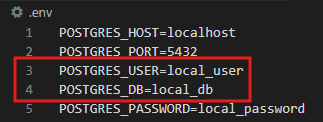

**Nota:**
- Note que os **valores das `Variáveis de Ambiente` foram alterados**.
 

#### Analisando o erro
Ao salvar o código após a execução da instrução anterior, o `Jest` acusará erro.
 

**Erro acusado pelo `Jest:`**
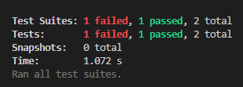

O erro ocorre **porque alteramos as credenciais de acesso, porém como o `Banco de Dados` está em execução e foi criado com OUTRAS CEREDENCIAIS (Definidas quando o `container` foi executado), a conexão falha**.

Para corrigirmos este erro, **pararemos a execução do `container`** com o seguinte comando no `Terminal`:
 

~~~ Terminal
docker compose -f infra/compose.yaml down
~~~
 

**Execução do comando no `Terminal`:**

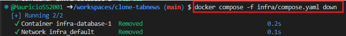
 

Agora **executaremos novamente o `Container`** com a execução do seguinte comando no `Terminal`:
 

~~~ Terminal
docker compose -f infra/compose.yaml up -d
~~~
 

**Execução do comando no `Terminal`:**

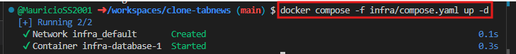
 

Agora iniciaremos todos os serviços (**um em cada `Terminal`**) novamente na seguinte ordem preferencialmente:

- **Banco de Dados (Container Docker):**
~~~
docker compose -f infra/compose.yaml up -d
~~~
 

- **Servidor WEB (Node):**
~~~ Terminal
npm run dev
~~~
 

- **Testes (Jest):**
~~~ Terminal
npm run test:watch
~~~
 

# Fazendo `Commit` das alterações

**Adicionando arquivo em `stage`:**
~~~
git add -A
~~~
 

**Adicionar uma mensagem ao `Commit`:**
~~~ Terminal
git commit -m 'Adicionados arquivos `database.js` e `.env`'
~~~
 

**Empurrar as alterações para o repositório com `push`:**
~~~ Terminal
git push
~~~
 

# Marcar a tarefa como concluída
Agora podemos marcar a `Issue` **Criar Módulo `database.js`** como concluída.
 

**Conclusão da `Issue`:**

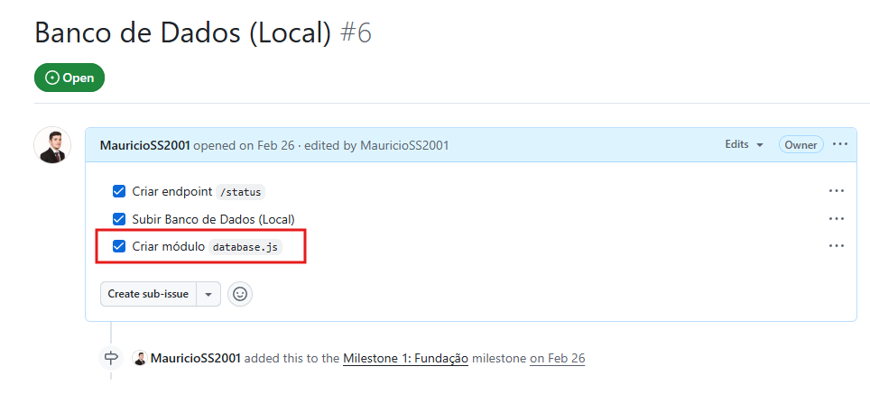
 

# Criando uma nova `issue` dentro desta `Milestone`
Com o avanço desta aula, criamos várias novas implementações, porém, ainda há registros de dados de teste. Limparemos eles nas próximas aulas.
Dentro do quesito deste resíduos, é importante destacar que o `endpoint` `/status` apresenta este comportamento, retornando apenas uma mensagem de teste.
 

**Criação da nova `Issue`:**

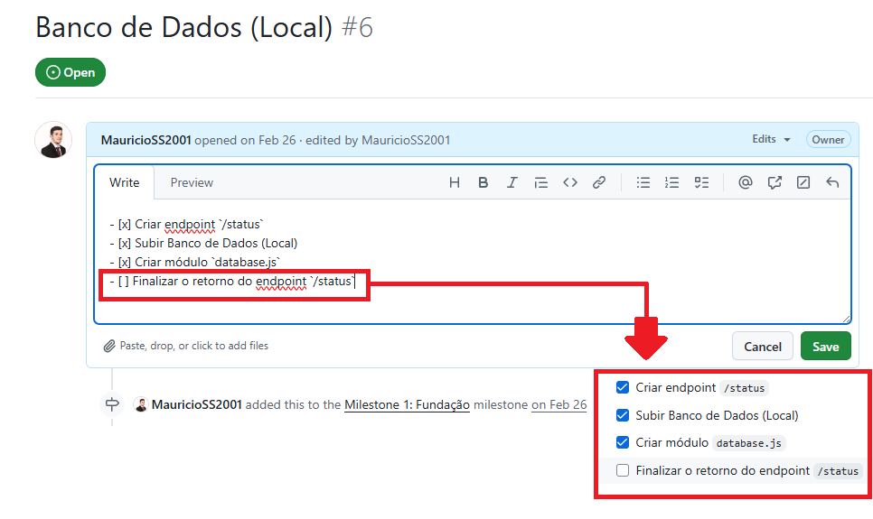

## O que ainda falta no Projeto?
- Tratamento de erros no `database.js`.
- Comandos em `scripts`.
- Retorno do `endpoint` `status` com informações da saúde do `Banco de Dados`.
