# Foi certo fazer o commit do .env?

O objetivo desta aula é concluir a `issue` **finalizar retorno do `endpoint` `/status`**.
 

## Foi correto realizar o `commit` do arquivo `.env`?

Segundo o `repositório` **oficial** do `dotenv`, o arquivo `.env` **NÃO** deve ser incluído no `commit`.
 

**FAQ disponível no `Repositório`**

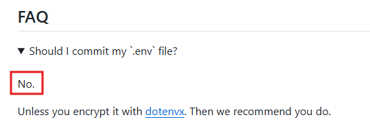

**Link do repositório:** <a href="https://github.com/motdotla/dotenv">https://github.com/motdotla/dotenv</a>

Porém, ao consultarmos a `documentação` **oficial** do `Next.js`, **É RECOMENDADO** incluir o arquivo `.env` no `commit`.
 

**Documentação do `Next.js`:**

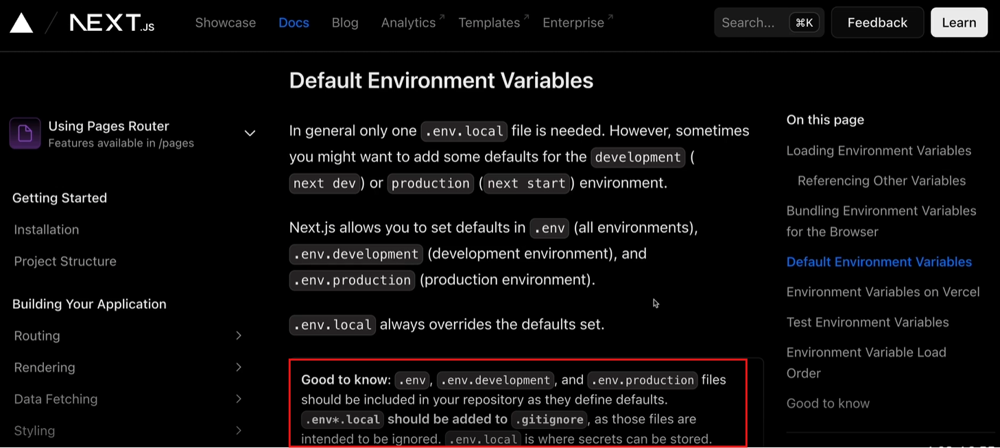

**Link da Documentação:** <a href="https://nextjs.org/docs/pages/guides/environment-variables">https://nextjs.org/docs/pages/guides/environment-variables</a>

**Nota:** A `Documentação` do `Next.js` foi atualizada e novas informações estão registradas no **site oficial**.
 

### Qual abordagem utilizaremos?
para seguir no projeto, utilizaremos a abordagem segundo a `documentação` do `Next.js`, onde **é CORRETO** enviar o arquivo `.env` no `commit`.
 

#### Por que utilizar esta abordagem?
Utilizaremos esta abordagem, pois o `.env` funciona com base na **precedência de arquivos**.
 

## Precedência de arquivos no `.env`
A **precedência de arquivos** é o método para qual o `.env` atribui um **valor** à uma `Variável de ambiente` com base na regra de importância.
A tabela abaixo demonstra como cada arquivo `.env` tem precendência, **onde quanto mais alto (menor número), sobrescreve os inferiores**.
 

**Precendência** | **Arquivo** | **Ambiente**
-|-|-
**1** | **process.env** | **Geralmente, `Ambiente de Produção`**.
**2** | **.env.development** | **`Ambiente de Desenvolvimento`**.
**3** | **.env** | **TODOS `Ambientes`**.

 

O `process.env` pode receber **valores injetados** a partir da `Vercel`. Caso isto ocorra, qualwuer valor que havia sido definido nos arquivos anteriores, **será sobreescrito**.
 

**Exemplo de injeção de valores:**

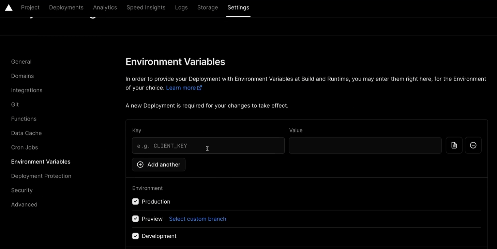

**Nota:** Este conteúdo ainda não foi abordado no curso e será explicado mais a frente.

Com base no conteúdo visto até agora, nota-se que os valores das `Variáveis de Ambiente` registrados no arquivo `.env` são apenas locais e posteriormente, serão **sobreescritas na `Vercel`**. (São apenas `Credenciais locais`)
 

## Respeitando a `Semântica`
Embora a `injeção de valores` funcione, é melhor separarmos os arquivos `.env` **conforme o `Ambiente` que serão executados**.
 

### Renomeando o arquivo `.env` do nosso Projeto

Para renomearmos o arquivo `.env`, utilizaremos o seguinte comando no `Terminal`:
 

~~~ Terminal
git mv .env .env.development
~~~
 

**Notas:**
- `mv` significa `move` (mover).
- São definidos o nome do arquivo inicial, e para qual ele será movido (final).
- `git status` pode ser utilizados antes e após o processo para verificar se o novo arquivo foi para o `status` de `staged`.
 

**Execução do comando:**

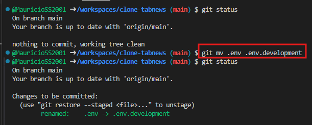

Agora, alteraremos o arquivo `compose.yaml` para buscar o nome correto do arquivo.

**Correção do arquivo `compose.yaml`:**

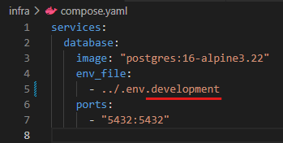
 

## Fazendo `Commit` das novas alterações
Faremos agora o processo de `commit` para salvar nossas alterações. Para isto, executaremos os seguintes comandos no `Terminal`:
 

**Adicionando arquivos ao `Commit`:**
~~~ Terminal
git add -A
~~~
 

**Adicionan uma mensagem ao `Commit`:**
~~~ Terminal
git commit -m 'Movendo `.env` para `.env.development`'
~~~
 

**Enviando as alterações ao `Repositório Remoto`:**
~~~ Terminal
git push
~~~
 

**Execução dos comandos:**

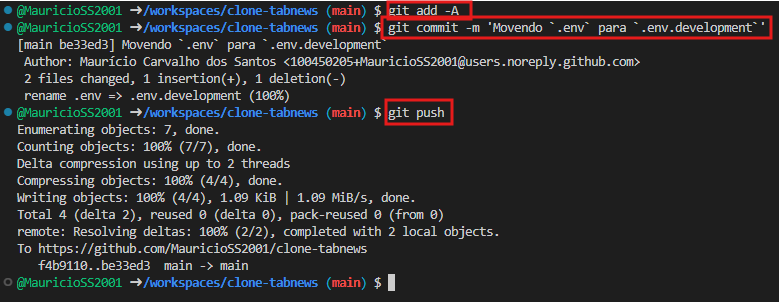
 

## `Edge Cases`
`Edge Cases` **são Exceções** que **prejudicam** o sistema.
 

## Fazendo `Push` de `Dados Sensíveis`
`Dados Sensíveis` podem ser `Chaves de API`, `Credenciais de Acesso`, entre outros, e em algum momento, podem ser `commitadas` acidentalmente. Considerando que o erro pode passar despercebido e ser notado vários `commits` à frente, é possível utilizar dois meios para reverter esta situação.

**Meios de reversão**
- Utilizar o comando `git-filter-repo`.
- Utilizar a ferramenta `BFG-Repo-Cleaner`.

Para consultar como utilizar estes recursos, acesse o [`Material` desta aula](./Materiais/1-Foi%20certo%20fazer%20o%20commit%20do%20.env%20.md).
 

---
---
---
 

# Uma história macabra sobre "Choque Elétrico" e "TDD"

## `Node.js` não possuí `Root Path` (Caminho Padrão / diretório Raíz)
`Node.js` não possuí um `Root Path` (Caminho padrão/ diretório raíz), fazendo com que muitas vezes tenhamos que importar `Módulos` utilizando vários pontos `../..` (exemplo) para definir um caminho.

Um exemplo é a `rota` `/status`, que possuí um longo caminho para acessar o arquivo `database.js`.
 

**Rota `/status`:**

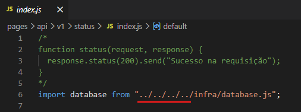

O `Node` nunca sai de um ponto inicial igual para chegar até um arquivo, **sempre de onde o arquivo que você está trabalhando está**. Muitas vezes, navegando para diretórios atrás.
 

### Métodos de importação de um arquivo
Um arquivo pode ser importado por dois meios diferentes, `Relative` e `Absolute imports`.

`Relative`: É o caminho como vimos no exemplo anterior, referenciando o caminho a partir do diretório atual do arquivo que estamos trabalhando.

`Absolute Import`: É o caminho a partir de um **diretório padrão**. Podemos considerar por exemplo sempre começarmos no diretório `infra` e definirmos o caminho a partir dele. 

Dentro deste exemplo, o diretório `infra` seria sempre a raíz, onde todos os caminhos iniciariam nele.
 

### Cuidado com `intellisense`
O `intellisense` é o `software` responsável por sugerir termos para completar quando você está programando. Alguns métodos de importação de arquivos, podem causar falhas no `intellisense`, fazendo com que ele não saiba todas as sugestões disponíveis para autocompletar.
 

## Popularização do `Visual Studio Code`
Com a popularização do `Edito de Código` `Visual Studio Code`, a `Microsoft` (Empresa desenvolvedorá do software) também popularizou o arquivo `jsconfig.json` para organizar melhor a configuração de projetos `JavaScript`. (Também há o `tsconfig.json` para projetos `TypeScript`)

Este recurso permite definir um `Root Path` (Diretório Raíz) no nosso projeto `JavaScript`. (Será utilizado no projeto)
 

### `Next.js` saberá utilizar o `jsconfig.json`?
A resposta é **SIM**, `Next.js` possuí compatibilidade com a utilização do `jsconfig.json`.

Por padrão, `Next.js` é compatível com opções `"path"` e `"baseurl"` por meio dos arquivos `jsconfig.json` e `tsconfig.json`.

Utilizaremos o `"baseurl"` no nosso projeto para **definir sua `Raíz` (Diretório)**.
 

---
---
---
 

# Configurar o "baseUrl" para "Absolute Imports"

## Inicializando o Projeto
Para configurar, executaremos os `serviços` na seguinte ordem:
Para isto, podemos dividir um `Terminal` em dois e criar mais um separado.
 

**Executando `container` do `Docker` com `Banco de Dados`:**
~~~ Terminal
docker compose -f infra/compose.yaml up -d
~~~
 

**Executnado os `testes automatizados` com `Jest`:**
~~~ Terminal
npm run test:watch
~~~
 

**Executando  o `Servidor WEB`:**
~~~ Terminal
npm run dev
~~~
 

## Limpando a `UI` do `GitHub`
Para limparmos um pouco a quantidade de abas na tela, podemos **fechar a `Árvore de arquivos`** e também **oculta o `minimapa` do código**.

**Fechando `Árvore de arquivos`:**
Para fechar a `Árvore` de arquivo, basta **clicar no ícone à esquerda**.

**Ocultando o `Minimapa` do código:**
Para ocultar o `Minimapa` do código, basta **clicar com direito do Mouse** no mesmo e selecionar a opção **"Minimapa"**.
 

**Execução das intruções acima:**

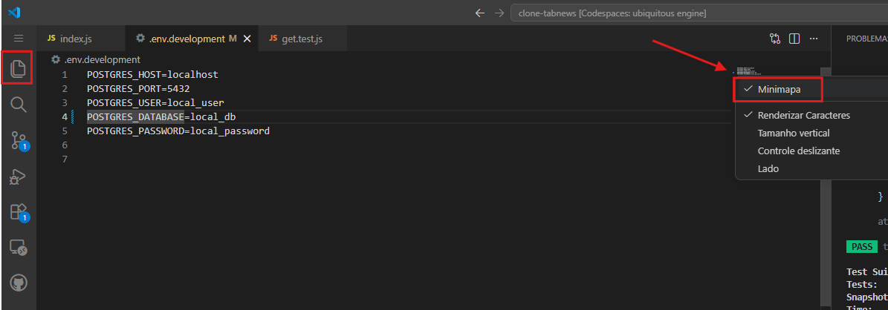

**Nota:** Na imagem acima há uma alteração no código, porém **não é necessário realiza-lá**.
 

## Tentando utilizar `Absolut Import` nativamente no `Node.js`

Para realizarmos esta tentativa, alteraremos o caminho presente no arquivo `index.js` (`pages/api/v1/status/index.js`) para apenas `/infra/database.js`.
 

**Alteração no arquivo `index.js`:**

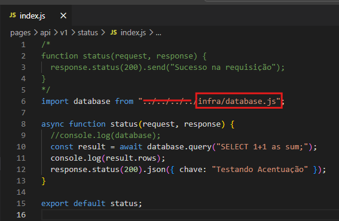

Note que ao executarmos esta alteração, **o código acaba quebrando**. Isto é acusado pelo `Jest` no `Temrinal`.

**Acusação do `Jest`:**

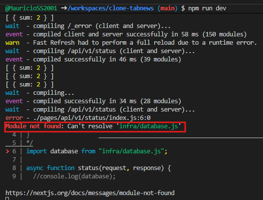

### Spoiler
Futuramente configuraremos o arquivo `jsconfig.json` para aceitar esta alteração.
 

## Criando o arquivo `jsconfig.json` pelo `Terminal`

Parar criarmos o arquivo `jsconfig.json` sem utilizar a `Árvore de arquivos`, podemos criá-lo pelo `Temrinal`. Para isto, seguiremos alguns passos.

**1.** Parar o `Servidor Web`. (`CTRL` **+** `C` no `Terminal` que estiver executando-o)

**2.** Executar o seguinte comando no `Terminal`:

~~~ Terminal
code jsconfig.json
~~~

**Notas:**
- `code` é o termo padrão do `VS Code` para editar/criar um arquivo.
- Cuide para o arquivo ser criado na `Raíz do Projeto`. (`\workspaces\clone-tabnews`)

**3.** Uma nova aba será aberta no `VS Code` automaticamente.

**Aba criada:**

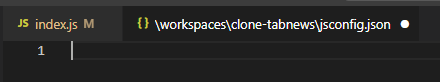

A configuração responsável por definir o `Caminho Absoluto` que estamos configurando está dentro de uma propriedade chamada `compilerOptions` (`Opcões de Compilação`).

**Mas por que a propriedade chama-se `compiler` se `JavaScript` é `Interpretado` e não `Compilado`?**

Segundo a `Dcoumentação oficial`, este fato ocorre porque o arquivo `jsconfig.json` **é um descendente** do arquivo `tsconfig.json`. (`Typescript` é uma `Linguagem de Programação Compilada`)

**Documentação oficial:**

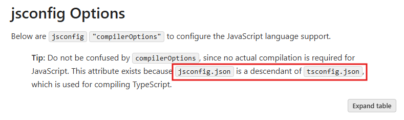

**Disponível em:** <a href="https://code.visualstudio.com/docs/languages/jsconfig">https://code.visualstudio.com/docs/languages/jsconfig</a>
 

Embora a propriedade `compilerOptions` se expanda em várias outras, mais complicadas inclusives, utilziaremos no `Projeto`apenas a `basUrl` por enquanto.

`baseUrl` **define o `Diretório Base` para resolução de nome de `Módulos` não relativo**.

**Documentação Oficial:**

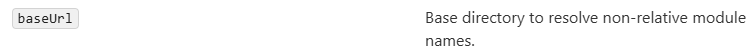
 

## Configurando o arquivo `jsconfig.json`
Para configurarmos o arquivo, começaremos **criando um `objeto JSON`**.
 

**Criando `Objeto JSON` vazio dentro do arquivo `jsconfig.json`:**

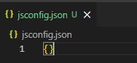

Logo em seguida, criaremos uma chave chamada "`compilerOptions`" com um `Objeto JSON` como valor.

**Definindo `chave` e `valor` do `Objeto JSON`:**
 

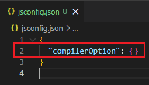

Dentro deste novo `Objeto JSON` criado, definiremos uma `chave` chamada "`baseUrl`" e um valor que será uma `string` vazia por enquanto.
 

**Definindo `chave` e `valor` do `Objeto JSON`:**

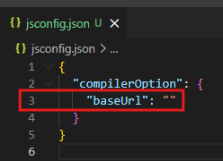
 

#### Navegando pelos caminhos no `Terminal` (`Shell`)
Por padrão, a utilização do caractere `.` permite a navegação pelos diretórios dentro do do `Terminal`(`Shell`).
 

**Caractere(s)** | **Representação** | **Utilização**
-|-|-
**Um ponto** |`.` | É utilizado para o `Diretório Atual`.
**Dois pontos** | `..` | São utilizados para acessar um `Diretório anterior` **ao atual**.
**Três pontos** | `...` | São utilizados para acessar dois `Diretórios anteriores` **ao atual**.

 

**Nota:** Nem todos `Terminais` permitem a utilização de **três pontos**.

Podemos explorar isto criando um `Terminal zhs` no `GitHub Codespaces`.

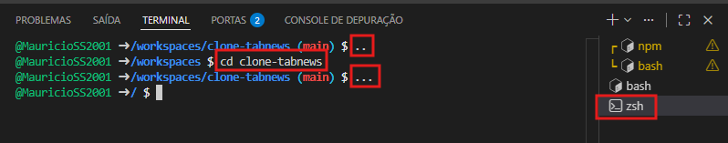

- **Primeiro comando**: Retorna um `Diretório anterior`.
 

- **Segundo comando:** Acessa o `Diretório Raíz` novamente.
 

- **Terceiro comando:** Retorna dois `Diretórios anteriores`.

Encerre o terminal com o comando `exit`.
 

## Voltando ao arquivo `jsconfig.json`
Agora iremos definir o `valor` da `propriedade` `baseUrl`, que será ponto (`.`).

** Definindo o `valor` da `propriedade`:**

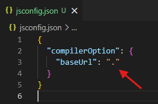

**Mas por que ponto (`.`)?**
Pois o ponto (`.`) indica o `Diretório Atual` que o **arquivo `jsconfig.json` está**.

**Nota:** 
Ao salvar o arquivo, o `Jest` acusará erro, pois o `Servidor WEB` encontra-se **desligado**.
Para liá-lo novamente, basta digitar o seguinte comando no `Terminal`:

~~~ Terminal
npm run dev
~~~
 

## Resultado
Ao executar estes passos, o resultado esperado é que o `Jest` não acuse nenhum erro.

**`Jest`:**

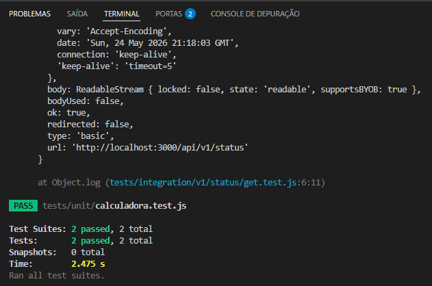

## Realizando `commit` com as alterações feitas
Para salvarmos nossas alterações, realizaremos agora o processo de `commit`.

**1. Adicionando arquivos ao `commit`:**
~~~ Terminal
git add -A
~~~

**2. Adicionando uma mensagem ao `commit`:**
~~~ Terminal
git commit -m 'Adicionado arquivo `jsconfig.json`'
~~~

**3. Realizar o `push` do `commit`:**
~~~ Terminal
git push
~~~
 

---
---
---
 

# Configurar scripts dos serviços

## Objetivo da Aula

O objetivo desta aula é a preparação para implementação do `CI (Continuous Integration)`.

**`Issue` no `GitHub`:**
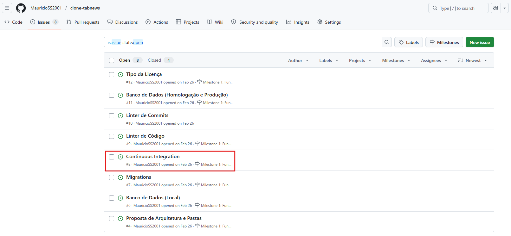

Com esta implementação, automatizaremos o comando responsável por executar o `Container` do `Banco de Dados`. (`Docker`)
 

## Automatizando com `script`
Para iniciarmos, abriremos o arquivo `package.json` para alterá-lo. O desafio proposto é realizar a abertura do arquvio **sem utilizar** a `Árvore de Arquivos` **nem o `Terminal`**.

Para isto, utilizaremos a técnica de  `Fuzzy Search (Busca Difusa)`
 

### Utilizando `Fuzzy Search` em diferentes `SO's`
Para realizar uma `Fuzzy Search`, podemos utilizar alguns atalhos no `Teclado`.

- **Windows/Linux:** `CTRL` **+** `P`
- **macOS:** `CMD` **+** `P`

Ao pressionar o atalho, uma barra de busca aparecerá centralizada no `VS Code`.

**Barra de Busca:**

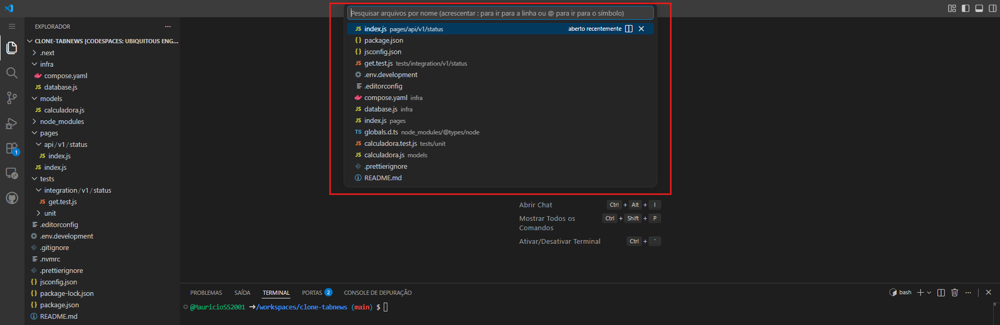
 

Ao procurarmos o termo "`package.json`" ele exibirá dois arquivos. Isto ocorre porque o `VS Code` utiliza `Match parcial` quando busca os arquivos por nome.
 

**Busca de `package.json`:**

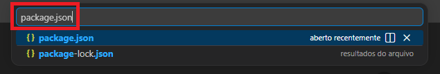

**Mas o que significa `Match parcial`?**
`Match parcial` significa que ele buscará com base nas letras e procurará quais arquivos tem combinações destas letras, nessa ordem, nos arquivos.

Note que ao pesquisarmos o termo "`pk`", ele encontra os mesmos arquivos.

**Busca de `pk`:**

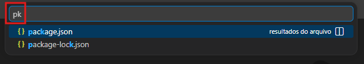
 

### Consultando uma propriedade dentro de um arquivo
Podemos pesquisar uma `Propriedade` ou `trecho de código` específico dentro de um arquivo utilizando `Fuzzy Search (Busca Difusa)`.

Para isto, basta utilizar o caracter `@` após o nome do arquivo.
 

**Busca de `pk@sc`:**

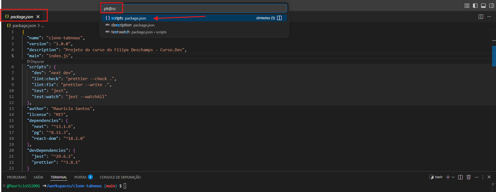

Note que o arquivo `package.json` é **aberto automaticamente** no trecho dos `scripts`.

Ao pressionar `ENTER`, o `VS Code` já posiciona automaticamente o cursor sobre o termo pesquisado.
 

## Criando o script `services:up` dentro do `package.json`
Dentro do arquivo `package.json`, criaremos um novo `script` logo após o `script` `dev`. Chamaremos-o de `services:up`, pois ele será responsável por "levantar" os `Serviços` do `Projeto`.

O valor deste script, **será o comando que executa o `Container Docker (Banco de Dados)`**.

**Lembre-se de adicionar a vírgula (`,`) após o comando**
 

~~~ package.json
docker compose -f infra/compose.yaml up -d
~~~
 

**Criação do `Script` no `package.json`:**

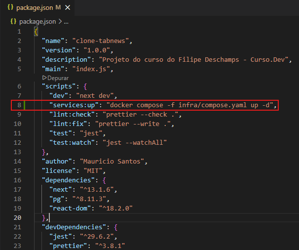
 

Para testarmos se o comando funcionou, podemos **executar o `script` no `Terminal`**:
 

~~~ Terminal
npm run services:up
~~~
 

**Execução do `Script` no `Terminal`:**

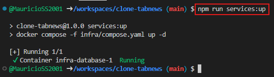
 

Para verificarmos se o `Container` realmente está sendo executado, podemos utilizar o comando abaixo no `Terminal`:

~~~
docker ps
~~~
 

**Verificação se o `Container` está sendo executado:**

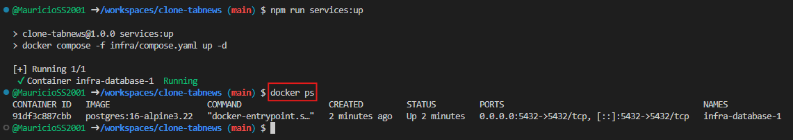
 

### Criando o `Script` `services:down`
O `Script` `services.down` tem como objetivo desligar e remover o `container` que está sendo executado.
Para isto, duplicaremos a linha de criação do `script` `services.up` e alteraremos o **parâmetro** `up` por `down` e **removendo o parâmetro `-d`**.

**Lembre-se de utilizar a vírgula (`,`) após o comando.**

~~~ package.json
docker compose -f infra/compose.yaml down
~~~
 

**Criação do `script` `services:down`:**

 

**Nota importante:** Quando este `Script` é executado, ele **destrói o `container`**, **apagando todos os dados salvos no `Banco de Dados`**.
 

### Criando o `script` `stop`
Como vimos no tópico anterior, o `script` `down` **causa perda de dados**, porém o `Docker` conta com um outro parâmetro chamado `stop`, que **pausa temporariamente o `Container`**.

Criaremos agora um novo `script`, chamado `stop`.

Podemos copiar e colar o `script` `down` alterando o termo `down` por `stop` e **removendo o parâmetro `-d`**.

**Lembre-se de utilizar a vírgula (`,`) após o comando.**

~~~ package.json
docker compose -f infra/compose.yaml stop
~~~
 

**Criação do `script` `services:stop`:**

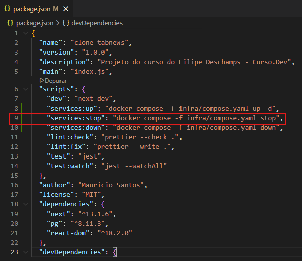
 

## Testando os `scripts` novos
Para testarmos os scripts, podemos **limpar o `Terminal`** para uma melhor visualização.
 

~~~ Terminal 
clear
~~~
 

Começaremos **testando o `script` `stop`** com o seguinte comando no `Terminal`:
 

~~~
npm run services:stop
~~~
 

**Execução do `script` `services:stop`:**
 

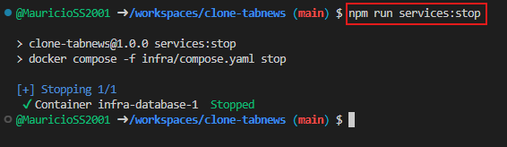
 

Agora verificaremos se o `container` **parou de ser executado**. Para isto, utilizaremos o seguinte comando no `Terminal`:
 

~~~ Terminal
docker ps
~~~
 

**Execução do comando no `Terminal`:**
 

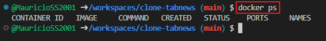

**Nota importante:**
O `script` que executamos **apenas fez com que o `Container` parasse de executar**, mas ele **não foi destruído**.

Isto faz com que ele não apareça na lista na execução deste coamndo do `Docker`.
 

Para verificarmos todos os `Containers` **que existem**, estando eles **em execução ou não**, utilizaremos o comando abaixo no `Terminal`:
 

~~~ Terminal
docker ps --all
~~~
 

**Execução do comando no `Terminal`:**

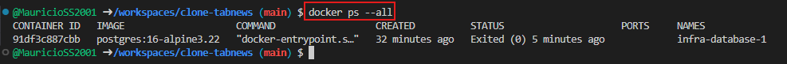
 

Por fim, **encerraremos (destruindo)** a execução do `Container` com o seguinte comando no `Terminal`:
 

~~~ Terminal
npm run services:down
~~~
 

**Execução do comando no `Terminal`:**

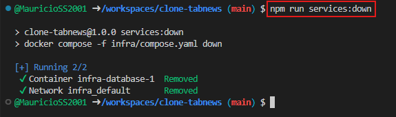

Para verificarmos se o `container` encerrou sua execução e foi destruído, utilizaremos o seguinte comando no `Terminal`:
 

~~~ Terminal
docker ps --all
~~~
 

**Execução do comando no `Terminal`:**

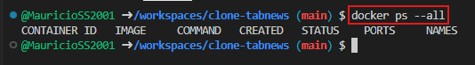
 

## Concatenando `scripts`
Para mais automação, podemos **concatenar `scripts`**, fazendo com que mais de um comando seja executado ao executarmos um único `script` no terminal.

Previamente, havia **um comando para executar o `container` (`Docker`)** e **um comando para executar o `Servidor WEB`**. Agora, podemos concatena-los para utilizar apenas um comando e executar os dois serviçoes em sequência.

Para isto, iremos configurar o arquivo `package.json`, com a seguinte alteração:
Iremos adicionar o comando `npm run services:up` dentro do script `dev`.

utilizando o operador `AND` (`&&`) cosneguimos concatena-los.
 

~~~ package.json
"dev": "npm run services:up && next dev",
~~~
 

**Alteração no `Script` `dev` do `package.json`:**

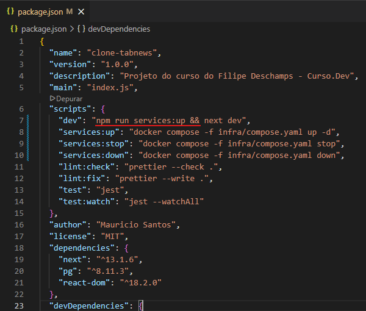
 

**Nota importante:** 
O segundo `script` é executado apenas **após a execução bem sucedida do primeiro** (Saída com `Código 0`).
 

## Testando a execução de `scripts` concatenados
Para testarmos, utilizaremos o comando que antes executava apenas o `Servidor WEB`.

No `Terminal` utilizaremos o seguinte comando:
 

~~~ Terminal
npm run dev
~~~
 

**Execução do comando no `Terminal`:**

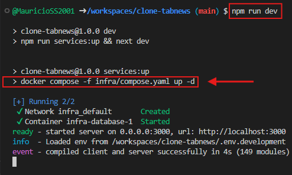

Note que o segundo texto destacado é o comando para execução do `container`, ou seja ele executou o primeiro `script` (do `Serviço` de `Banco de Dados`) e logo na sequência executou o segundo `script` (`Servidor WEB`).
 

## Salvando as alterações no código
Para salvarmos nossa alterações, faremos um `commit`, porém com um detalhe diferente desta vez. Como não criamos nenhum arquivo novo, podemos utilizar um comando único para realizar o todo o processo de criação de `commit`.

para isto, utilizaremos o seguinte comando no `Terminal`:
 

~~~ Terminal
git commit -am 'Adicionados `scripts` de serviço'
~~~
 

**Criação do `commit:`**

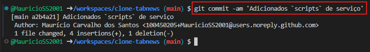
 

Agora enviaremos o `commit` ao `Repositório Remoto` com o seguinte comando no `Terminal`:
 

~~~ Terminal
git push
~~~
 

**Envio do `commit`:**

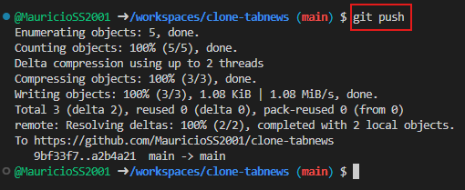
 

## Atualizando `Issues` na nossa `Milestone`
Para atualizarmos nossas `Issues`, clicaremos na opção `Issues` localizada no canto superior esquerdo do `Repositório` e acessaremos a `Issue` `Banco de Dados (Local)`.
 

**Acessando `issue` `Banco de Dados (Local)`:**

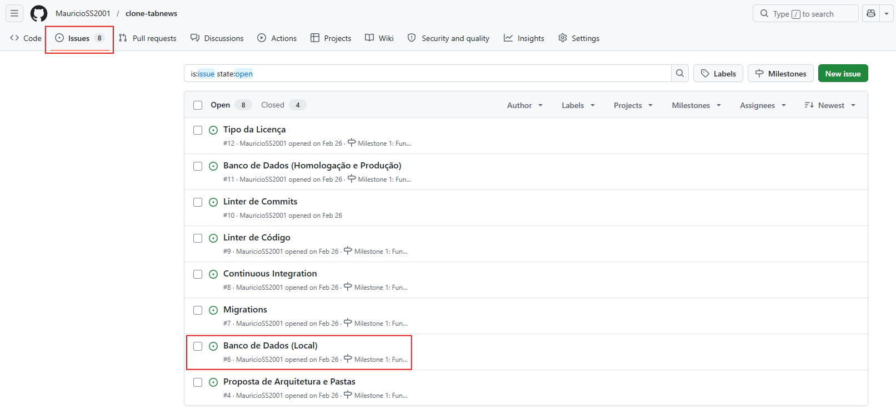

Agora criaremos **três novas** `tasks (Tarefas)`:

- **"Mover o arquivo `.env` para `.env.development`**
 

- **Adicionar `.jsconfig.json` com o `baseUrl`**
 

- **"Adicionar os scripts dos serviços"**
 

**Novas `Tasks (Tarefas)` na `Issue`:**

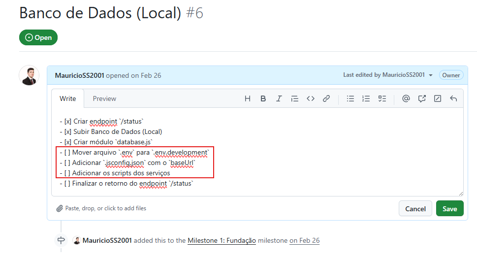

Agora por fim, vamos marcar as **três `tarefas` criadas agora** como concluídas.
 

**Marcando as `Tarefas` como concluídas:**

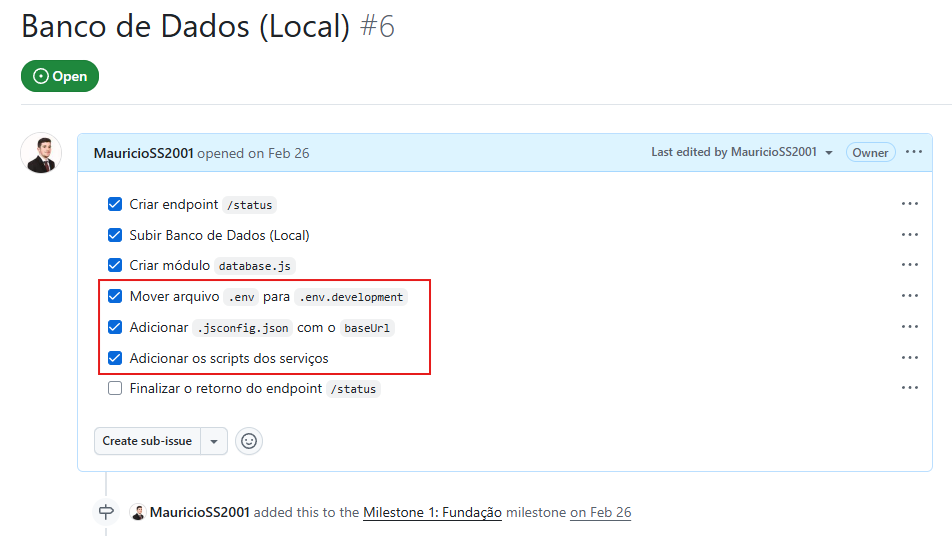

