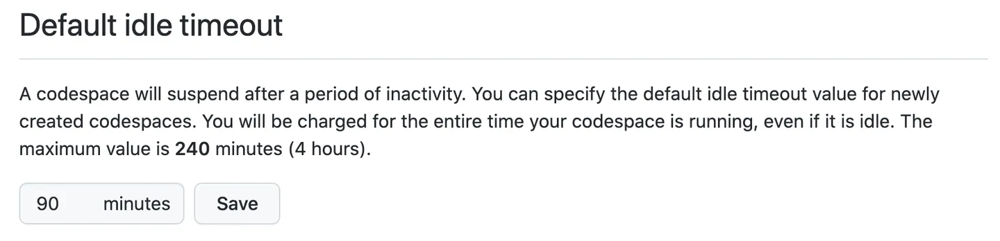
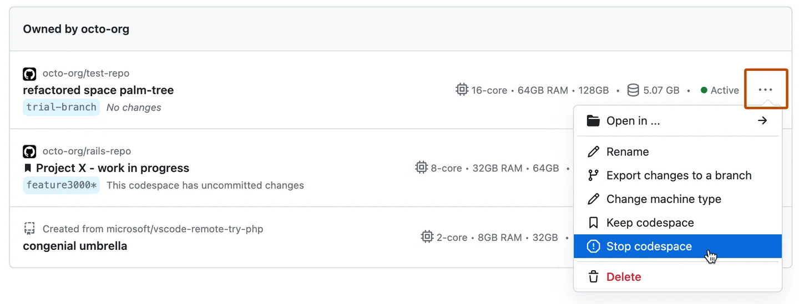
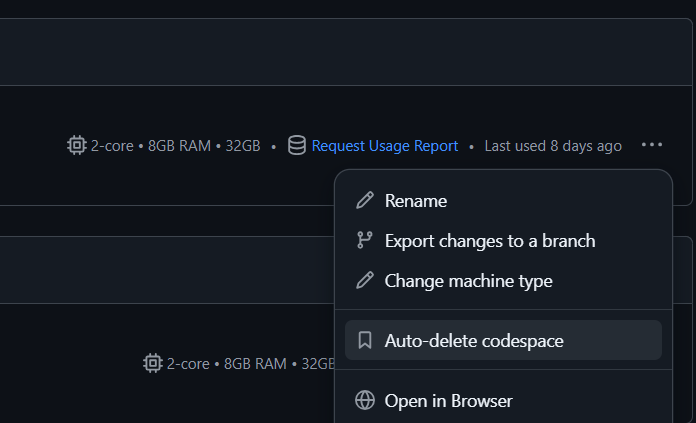

# 2 dicas para economizar o Codespaces (+1 bônus)
O Codespaces do GitHub é uma ferramenta fantástica que facilita bastante o nosso trabalho de configurar um ambiente de desenvolvimento. Não é à toa que ele é o ambiente recomendado aqui no curso.dev, para que os alunos possam acompanhar as aulas com o mínimo de atrito.

As contas pessoais do GitHub incluem uma cota gratuita de uso do Codespaces que é renovada mensalmente, sempre no primeiro dia do mês. O uso é medido com base no armazenamento em disco e no processamento, cujos limites são:

Armazenamento por mês|Horas de núcleo por mês
-|-
15 GB/mês|	120

O limite de armazenamento é bem generoso para o uso do nosso projeto aqui do curso, então não precisa prestar muita atenção nele. Agora, as horas de processamento são mais limitadas e se o seu uso for muito intenso e você não aplicar as dicas que eu vou dar aqui, pode ser que você fique impedido de usar o seu Codespaces até que os seus créditos gratuitos sejam renovados.

**Para ter uma noção:** por padrão, as máquinas virtuais criadas para os Codespaces possuem 2 núcleos, e segundo a <a href="https://docs.github.com/pt/billing/concepts/product-billing/github-codespaces#free-and-billed-use-by-personal-accounts">documentação</a>, uma máquina desse tipo usada por 1 hora consome 2 horas de núcleo. Então, para atingir esse limite, você precisaria usar a sua instância 2 horas por dia, durante 30 dias.

## 1º dica: diminua o tempo limite de ociosidade
Se você já usou o Codepaces por um tempo, já deve ter percebido que ele para de funcionar após um período de inatividade. A ausência das seguintes ações é definida como inatividade:

- Digitar ou usar o mouse;
- Atividade de entrada ou saída no terminal (os logs do servidor web são considerados como atividade, por exemplo);
Por padrão, o período de ociosidade que o Codespaces vai esperar para desligar automaticamente é de 30 minutos, mas você pode alterar esse valor seguindo os passos abaixo:

1. No canto superior direito de qualquer página do GitHub, clique sua foto de perfil e, em seguida, clique em Configurações.
2. Na seção "Código, planejamento e automação" da barra lateral, clique em Codespaces.
3. Em "Tempo limite ocioso padrão", insira a hora desejada e clique em Salvar. O tempo deve ser entre 5 minutos e 240 minutos (4 horas).

Eu configurei o meu para 10 minutos. Talvez isso seja pouco para você. Mas como eu não costumo deixa a minha instância aberta sem que eu esteja trabalhando nela, isso previne que meus créditos sejam consumidos à toa caso eu precise sair do computador, e me esqueça de pausar ela. E isso nos leva à segunda dica.

---

## 2º dica: pare o seu Codespaces manualmente
Depois de você terminar o seu trabalho, ao invés de simplementes fechar a aba do navegador (isso não funciona para desligar ele, vai continuar rodando remotamente até atingir o limite de ociosiade), é você parar ele manualmente, o que já economiza um pouquinho mais de créditos. Para isso, siga os passos abaixo:

1. Acesse a página "Seus Codespaces" em https://github.com/codespaces.
2. À direita do codespace que você deseja interromper, clique nas reticências `(...)`.
3. Clique em `Parar codespace`.

---

## Dica bônus: desabilite a exclusão automática
Essa dica não tem a ver com economia de créditos, mas pode te poupar de perder trabalho não salvo, caso você passe muito tempo sem acessar o seu Codespace.

Por padrão, os Codespaces são excluídos automaticamente depois que são parados e continuam inativos por 30 dias. Se por algum motivo você permanecer todo esse tempo sem acessar a sua instância, e ela ainda possuir trabalho não salvo, ele será perdido. Para evitar isso, você deve:

1. Acessar a página "Seus Codespaces" em https://github.com/codespaces.
2. À direita do codespace que você deseja interromper, clique nas reticências `(...)`.
3. Desmarque a opção `Auto-delete codespace`.

**Fonte: https://docs.github.com/pt/codespaces**