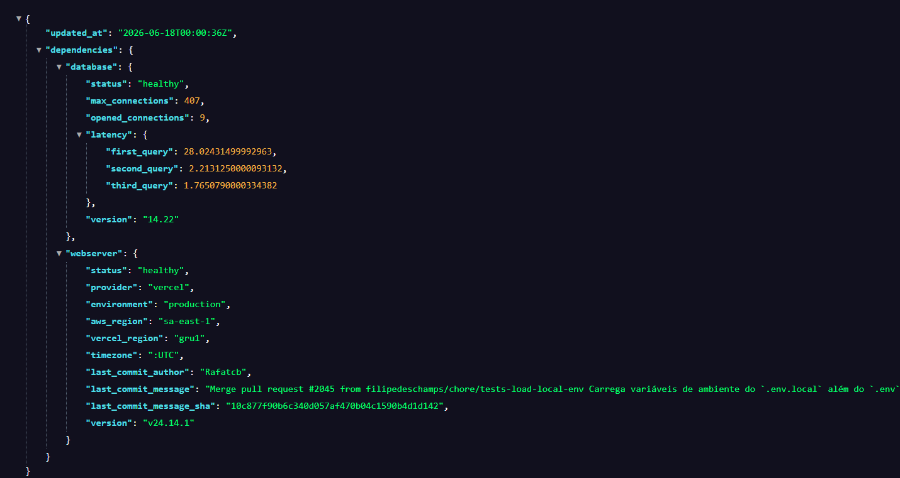
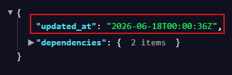
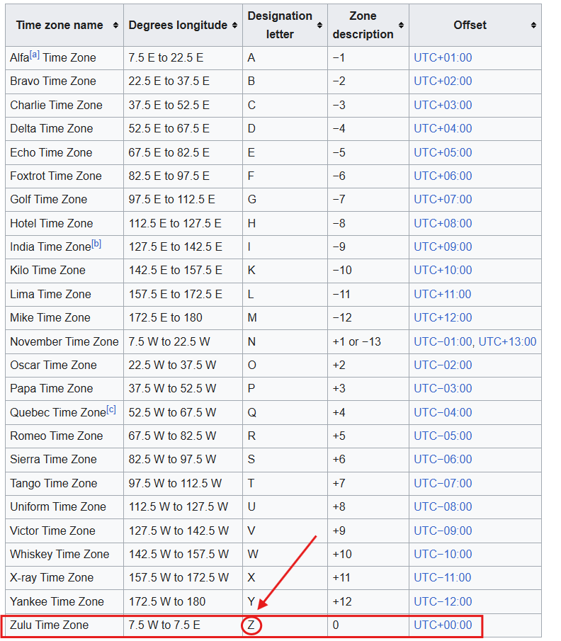

# Endpoint "/status": ISO 8601 + Fuso + MVC + lowerCamelCase
 

## Objetivo da aula
O objetivo da **aula do dia 20** é **concluir o endpoint `/api/v1/status`**.
O `endpoint` deverá informar a `saúde` da **aplicação**.
 

### Anotação (Alteração em um dos recursos utilizados no curso)
A extensão `Json Viewer` não estava mostrando os objetos de maneira colorida como o proposto, então instalei a `JSON Viewer PRO`.

(Disponível em: <a href="https://chromewebstore.google.com/detail/json-viewer-pro/eifflpmocdbdmepbjaopkkhbfmdgijcc">https://chromewebstore.google.com/detail/json-viewer-pro/eifflpmocdbdmepbjaopkkhbfmdgijcc</a>)
 

## Exemplo do que esperar ao acessar a rota `status` da `API`
Um exemplo do que esperamos está disponível no site do `TabNews` (`tabnews.com.br/api/v1/status`)
 

**Json retornado (`tabnews.com.br/api/v1/status`):**

 

## Analisando o objeto (`Json`) recebido
Para uma melhor análise, fecharemos as propriedades até que fiquemos **apenas na raíz do objeto**.
 

**Raíz do objeto:**

A propriedade `"update_at"` retorna a data e hora em que os dados foram gerados no `backend` (quando realizamos a consulta). Estes dados servem para verificar se estamos recebendo dados atualizados e informar o fuso horário deles.

O formato da data e fuso horário é conhecido por `ISO 8601`. Ele é muito utilizado por padrão nos sistemas.
 

**Constituição do valor recebido:**
~~~ Json
ano-mês-dia|T|hora:minuto:segundoFuso horário
~~~
 

**Dados presentes:**
**Ano** | **Mês** | **Dia** | **T** | **Hora** | **Minuto** | **Segundo** | **Fuso Horário**
-|-|-|-|-|-|-|-
2026 | 06 | 18 | T | 00 | 00 | 36 | Z

 

### Mas o que significa a letra `Z`?
A letra `Z` é um **código** do **fuso horário militar** (<a href="https://en.wikipedia.org/wiki/Military_time_zone">Mais informações disponíveis aqui</a>).

Neste sistema, cada letra representa um nome e um fuso horário.

**Tabela do fuso horário militar:**

A letra `Z` é representada por `Zulu Time Zone` e está no fuso horário `UTC+00:))`. 

(`UTC (Tempo Universal Coordenado)`)
 

**Material extra:** <a href="https://time.is/pt_br/UTC">Consultar `UTC` agora</a>
 

### Analisando mais dados vindos do objeto

