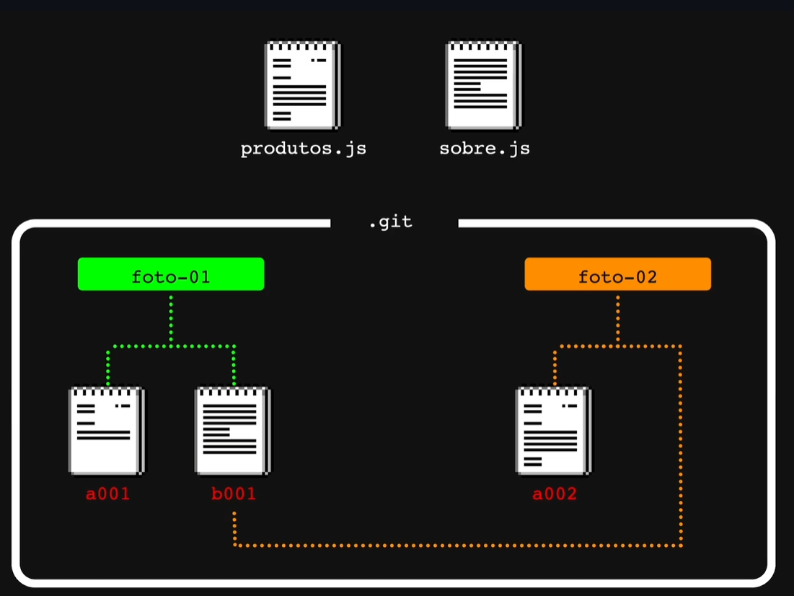
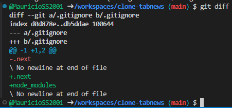
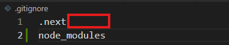

# Versionamento de Código

## Versionamento local no VS Code - <i>Local History</i>
O `VS Code` permite a visualização das alterações feitas no arquivo por meio do acesso a aba `timeline`.
 

### História do Versionamento de código
- **1972:** <i>Bell Lab</i> inventa o `SCSS (Source Code Control System)`.
    - Primeiro sistema digital de versionamento.
    - Centralizado.
     
- **1982:** Surge o `RCS (Revision Control System)`.
- Centralizado.
 

- **1986:** Surge o `CVS`.
- Centralizado.
 

- **2000:** Surge o `SVN`.
- Centralizado.
 

**2005:** Surge o `Git`.
 - Criado por <i>Linus Torvalds</i>.
 - Distribuído.

### Sistema Centralizado vs Distribuído

- **Centralizado:** Um servidor disponibiliza a cópia para somente um desenvolvedor e bloqueia que os demais copiem até que o desenvolvedor retorne os arquivos com as alterações.
As alterações eram visualizadas a partir de do processo de **saída**(`checkout`) e **entrada**(`checkin`).
O `checkin` era feito manualmente pelo desenvolvedor no retorno do código e o objetivo principal deste modelo era evitar o processo de **união/mesclagem de alterações em um mesmo arquivo**(`Merge`).
 

- **Distribuído:** Vários desenvolvedores podem receber uma cópia integral dos códigos (`Clone`) e alterar simultâneamente, evitando perda de tempo.

### Merge Conflict
Processo no qual dois desenvolvedores alteram a mesma parte do arquivo com alterações diferente e há necessidade de seleção humana para versão final de código.
 

### Listando arquivos no Git
Para listar os arquivos, basta utilizar comandos `ls` no terminal.

**Listar arquivos:**
~~~ git
ls
~~~
 

**Listar arquivos verticalmente:**
~~~ git
ls -l
~~~
 

**Listar TODOS arquivos (incluindo ocultos) verticalmente:**
~~~ git
list =la
~~~
**a:** all (Todos em Inglês).
 

### Pasta <i>.git</i>
A pasta `.git` é responsável pelo armazenamento das informações de alterações do repositório.
 

---
---
---
 

# Verificando diferenças entre versões

### Git Diff
O `Git` trabalha com "fotos". Cada "foto" é uma representação de uma versão. e cada versão contém um <i>**blob**</i> (Podemos considerar um espaço com todos os arquivos desta versão). Quando uma nova versão é criada, o `blob` pega o arquivo com as alterações e utilizá-o, porém se um arquivo não foi alterado desde a versão passada, o `git` pega o mesmo.
 

- O sistema `CVS` guardava apenas a alteração (`Delta Encoding`) de cada versão e não o código inteiro a cada versionamento.

 

Cada vez que o `git` compara duas versões, um `diff` é gerado dinâmicamente.
 

### Verificando registros do repositório
Para verificar as "fotos" do repositório, basta utilizar o comando abaixo no terminal (Git).
~~~ git
git log
~~~
**<i>log</i> tradução:** Registro.
 

### Commit ("Fotos")
Cada `commit` é equivalente a uma **"foto" (uma versão) do projeto**.
 

---
---
---

 

## 3(4) Estágios de um commit
- **<i>Modified:</i>** É um arquivo que já estava presente em uma versão anterior, porém foi modificado agora.
 

-  **<i>Staged:</i>** Escolha dos arquivos modificados que realmente serão enviados ao repositório remoto.
 

- **<i>Commit:</i>** Etapa final do envio de arquivos ao repositório.
 

- **<i>Untracked:</i>** Arquivo que não existia no <i>commit</i> anterior.
 

## Status de um repositório
Para verificar o status dos arquivos em relação ao `git`, utilizam-se os comandos abaixo no terminal (`git`).
 

**Resumo de logs**
~~~ git
git log --stat
~~~
 

**Comparando todos arquivos locais com os do git (commit anterior)**
~~~ git
git status
~~~
 

## Build de um projeto
**<i>Build</i>** de um projeto é transformar os arquivos de desenvolvimento em arquivos finais que compõem a aplicação.
 

## Ignorando arquivos em um diretório
Para evitar mandar arquivos que não são necessários, pois são gerados dinâmicamente em cada execução, é possível criar um arquivo cahmado `.gitignore` que evita que eles sejam enviados nos `commits`.
Para ingorar um arquivo ou diretório, basta digitar seu nome dentro do arquivo `.gitignore`.
 

---
---
---

 

# Emendando commits

## Diretórios

- **Working Directory:** Diretório atual que o código está sendo alterado pelo desenvolvedor.
 

- **.git:** Diretório que tem o projeto que tem o projeto no commit prévio.
 

## Verificando diferenças entre os diretórios

~~~ terminal
git diff
~~~
 

## Alterações
No exemplo abaixo, o arquivo `.next` foi removido e adicionado novamente. 

**Por que isso ocorreu?**
O arquivo inicial foi alterado ao pressionar `enter` para adicionar a linha abaixo contendo o diretório `node_modules`. O espaço marcado em vermelho, é onde há um **caracter invisível** chamado `Newline`.

O caracter `Newline` pode ser representado de várias maneiras.

Tipo | Valor
-- | -
String | "\n"
ASCII | Chr(10)
Hex | 0x0A

O caracter `Newline` também utilizado para indicar o fim de uma linha de modo que evite erros de "linha infinita". Foi padronizado no `Unix`.

Para selecionar este caracter, basta usar o comando `Shift + ->`
 

## Amend / Emendando um commit
Emendar um commit significa que iremos adicionar as alterações atuais ao último <i>commit</i> sem a criação de um novo.

~~~ git
git commit --amend
~~~

**Nota importante:** Após emendar um <i>commit</i>, **seu identificador será alterado**.

- **<i>Commits</i> são IMUTÁVEIS**.