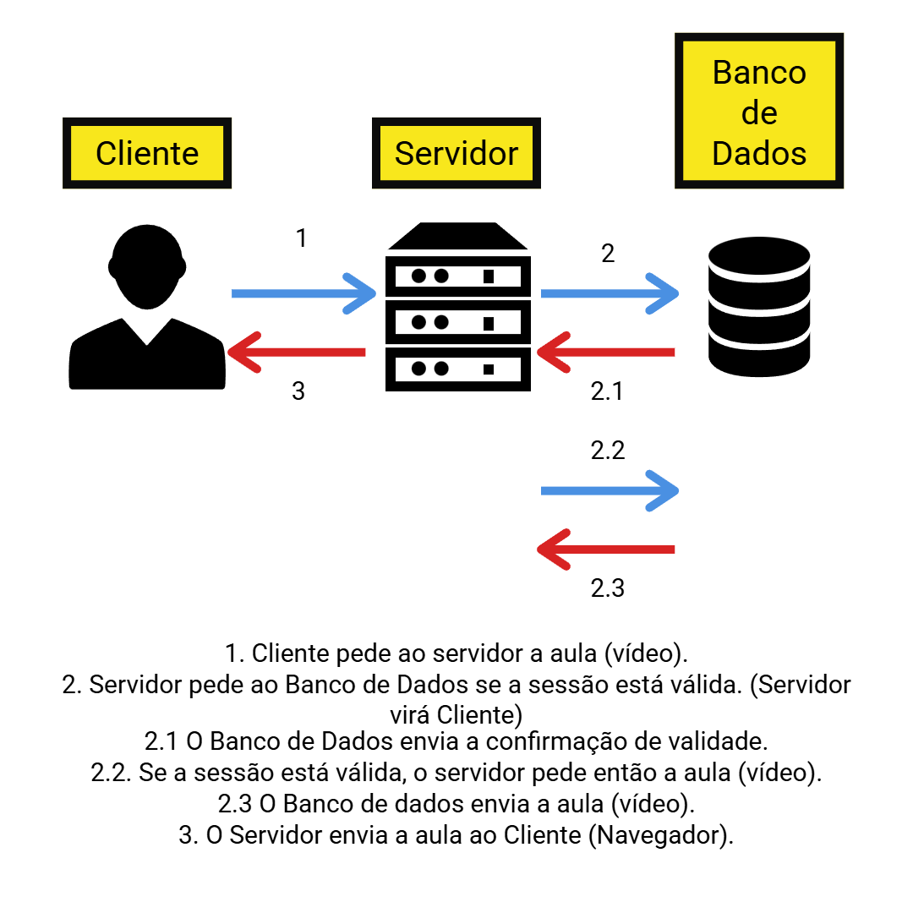

# <i>Client</i> e <i>Server</i> (Cliente e Servidor)

## Continous Deployment (CD)
É a automação do processo de `deploy`. Um `deploy` é onde uma nova versão de seu software entra em produção. Ao final deste processo, pode observar-se uma redução do tempo para o cliente receber uma nova implementação em seu software (Produto).

### Passos aprendidos até agora
**FLuxo:**
**1.** Desenvolver a implementação na cópia local. (<i>Branch</i> local)
**2.** "Empurrar" a implementação para o repositório de origem. (<i>Branch</i> remota)

**Instalar um "robozinho" para ficar monitorando novidades no repositório de origem.**

**3.** Caso uma novidade "apareça", o robozinho transferirá as alterações para o servidor. (**Fazer Deploy**)

A partir deste fluxo, qualquer cliente receberá as alterações disponíveis no software.
 

---

 

## Client (Cliente) e Server (Servidor)
O sistema `cliente/servidor` funciona com base em requisições, onde o `cliente` geralmente é um navegador e solicita dados (faz uma requisição) ao `servidor`.

**Exemplos práticos:** 

- **1. Pai e filho almoçando**
Um pai e um filho estão almoçando. O filho (`cliente`) solicita que o pai (`servidor`) lhe alcance um copo de água.
 

- **2. Pai, Mãe e filho almoçando**
A família está almoçando e o filho (`cliente`) pede ao Pai (`servidor`) que alcance um copo de água. Porém, a Mãe (`servidor`) está mais perto, então o Pai pede à Mãe **(Neste momento Pai virá `Cliente`)** que lhe alcance o copo de água. O Pai **volta a ser `Servidor` quando recebe o copo e entrega ao filho**.

**Nota:** O **servidor** pode virar **cliente** em certo momento.
 

### Exemplo de aula

 

**Notas:** 
- O `Servidor` pode ter vários `Clientes` de **mesmo ou diferente tipos**.
- O `Servidor` pode se comunicar com vários serviçoes externos.
- **TODOS** precisam utilizar o **MESMO Protocolo**.
 

## Distância física
A distância física entre `cliente` e `servidor` pode afetar a experiência do usuário de modo que possa ocorrer demora de resposta (`latência`) ou perda de pacotes (`Packet loss`).
É importante ressaltar que o caminho pode conter distâncias diferentes como o `cliente` estar perto do primeiro servidor, porém quando ele (`servidor`) requisita a um segundo servidor, ele tem longa distância podendo causar falhas ou atrasos, ou vice-versa (`cliente` longe, mas `servidores` um perto do outro).
 

---
---
---
 

# Hospedagem e Deploy

## O que significa Hospedar
Hospedar segundo o dicionário, significa "dar abrigo". Dentro do contexto de desenvolvimento <i>web</i>, "hospedar um site" significa **dar abrigo aos arquivos de sua aplicação**.
 

## Hospedagem de sites ao longo da História

**Primeira Fase:**
- Inicialmente os sites eram desenvolvidos e hospedados em computadores próprios do desenvolvedor.
    - Inacessibilidade ao computador (falta de eletricidade, reiniciar, desligar, etc...) causavam problemas para acesso aos sites hospedados.
 

**Segunda Fase:**
- Posteriormente os sites eram armazenados em serviços específicos com maior estabilidade baseada em redundâncias (Internet, luz, etc..). Estes serviços também eram mais potentes, permitindo mais acesso simultâneamente.
     - Era necessário passar os arquivos da aplicação do computador do desenvolvedor para o servidor dedicado (Fazer **<i>deploy</i>** --> **"Implantar"**).
     - O envio de arquivos era feito por meio do **Protocolo FTP (File Transfer Protocol)**.
     - Este tipo de aplicação ainda é utilizado nos dias atuais.
     - Como este processo era feito manualmente, ocasionava o risco de erros de versionamento.

**Terceira Fase:**
- Seguir os principios da segunda, mas editar os arquivos diretamente no `servidor`, evitando assim ter que realizar o envio de arquivos do computador do desenvolvedor ao `servidor`.
    - Necessário se conectar ao `Windows Server` para alterar os arquivos na máquina `servidor`.
    - Caso fosse uma `Máquina Linux`, era utilizado o `protocolo SSH`.
    - Ambiente `local` e `remoto` eram heterogêneos podendo ocasionar falhas.
     (As vezes o `debug` era feito na máquina servidor).
    - Falta de sincronização entre máquinas (desenvolvedor e servidor) ocasionavam falhas.

**Quarta Fase:**
- Sistema de versionamento de código (`git`).
- `Git` pode ser instalado em `servidores`.
- Permitiu `automações`
    - Até mesmo ter um computador prévio à produção para conferências de etapas.
 

**Fase Atual:**
- Envio para `CI (Continous Integration)`.
    - Realiza testes automáticos para ver se algo está "quebrado".
    - Caso não haja nada "quebrado", o código é enviado para outra máquina para o processo de `build` (transforma **código fonte em pacote final** com otimizações para rodar em `servidor` permitindo abertura por navegadores).
    - Após sair da `build`, os arquivos são enviados ao(s) `servidor(es)` na Internet.
 

**Nota:** A área da tecnologia possuí evolução constante, sempre buscando abstrações (facilitar processos) permitindo assim uma maior facilidade de entrada de novas tecnologias no mercado.

**Nota:** `Continuos Integrator` verficia se alterações de outras linhas do tempo podem ser integradas na **linha do tempo Principal** (`branch main`) e subir isto em **produção**.

## Link do meu primeiro Deploy
https://clone-tabnews-henna-psi-41.vercel.app/

<a href="https://clone-tabnews-henna-psi-41.vercel.app/">Clique Aqui</a>
 

---

 

# Fazendo novos Deploys

## Principle of Least Privilege (Princípio do Menor Privilégio / Princípio do Privilégio Mínimo)
Princípio que afirma que para uma maior segurança de um projeto, é recomendado sempre **atribuir a menor quantidade de acessos, credenciais, privilégios, etc à uma conta dentro do sistema**. Esta recomendação é baseada na ideia que **TUDO pode ser utilizado como um vetor de ataque ao seu sistema**.
Os ataques contemplam meios desde falhas técnicas até `engenharia social` (O elo mais fraco de todos).
 

## Vercel - Anotações
- Permite visualizar dados de origem (`branch` e `commit`) de todos `deploys`. 
- Disponibiliza `URLs` únicas para cada `Deploy` do projeto.
    - `URLs` de deploys antigos ficam **permanentes**.
    - **Cada `push` faz com que o GitHub notifique a Versel para fazer um `deploy` do último `commit`.**
 

## URLs da Vercel

- **URL 1:** `URL` geral da aplicação.
- **URL 2:** `URL` da `branch`.
- **URL 3:** `URL` do `commit`.
 

---
---
---

 

# Encerramento do Desafio (Resultados de todo mundo) 🎉

## Duas muralhas para ser reconhecido na empresa

- **Tecnologia:**
    - Domínio de tecnologias e técnicas é o principal desafio.
    - Escolheu uma frase técnica.
    - Negigência o impacto gerado no cliente final.
 

- **Negócio:**
    - Preocupa-se com o impacto gerado no cliente final com base nos conhecimentos.
    - Foca no cliente final.
    - Geralmente negligência a análise técnica do problema.

**Notas:**
- Cada indivíduo "nasce" em uma muralha em Tecnologia.
- Uma muralha tampa a visão da outra.
- O objetivo principal é ser capaz de ver e entender a outra muralha.
 

---

# Comentário do desafio
> Eu escolhi meus pais pois são as pessoas mais importantes da minha vida, então >acho que é uma boa justificativa para furar o combinado de "UMA" pessoa kkkkk.
>Além de ficarem muito felizes me parabenizaram pela minha evolução na minha >carreira.
>Como opinião pessoal, fiquei extremamente feliz em poder apresentar para eles >um pedaço do que eu estou acostumado a fazer profissionalmente. Ver a reação >deles com certeza foi um dos momentos que mais me impactou positivamente desde >o início do curso.
>
> Maurício Santos - 02/02/2026 - 22:00

Link: https://clone-tabnews-henna-psi-41.vercel.app/