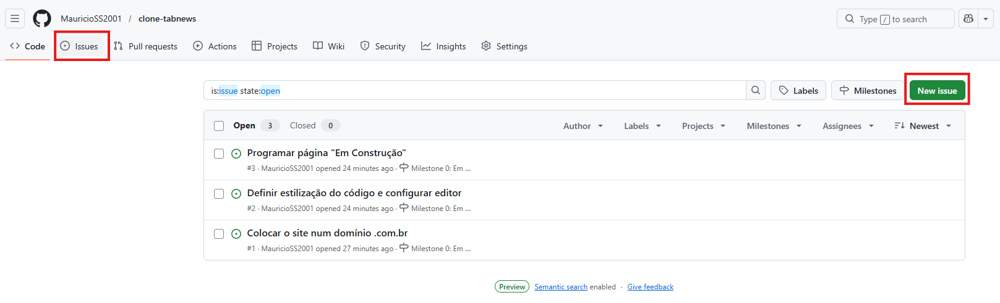
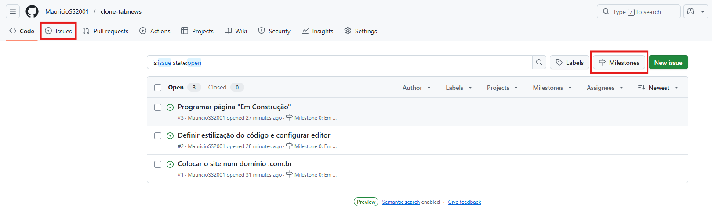

# Qual o “segredo” para organização de tarefas?

## Organizando tarefas
A ideia da organização de tarefas é
> Fazer muito com pouco.

e não,
> Fazer pouco com muito.

Lembre-se:
- **Não planeje muito e execute pouco.**
- **Planeje pouco e execute muito.**
 

## Saldo
O saldo é um conceito que defini se algo deve continuar a ser executado ou abortado.
Considere as metáforas abaixo:

- Se dermos 10 passos atrás e 2 a frente, será um **saldo negativo**.
- Se dermos 2 passos atrás e 10 a frente, será um **saldo positivo**.
  

 # Níveis organizacionais
Abaixo está cada nível cosniderandos os intens que tem a necessidade de serem feitos.

 - **Nível 1:** Ser lembrado individualmente.
    - **Menor custo de produção** e menor **tempo de aquecimento**.
        - **Produção:** Custo de energia necessário para registrar o que precisa ser feito.
        - **Aquecimento:** Tempo necessário para ver/conferir o que há necessidade de ser feito.
     
        **Exemplo:** Anotar uma lista apenas com títulos referentes aos itens necessários.
 

- **Nível 2:** Ser lembrado em grupo.
    - Quadros de Kanban.
    - Ainda **não é recomendado o registro detalhado** das tarefas necessárias.
     
    **Exemplo:** Quadro de `kanban` listando tarrefas **necessárias**, **em andamento** e **concluídas**.
 

- **Nível 3:** Expandir o conhecimento
    - **Conversar** e **detalhar** como algo deve ser feito.
    - Sistemas como `Trello` e `GitHub` (Fornecem espaço para adição de informações e recursos).
    - Processo mais **ativo** e **oneroso em questão de tempo**.
 

- **Nível 4:** Gerar métricas
    - **Mensurar produtividade** das pessoas que estão desempenhando as tarefas.
        - Gera polêmica pois por vezes gera valor a pessoa que gerencia e não gera valor a quem executa (Desenvolvedor).
        - O executor (Desenvolvedor) pode também associar a tarefa extra à **saldo negativo**.
        - Gerente pode por vezes considerar quantas `barreiras técnicas` foram avançadas sem a considerar os avanços nas `barreiras de negócio`.
 

### Certificação PCI (Tópico menor)
Certificação necessária para armazenamento de dados de cartão de crédito.

**Nota:** `jira`: software citado para realizar organização de tarefas.
 

---
---
---
 

# Como peitar projetos de qualquer tamanho?

## Negociação com cérebro
Nunca negociar **tudo ou nada**.

**Exemplo:** "Ou faz o projeto inteiro no fim de semana ou não faz".

- Desenvolver aos poucos é mais recompensador no final.
 

## Issue de Inception
Recurso utilizado para uma pessoa apontar problemas ou tarefas dentro de um repositório.
- Alta possibilidade organizacional de cada `issue`.
 

## Divisão do projeto
O projeto pode ser considerado como uma pedra gigante quando todas ideias são psotas na projeção, então o que fazer com isso? 
Quebrar a pedra até ela se tornar pequena e ir parte por parte.
 

## Milestones
`Milestones` são como grandes conquistas que incluem várias tarefas do proejto que queremos atingir. Podemos pensar com grandes etapas do desenvolvimento de um projeto.
 

---
---
---
 

# Criando a primeira Milestone e Issues do Projeto
O projeto começará com apenas uma `milestone` e três `issues`.

> **Milestone 0: Em Construção**
    |--- **Issue 1: Colocar o site num domínimo .com.br**
    |--- **Issue 2: Definir estilização do código e configurar editor**
    |--- **Issue 3: Programar página "Em Construção"**

Cada `milestone` pode ser tratada como uma grande pedra que podemos quebrar em pedras menores chamadas `issues`.
`Milestones` são blocos de conquistas que contém tarefas para serem desenvolvidas (`issues`).
 

## Como criar Milestones e Issues?
`Milestones` e `Issues` são criadas a partir do repositório no `GitHub`.

**Issues:** 
Para criar uma `issue`, basta acesssar a aba `issues` no repositório e clicar no botão `New Issue`.

**Milestones:**
Para criar uma `issue`, basta acesssar a aba `issues` no repositório, clicar no botão `Milestones` e posteriormente no botão `New Milestone`.

 

## Vínculo entre Milestones e Issues

Embora ambas possam ser utilziadas separadamente, a ideia é utilizar uma `milestone` como um grande bloco contendo suas `issues` (Tarefas do projeto).
A vinculação entre as duas pode ser feita a qualquer momento na tela do repositório do `GitHub`.
 

## Mecânica da dopamina

A dopamina possuí **três estágios** sendo eles, `início`, `progresso`, `conclusão`.

**Estágio 1: Início:**
O cerécbro percebe que algo positivo pode acontecer a partir do início de um projeto. A liberação deste hormônio no cérebro estimula você a começar um movimento.
 

**Estágio 2: Progresso:**
O segundo estágio é marcado pela observação se houve ou não progresso dentro do projeto. Em caso positivo, mais dopamina é liberada. Caso negativo, é melhor mudar a rota do projeto.
 

**Estágio 3: Conclusão:**
Após a conclusão, tendo o resultado visto, a última carga de dopamina é liberada, fazendo com que a experiência seja mais familiar a memória.